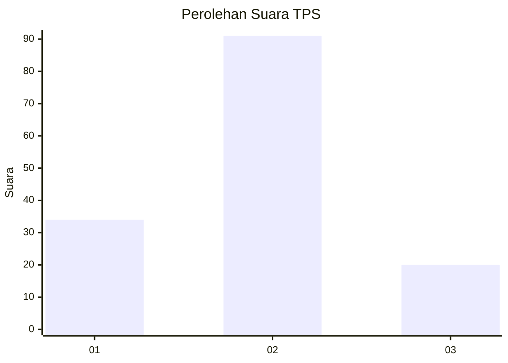
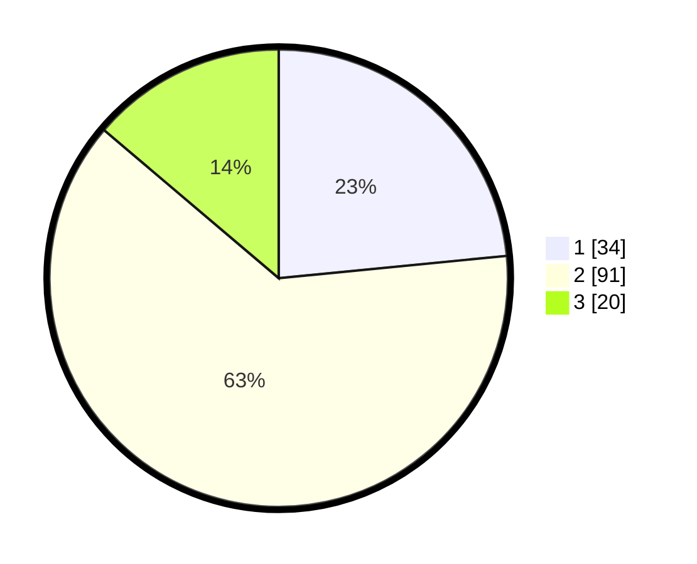

# Hasil

## Grafik

## Tabel

| No. | Nama Paslon    | Suara | Suara (raw) | Persentase |
|:--- |:-------------- | -----:| -----------:| ----------:|
| 1   | ANIES MUHAIMIN | 34    | [34][p-1]   | 23,45      |
| 2   | PRABOWO GIBRAN | 91    | [91][p-2]   | 62,76      |
| 3   | GANJAR MAHFUD  | 20    | [20][p-3]   | 13,79      |

[p-1]: https://github.com/gigit-pemilu/pemilu-2024-35-jawa-timur/blob/main/pilpres/hitung-suara/sub/35-jawa-timur/sub/78-kota-surabaya/sub/16-semampir/sub/1004-ujung/sub/072-tps/sub/paslon-1.txt
[p-2]: https://github.com/gigit-pemilu/pemilu-2024-35-jawa-timur/blob/main/pilpres/hitung-suara/sub/35-jawa-timur/sub/78-kota-surabaya/sub/16-semampir/sub/1004-ujung/sub/072-tps/sub/paslon-2.txt
[p-3]: https://github.com/gigit-pemilu/pemilu-2024-35-jawa-timur/blob/main/pilpres/hitung-suara/sub/35-jawa-timur/sub/78-kota-surabaya/sub/16-semampir/sub/1004-ujung/sub/072-tps/sub/paslon-3.txt

## Foto C Plano

https://sirekap-obj-formc.kpu.go.id/681c/pemilu/ppwp/35/78/16/10/04/3578161004072-20240214-204537--e86636ba-067d-4262-81a3-29d843bc4902.jpg

https://sirekap-obj-formc.kpu.go.id/681c/pemilu/ppwp/35/78/16/10/04/3578161004072-20240214-194311--42aa7ece-7e98-43f8-a587-3f4d69eedce6.jpg

https://sirekap-obj-formc.kpu.go.id/681c/pemilu/ppwp/35/78/16/10/04/3578161004072-20240214-194313--6b46a0de-9069-4eb3-9df0-e751c19b9780.jpg

## Metadata

| Key        | Value               |
| ---------- | ------------------- |
| Time Stamp | 2024-02-21 14:00:00 |

