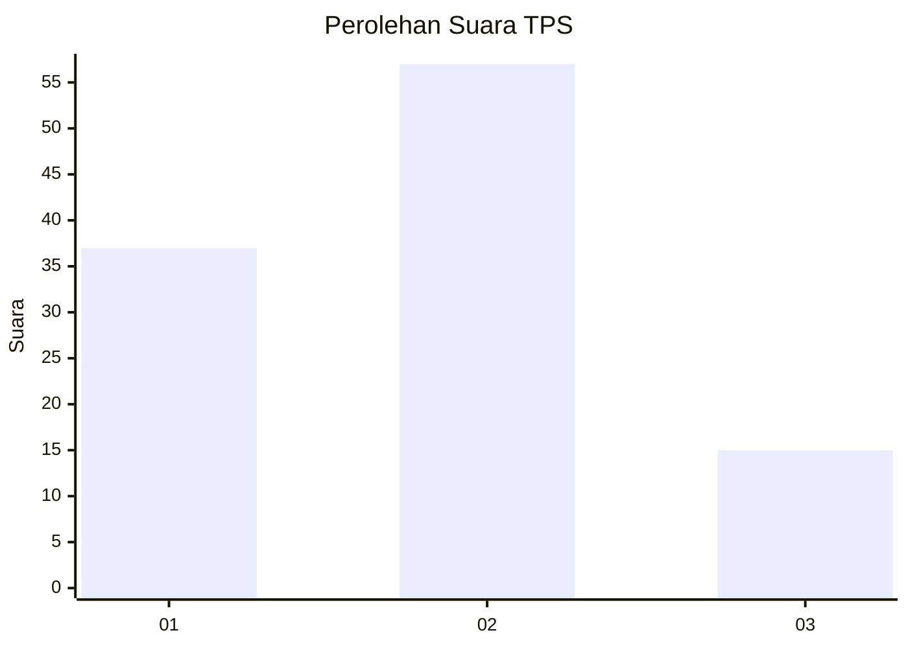
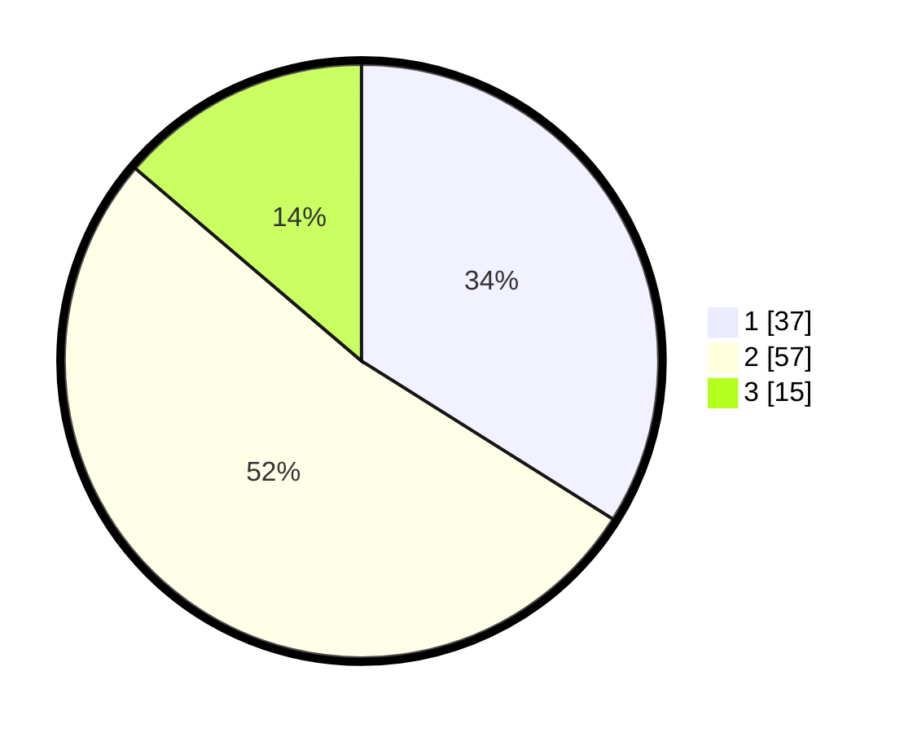

# Hasil

## Grafik

## Tabel

| No. | Nama Paslon    | Suara | Suara (raw) | Persentase |
|:--- |:-------------- | -----:| -----------:| ----------:|
| 1   | ANIES MUHAIMIN | 37    | [37][p-1]   | 33,94      |
| 2   | PRABOWO GIBRAN | 57    | [57][p-2]   | 52,29      |
| 3   | GANJAR MAHFUD  | 15    | [15][p-3]   | 13,76      |

[p-1]: https://github.com/gigit-pemilu/pemilu-2024-35-jawa-timur/blob/main/pilpres/hitung-suara/sub/35-jawa-timur/sub/78-kota-surabaya/sub/16-semampir/sub/1004-ujung/sub/073-tps/sub/paslon-1.txt
[p-2]: https://github.com/gigit-pemilu/pemilu-2024-35-jawa-timur/blob/main/pilpres/hitung-suara/sub/35-jawa-timur/sub/78-kota-surabaya/sub/16-semampir/sub/1004-ujung/sub/073-tps/sub/paslon-2.txt
[p-3]: https://github.com/gigit-pemilu/pemilu-2024-35-jawa-timur/blob/main/pilpres/hitung-suara/sub/35-jawa-timur/sub/78-kota-surabaya/sub/16-semampir/sub/1004-ujung/sub/073-tps/sub/paslon-3.txt

## Foto C Plano

https://sirekap-obj-formc.kpu.go.id/6370/pemilu/ppwp/35/78/16/10/04/3578161004073-20240214-202450--77b9f58d-005b-4a70-9c44-d3dd10c3423c.jpg

https://sirekap-obj-formc.kpu.go.id/6370/pemilu/ppwp/35/78/16/10/04/3578161004073-20240214-202536--94ca2e92-b651-4065-b329-689e726c1178.jpg

https://sirekap-obj-formc.kpu.go.id/6370/pemilu/ppwp/35/78/16/10/04/3578161004073-20240214-202619--8a8a82ac-a28b-4f99-ba13-ab68f07e3fa3.jpg

## Metadata

| Key        | Value               |
| ---------- | ------------------- |
| Time Stamp | 2024-02-24 22:31:28 |

