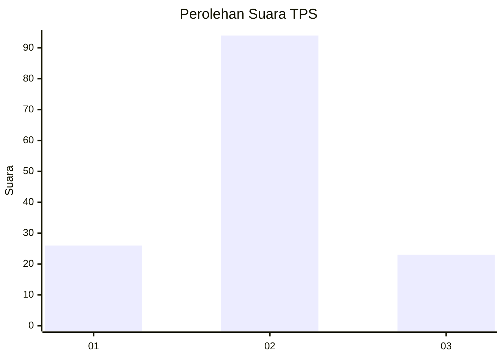
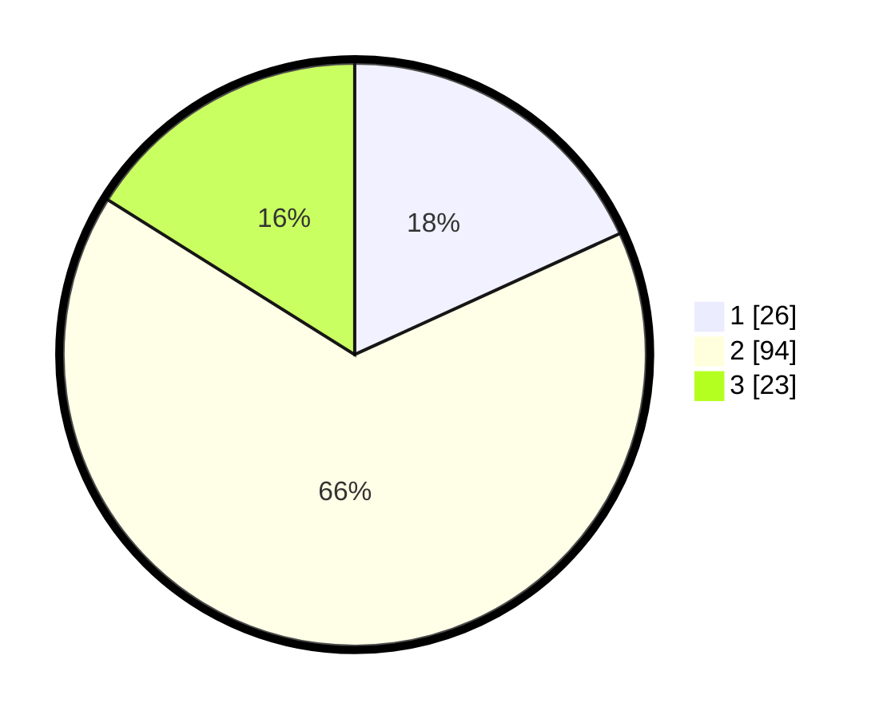

# Hasil

## Grafik

## Tabel

| No. | Nama Paslon    | Suara | Suara (raw) | Persentase |
|:--- |:-------------- | -----:| -----------:| ----------:|
| 1   | ANIES MUHAIMIN | 26    | [26][p-1]   | 18,18      |
| 2   | PRABOWO GIBRAN | 94    | [94][p-2]   | 65,73      |
| 3   | GANJAR MAHFUD  | 23    | [23][p-3]   | 16,08      |

[p-1]: https://github.com/gigit-pemilu/pemilu-2024-35-jawa-timur/blob/main/pilpres/hitung-suara/sub/35-jawa-timur/sub/78-kota-surabaya/sub/16-semampir/sub/1004-ujung/sub/083-tps/sub/paslon-1.txt
[p-2]: https://github.com/gigit-pemilu/pemilu-2024-35-jawa-timur/blob/main/pilpres/hitung-suara/sub/35-jawa-timur/sub/78-kota-surabaya/sub/16-semampir/sub/1004-ujung/sub/083-tps/sub/paslon-2.txt
[p-3]: https://github.com/gigit-pemilu/pemilu-2024-35-jawa-timur/blob/main/pilpres/hitung-suara/sub/35-jawa-timur/sub/78-kota-surabaya/sub/16-semampir/sub/1004-ujung/sub/083-tps/sub/paslon-3.txt

## Foto C Plano

https://sirekap-obj-formc.kpu.go.id/5977/pemilu/ppwp/35/78/16/10/04/3578161004083-20240214-225233--09786ad1-610f-4354-9932-be428a8af135.jpg

https://sirekap-obj-formc.kpu.go.id/5977/pemilu/ppwp/35/78/16/10/04/3578161004083-20240214-225141--fe322672-bcc4-4894-a0b9-ed369c6b625e.jpg

https://sirekap-obj-formc.kpu.go.id/5977/pemilu/ppwp/35/78/16/10/04/3578161004083-20240214-225109--d41fd78a-07af-4e8a-a8fc-409ff20c7c9b.jpg

## Metadata

| Key        | Value               |
| ---------- | ------------------- |
| Time Stamp | 2024-02-25 15:00:00 |

