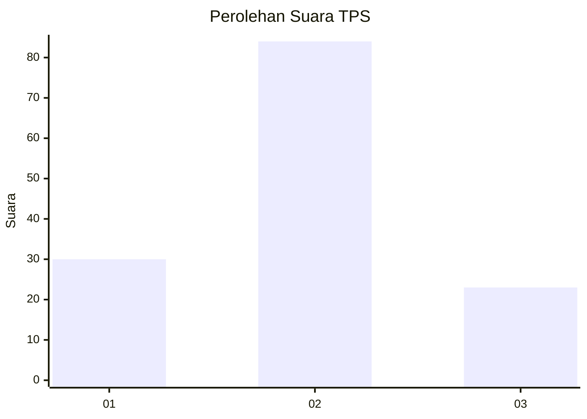
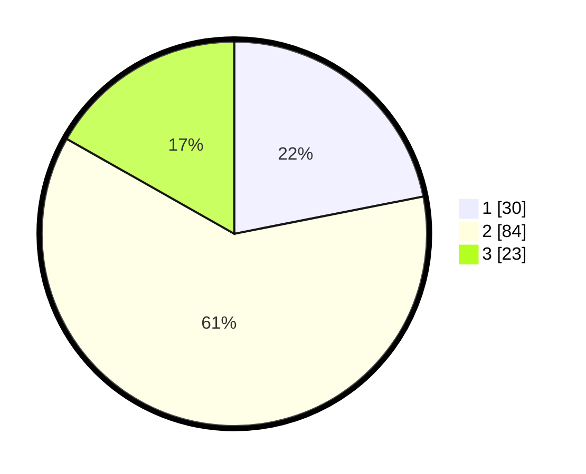

# Hasil

## Grafik

## Tabel

| No. | Nama Paslon    | Suara | Suara (raw) | Persentase |
|:--- |:-------------- | -----:| -----------:| ----------:|
| 1   | ANIES MUHAIMIN | 30    | [30][p-1]   | 21,90      |
| 2   | PRABOWO GIBRAN | 84    | [84][p-2]   | 61,31      |
| 3   | GANJAR MAHFUD  | 23    | [23][p-3]   | 16,79      |

[p-1]: https://github.com/gigit-pemilu/pemilu-2024/blob/main/pilpres/hitung-suara/sub/35-jawa-timur/sub/78-kota-surabaya/sub/16-semampir/sub/1004-ujung/sub/085-tps/sub/paslon-1.txt
[p-2]: https://github.com/gigit-pemilu/pemilu-2024/blob/main/pilpres/hitung-suara/sub/35-jawa-timur/sub/78-kota-surabaya/sub/16-semampir/sub/1004-ujung/sub/085-tps/sub/paslon-2.txt
[p-3]: https://github.com/gigit-pemilu/pemilu-2024/blob/main/pilpres/hitung-suara/sub/35-jawa-timur/sub/78-kota-surabaya/sub/16-semampir/sub/1004-ujung/sub/085-tps/sub/paslon-3.txt

## Foto C Plano

https://sirekap-obj-formc.kpu.go.id/fabd/pemilu/ppwp/35/78/16/10/04/3578161004085-20240214-191531--10c99beb-42ad-4ea5-b094-3f1df4afa91c.jpg

https://sirekap-obj-formc.kpu.go.id/fabd/pemilu/ppwp/35/78/16/10/04/3578161004085-20240214-203445--80fc6cec-c016-464d-a686-44c6b4060ad5.jpg

https://sirekap-obj-formc.kpu.go.id/fabd/pemilu/ppwp/35/78/16/10/04/3578161004085-20240214-203539--622b4080-1deb-44a7-bc4c-36b073669bed.jpg

## Metadata

| Key        | Value               |
| ---------- | ------------------- |
| Time Stamp | 2024-02-25 11:00:00 |

