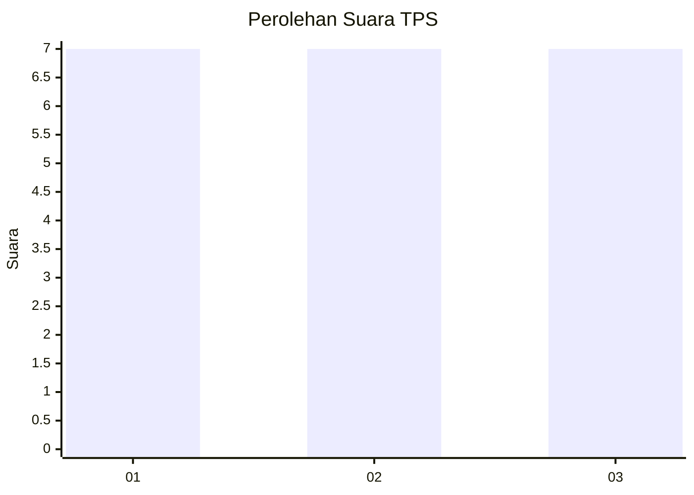
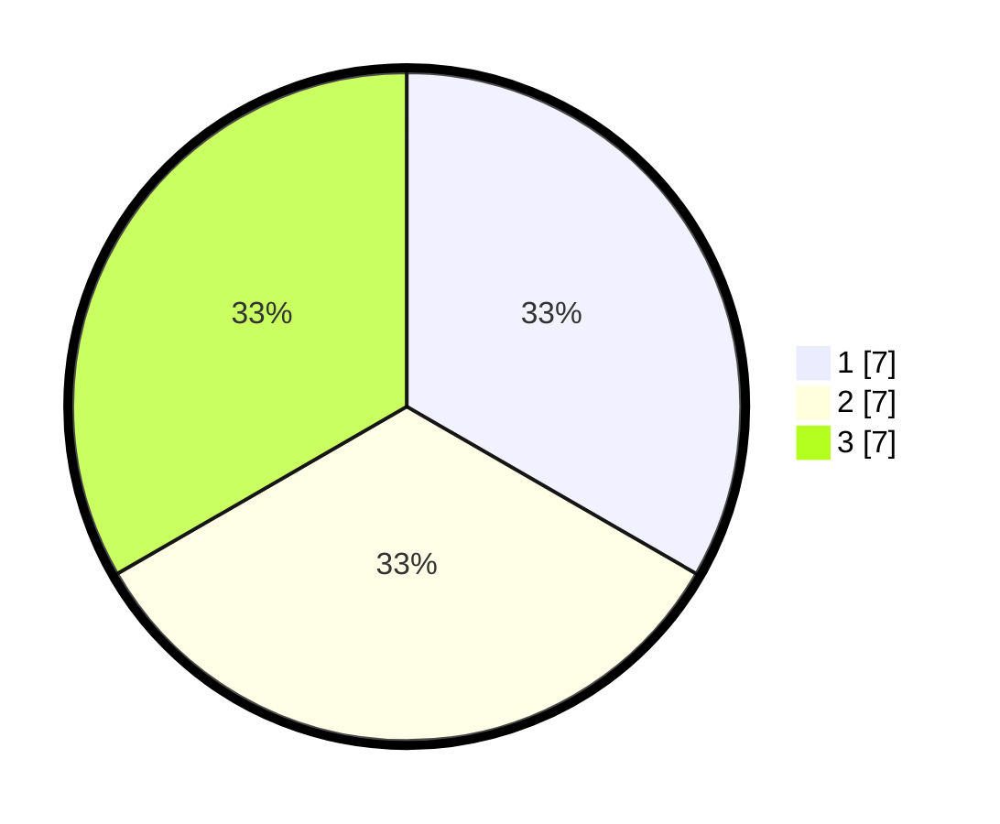

# Hasil

## Grafik

## Tabel

| No. | Nama Paslon    | Suara | Suara (raw) | Persentase |
|:--- |:-------------- | -----:| -----------:| ----------:|
| 1   | ANIES MUHAIMIN | 7     | [7][p-1]    | 33,33      |
| 2   | PRABOWO GIBRAN | 7     | [7][p-2]    | 33,33      |
| 3   | GANJAR MAHFUD  | 7     | [7][p-3]    | 33,33      |

[p-1]: https://github.com/gigit-pemilu/pemilu-2024-35-jawa-timur/blob/main/pilpres/hitung-suara/sub/35-jawa-timur/sub/78-kota-surabaya/sub/16-semampir/sub/1004-ujung/sub/088-tps/sub/paslon-1.txt
[p-2]: https://github.com/gigit-pemilu/pemilu-2024-35-jawa-timur/blob/main/pilpres/hitung-suara/sub/35-jawa-timur/sub/78-kota-surabaya/sub/16-semampir/sub/1004-ujung/sub/088-tps/sub/paslon-2.txt
[p-3]: https://github.com/gigit-pemilu/pemilu-2024-35-jawa-timur/blob/main/pilpres/hitung-suara/sub/35-jawa-timur/sub/78-kota-surabaya/sub/16-semampir/sub/1004-ujung/sub/088-tps/sub/paslon-3.txt

## Foto C Plano

https://sirekap-obj-formc.kpu.go.id/330a/pemilu/ppwp/35/78/16/10/04/3578161004088-20240225-165825--debff274-56e0-4555-a042-c3bfb580a72f.jpg

https://sirekap-obj-formc.kpu.go.id/330a/pemilu/ppwp/35/78/16/10/04/3578161004088-20240225-171503--a17fd7c8-8e6a-4130-87d5-f2625caed0f1.jpg

https://sirekap-obj-formc.kpu.go.id/330a/pemilu/ppwp/35/78/16/10/04/3578161004088-20240225-171616--46f92b98-b805-48a2-8922-cee426709545.jpg

## Metadata

| Key        | Value               |
| ---------- | ------------------- |
| Time Stamp | 2024-02-25 20:00:00 |

## DATA PEMILIH TETAP

Jumlah pemilih dalam DPT: **4**.
 * L: **0**.
 * P: **0**.

## DATA PENGGUNA HAK PILIH

Jumlah pengguna hak pilih dalam DPT: **0**.
 * L: **0**.
 * P: **0**.

Jumlah pengguna hak pilih dalam DPTb: **0**.
 * L: **800**.
 * P: **0**.

Jumlah pengguna hak pilih dalam DPK: **80**.
 * L: **0**.
 * P: **0**.

Jumlah pengguna hak pilih: **91**.
 * L: **777**.
 * P: **84**.

## JUMLAH SUARA SAH DAN TIDAK SAH

JUMLAH SELURUH SUARA SAH: **500**.

JUMLAH SUARA TIDAK SAH: **551**.

JUMLAH SELURUH SUARA SAH DAN SUARA TIDAK SAH: **202**.

