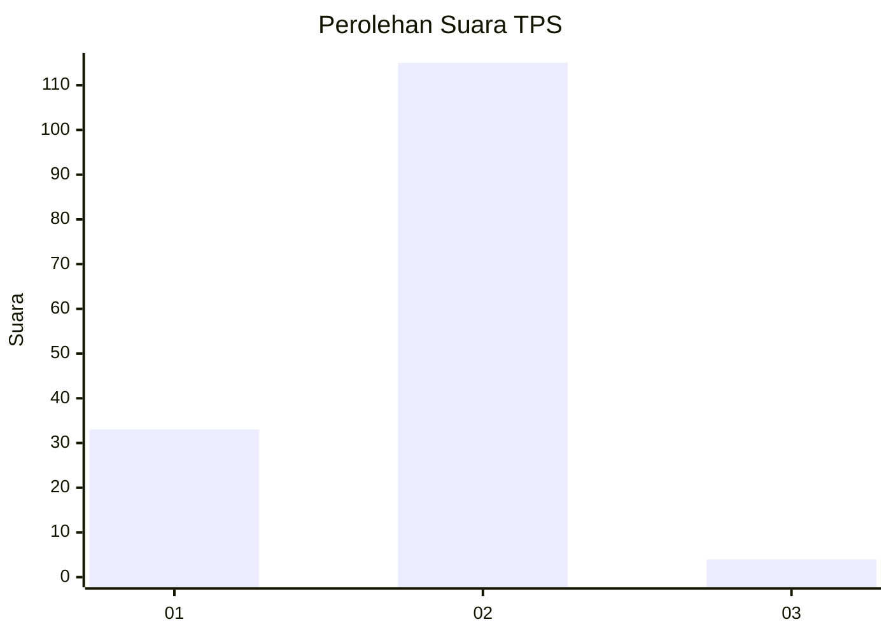
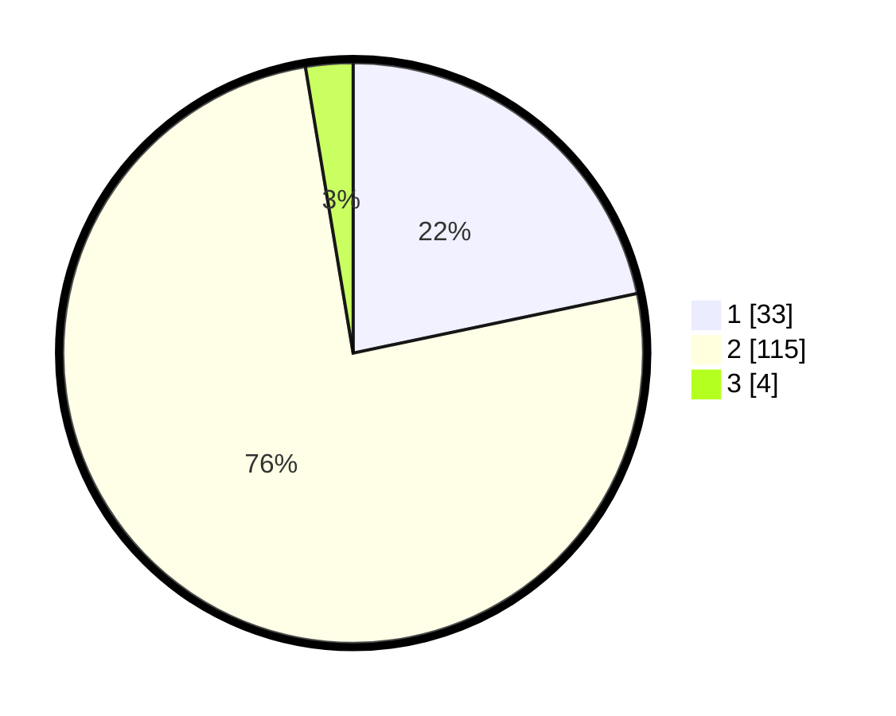

# Hasil

## Grafik

## Tabel

| No. | Nama Paslon    | Suara | Suara (raw) | Persentase |
|:--- |:-------------- | -----:| -----------:| ----------:|
| 1   | ANIES MUHAIMIN | 33    | [33][p-1]   | 21,71      |
| 2   | PRABOWO GIBRAN | 115   | [115][p-2]  | 75,66      |
| 3   | GANJAR MAHFUD  | 4     | [4][p-3]    | 2,63       |

[p-1]: https://github.com/gigit-pemilu/pemilu-2024/blob/main/pilpres/hitung-suara/sub/35-jawa-timur/sub/78-kota-surabaya/sub/16-semampir/sub/1005-sidotopo/sub/008-tps/sub/paslon-1.txt
[p-2]: https://github.com/gigit-pemilu/pemilu-2024/blob/main/pilpres/hitung-suara/sub/35-jawa-timur/sub/78-kota-surabaya/sub/16-semampir/sub/1005-sidotopo/sub/008-tps/sub/paslon-2.txt
[p-3]: https://github.com/gigit-pemilu/pemilu-2024/blob/main/pilpres/hitung-suara/sub/35-jawa-timur/sub/78-kota-surabaya/sub/16-semampir/sub/1005-sidotopo/sub/008-tps/sub/paslon-3.txt

## Foto C Plano

https://sirekap-obj-formc.kpu.go.id/16e7/pemilu/ppwp/35/78/16/10/05/3578161005008-20240219-200342--19ec60db-0d0d-48de-af3c-32440f43a749.jpg

https://sirekap-obj-formc.kpu.go.id/16e7/pemilu/ppwp/35/78/16/10/05/3578161005008-20240219-200504--4ea5df66-050c-4a26-bc9d-f2e46eb0fc6b.jpg

https://sirekap-obj-formc.kpu.go.id/16e7/pemilu/ppwp/35/78/16/10/05/3578161005008-20240219-201020--606fd4c4-02c1-4a5f-a9fa-85e751b93488.jpg

## Metadata

| Key        | Value               |
| ---------- | ------------------- |
| Time Stamp | 2024-02-25 12:00:00 |

