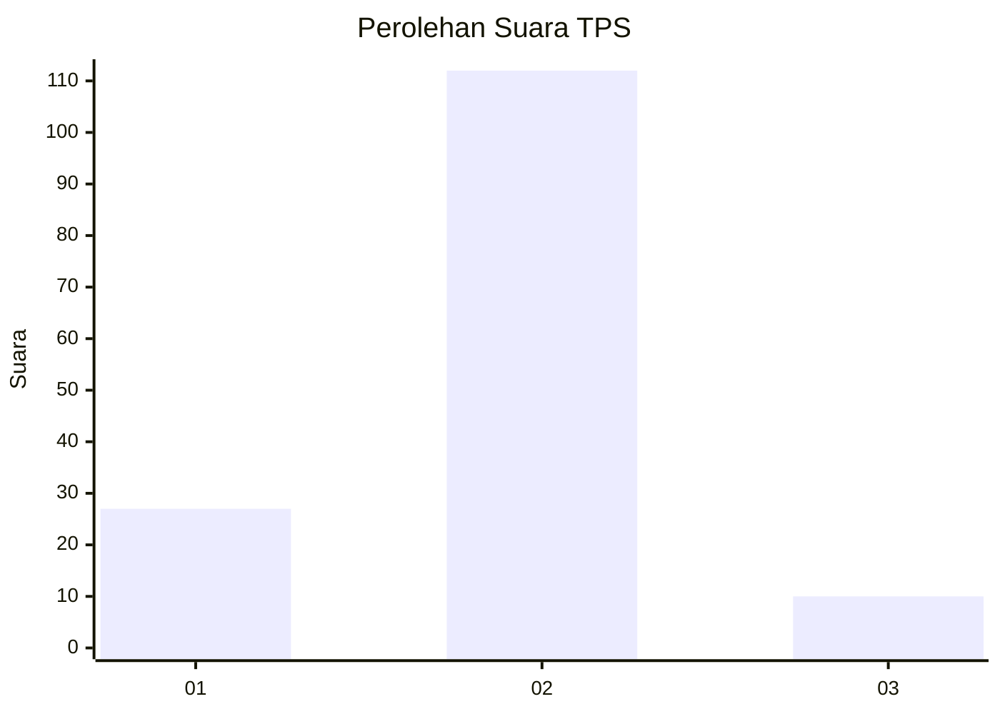
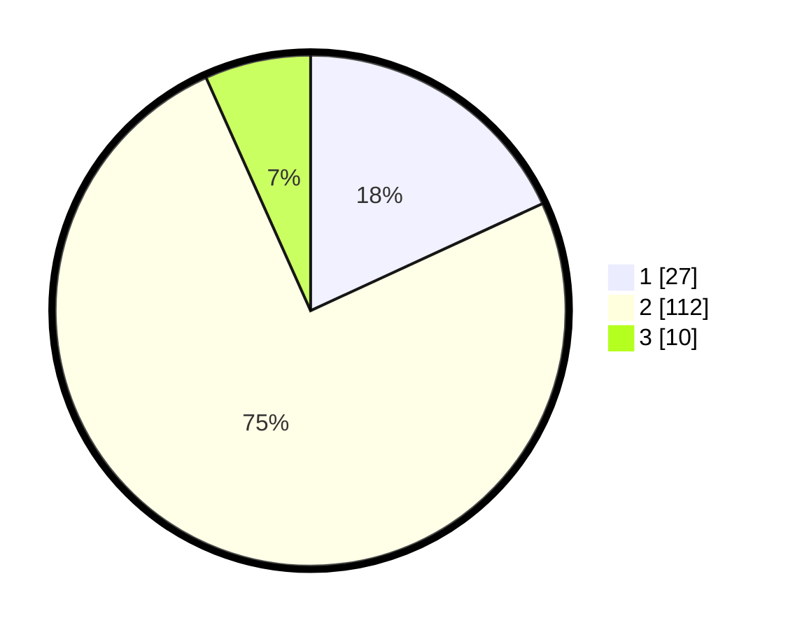

# Hasil

## Grafik

## Tabel

| No. | Nama Paslon    | Suara | Suara (raw) | Persentase |
|:--- |:-------------- | -----:| -----------:| ----------:|
| 1   | ANIES MUHAIMIN | 27    | [27][p-1]   | 18,12      |
| 2   | PRABOWO GIBRAN | 112   | [112][p-2]  | 75,17      |
| 3   | GANJAR MAHFUD  | 10    | [10][p-3]   | 6,71       |

[p-1]: https://github.com/gigit-pemilu/pemilu-2024-35-jawa-timur/blob/main/pilpres/hitung-suara/sub/35-jawa-timur/sub/78-kota-surabaya/sub/16-semampir/sub/1005-sidotopo/sub/018-tps/sub/paslon-1.txt
[p-2]: https://github.com/gigit-pemilu/pemilu-2024-35-jawa-timur/blob/main/pilpres/hitung-suara/sub/35-jawa-timur/sub/78-kota-surabaya/sub/16-semampir/sub/1005-sidotopo/sub/018-tps/sub/paslon-2.txt
[p-3]: https://github.com/gigit-pemilu/pemilu-2024-35-jawa-timur/blob/main/pilpres/hitung-suara/sub/35-jawa-timur/sub/78-kota-surabaya/sub/16-semampir/sub/1005-sidotopo/sub/018-tps/sub/paslon-3.txt

## Foto C Plano

https://sirekap-obj-formc.kpu.go.id/71d6/pemilu/ppwp/35/78/16/10/05/3578161005018-20240223-143357--66c3d741-aaa3-4710-9e44-47fb3373418d.jpg

https://sirekap-obj-formc.kpu.go.id/71d6/pemilu/ppwp/35/78/16/10/05/3578161005018-20240223-143226--261e355a-3466-4dec-b528-f12a71107cf6.jpg

https://sirekap-obj-formc.kpu.go.id/71d6/pemilu/ppwp/35/78/16/10/05/3578161005018-20240220-205504--454e2276-f1dc-4054-9505-c3c98b59af7e.jpg

## Metadata

| Key        | Value               |
| ---------- | ------------------- |
| Time Stamp | 2024-02-24 22:31:28 |

