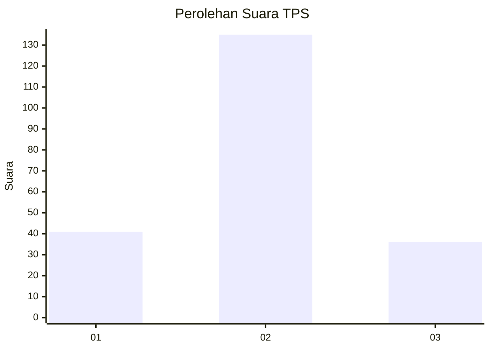

# Hasil

## Grafik

## Tabel

| No. | Nama Paslon    | Suara | Suara (raw) | Persentase |
|:--- |:-------------- | -----:| -----------:| ----------:|
| 1   | ANIES MUHAIMIN | 41    | [41][p-1]   | 19,34      |
| 2   | PRABOWO GIBRAN | 135   | [135][p-2]  | 63,68      |
| 3   | GANJAR MAHFUD  | 36    | [36][p-3]   | 16,98      |

[p-1]: https://github.com/gigit-pemilu/pemilu-2024/blob/main/pilpres/hitung-suara/sub/35-jawa-timur/sub/78-kota-surabaya/sub/17-kenjeran/sub/1001-tanah-kali-kedinding/sub/002-tps/sub/paslon-1.txt
[p-2]: https://github.com/gigit-pemilu/pemilu-2024/blob/main/pilpres/hitung-suara/sub/35-jawa-timur/sub/78-kota-surabaya/sub/17-kenjeran/sub/1001-tanah-kali-kedinding/sub/002-tps/sub/paslon-2.txt
[p-3]: https://github.com/gigit-pemilu/pemilu-2024/blob/main/pilpres/hitung-suara/sub/35-jawa-timur/sub/78-kota-surabaya/sub/17-kenjeran/sub/1001-tanah-kali-kedinding/sub/002-tps/sub/paslon-3.txt

## Foto C Plano

https://sirekap-obj-formc.kpu.go.id/1f90/pemilu/ppwp/35/78/17/10/01/3578171001002-20240215-042726--8935c10a-e82e-4450-a7f3-2066f927f680.jpg

https://sirekap-obj-formc.kpu.go.id/1f90/pemilu/ppwp/35/78/17/10/01/3578171001002-20240215-042844--00b35e31-840c-472b-93a5-a0db55a3ef00.jpg

https://sirekap-obj-formc.kpu.go.id/1f90/pemilu/ppwp/35/78/17/10/01/3578171001002-20240215-042918--1e0e5299-df80-4591-b303-5e1844d0d692.jpg

## Metadata

| Key        | Value               |
| ---------- | ------------------- |
| Time Stamp | 2024-02-19 06:16:00 |

