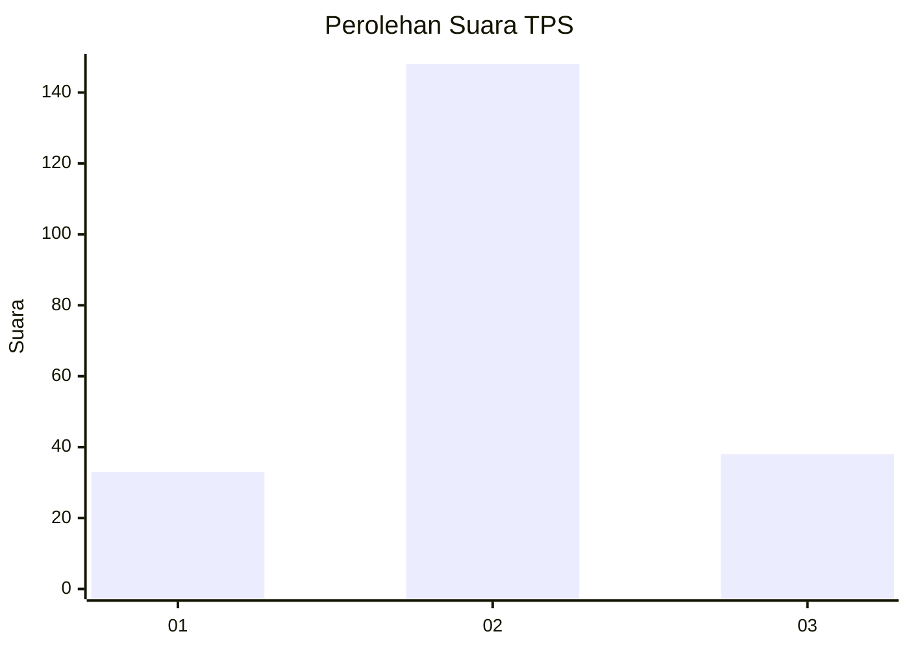
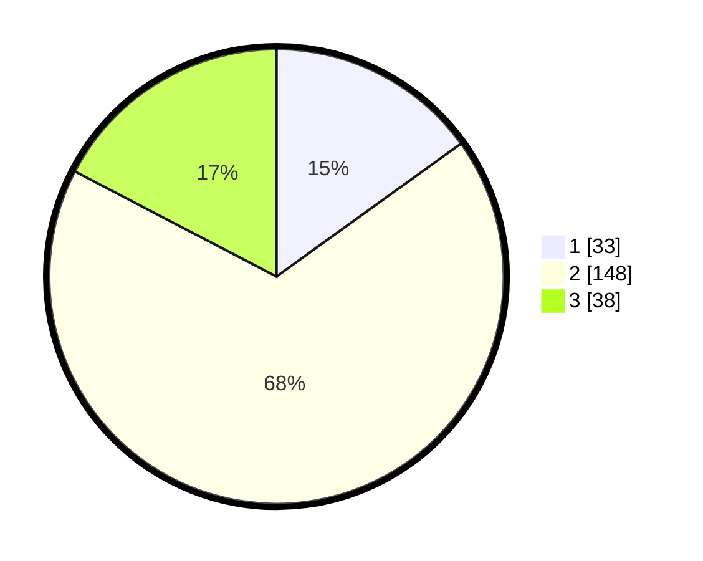

# Hasil

## Grafik

## Tabel

| No. | Nama Paslon    | Suara | Suara (raw) | Persentase |
|:--- |:-------------- | -----:| -----------:| ----------:|
| 1   | ANIES MUHAIMIN | 33    | [33][p-1]   | 15,07      |
| 2   | PRABOWO GIBRAN | 148   | [148][p-2]  | 67,58      |
| 3   | GANJAR MAHFUD  | 38    | [38][p-3]   | 17,35      |

[p-1]: https://github.com/gigit-pemilu/pemilu-2024-35-jawa-timur/blob/main/pilpres/hitung-suara/sub/35-jawa-timur/sub/78-kota-surabaya/sub/17-kenjeran/sub/1001-tanah-kali-kedinding/sub/003-tps/sub/paslon-1.txt
[p-2]: https://github.com/gigit-pemilu/pemilu-2024-35-jawa-timur/blob/main/pilpres/hitung-suara/sub/35-jawa-timur/sub/78-kota-surabaya/sub/17-kenjeran/sub/1001-tanah-kali-kedinding/sub/003-tps/sub/paslon-2.txt
[p-3]: https://github.com/gigit-pemilu/pemilu-2024-35-jawa-timur/blob/main/pilpres/hitung-suara/sub/35-jawa-timur/sub/78-kota-surabaya/sub/17-kenjeran/sub/1001-tanah-kali-kedinding/sub/003-tps/sub/paslon-3.txt

## Foto C Plano

https://sirekap-obj-formc.kpu.go.id/e06d/pemilu/ppwp/35/78/17/10/01/3578171001003-20240215-002628--3fe1eaec-e2a4-42ae-b732-7ef8fb1fe1f3.jpg

https://sirekap-obj-formc.kpu.go.id/e06d/pemilu/ppwp/35/78/17/10/01/3578171001003-20240215-000000--f62b3553-f0bb-49d7-bd68-59fb9aad37b1.jpg

https://sirekap-obj-formc.kpu.go.id/e06d/pemilu/ppwp/35/78/17/10/01/3578171001003-20240215-000201--010ea260-cfbb-4a8b-9ab6-09815395d67f.jpg

## Metadata

| Key        | Value               |
| ---------- | ------------------- |
| Time Stamp | 2024-02-19 06:16:00 |

