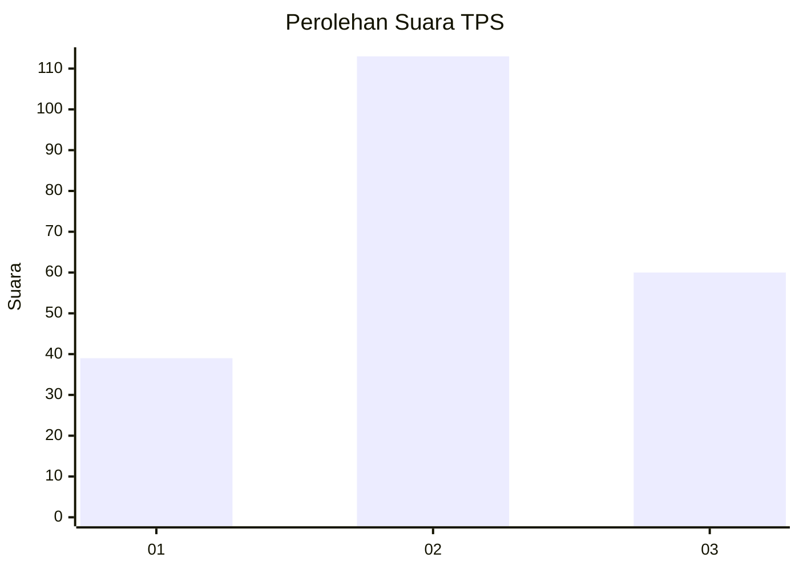
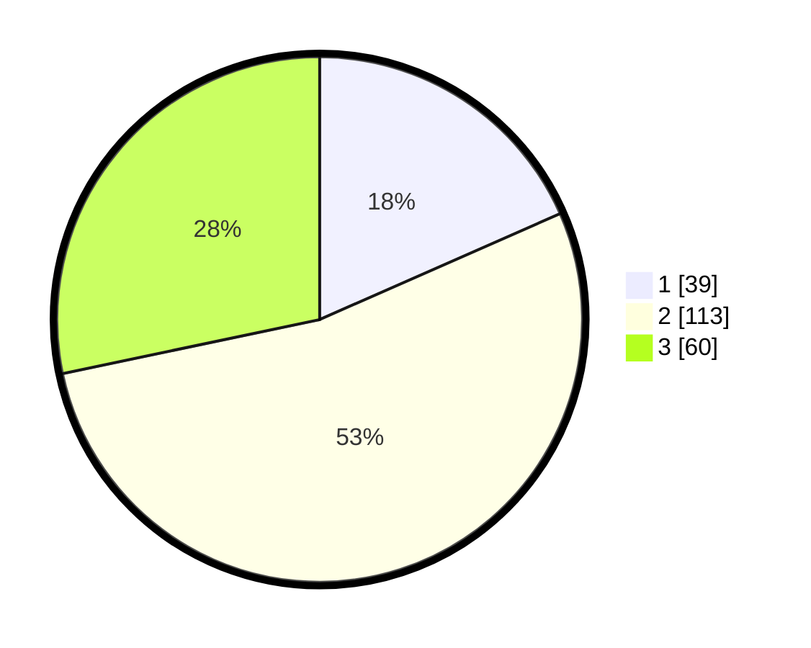

# Hasil

## Grafik

## Tabel

| No. | Nama Paslon    | Suara | Suara (raw) | Persentase |
|:--- |:-------------- | -----:| -----------:| ----------:|
| 1   | ANIES MUHAIMIN | 39    | [39][p-1]   | 18,40      |
| 2   | PRABOWO GIBRAN | 113   | [113][p-2]  | 53,30      |
| 3   | GANJAR MAHFUD  | 60    | [60][p-3]   | 28,30      |

[p-1]: https://github.com/gigit-pemilu/pemilu-2024/blob/main/pilpres/hitung-suara/sub/35-jawa-timur/sub/78-kota-surabaya/sub/17-kenjeran/sub/1001-tanah-kali-kedinding/sub/005-tps/sub/paslon-1.txt
[p-2]: https://github.com/gigit-pemilu/pemilu-2024/blob/main/pilpres/hitung-suara/sub/35-jawa-timur/sub/78-kota-surabaya/sub/17-kenjeran/sub/1001-tanah-kali-kedinding/sub/005-tps/sub/paslon-2.txt
[p-3]: https://github.com/gigit-pemilu/pemilu-2024/blob/main/pilpres/hitung-suara/sub/35-jawa-timur/sub/78-kota-surabaya/sub/17-kenjeran/sub/1001-tanah-kali-kedinding/sub/005-tps/sub/paslon-3.txt

## Foto C Plano

https://sirekap-obj-formc.kpu.go.id/afcf/pemilu/ppwp/35/78/17/10/01/3578171001005-20240214-231835--66ea05b8-bf4d-4ea7-900f-6ab5c387895c.jpg

https://sirekap-obj-formc.kpu.go.id/afcf/pemilu/ppwp/35/78/17/10/01/3578171001005-20240214-231849--8d3940b0-deb4-4644-9643-00947f70f591.jpg

https://sirekap-obj-formc.kpu.go.id/afcf/pemilu/ppwp/35/78/17/10/01/3578171001005-20240214-231857--b153fa1b-3ac8-461f-984f-6e6eb615fa23.jpg

## Metadata

| Key        | Value               |
| ---------- | ------------------- |
| Time Stamp | 2024-02-25 12:00:00 |

