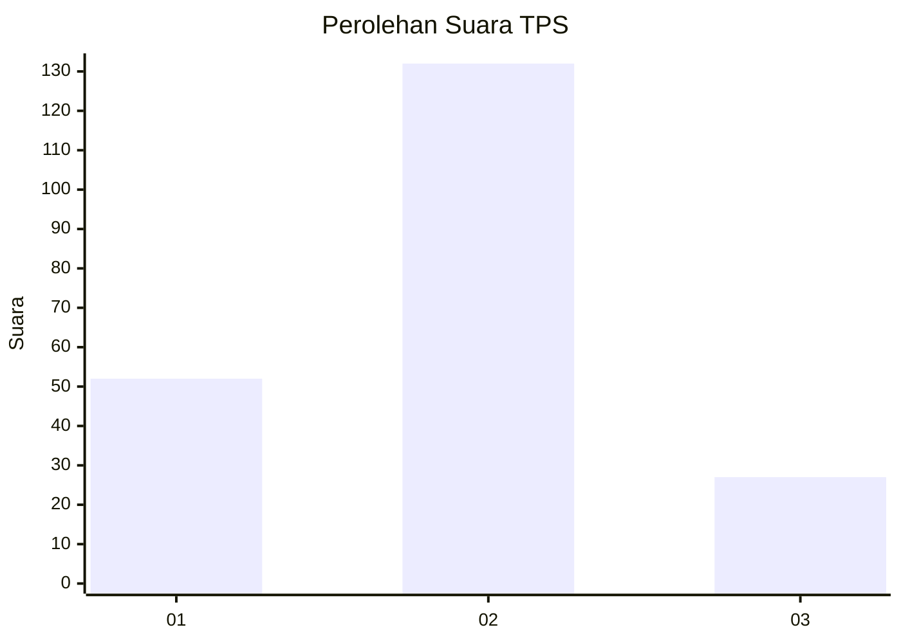
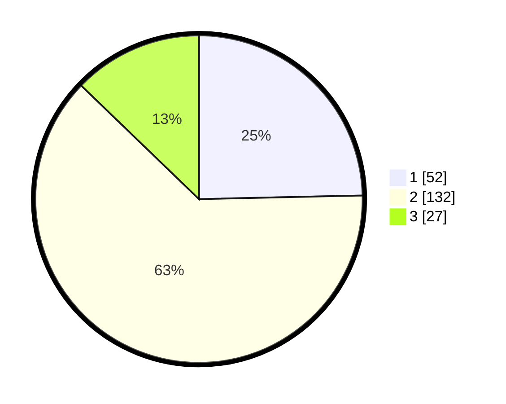

# Hasil

## Grafik

## Tabel

| No. | Nama Paslon    | Suara | Suara (raw) | Persentase |
|:--- |:-------------- | -----:| -----------:| ----------:|
| 1   | ANIES MUHAIMIN | 52    | [52][p-1]   | 24,64      |
| 2   | PRABOWO GIBRAN | 132   | [132][p-2]  | 62,56      |
| 3   | GANJAR MAHFUD  | 27    | [27][p-3]   | 12,80      |

[p-1]: https://github.com/gigit-pemilu/pemilu-2024-35-jawa-timur/blob/main/pilpres/hitung-suara/sub/35-jawa-timur/sub/78-kota-surabaya/sub/17-kenjeran/sub/1001-tanah-kali-kedinding/sub/013-tps/sub/paslon-1.txt
[p-2]: https://github.com/gigit-pemilu/pemilu-2024-35-jawa-timur/blob/main/pilpres/hitung-suara/sub/35-jawa-timur/sub/78-kota-surabaya/sub/17-kenjeran/sub/1001-tanah-kali-kedinding/sub/013-tps/sub/paslon-2.txt
[p-3]: https://github.com/gigit-pemilu/pemilu-2024-35-jawa-timur/blob/main/pilpres/hitung-suara/sub/35-jawa-timur/sub/78-kota-surabaya/sub/17-kenjeran/sub/1001-tanah-kali-kedinding/sub/013-tps/sub/paslon-3.txt

## Foto C Plano

https://sirekap-obj-formc.kpu.go.id/2c41/pemilu/ppwp/35/78/17/10/01/3578171001013-20240215-024119--09ac0384-622f-4f3a-aeed-d6faa4d27b16.jpg

https://sirekap-obj-formc.kpu.go.id/2c41/pemilu/ppwp/35/78/17/10/01/3578171001013-20240215-024221--5d565651-c638-4089-b101-e019b6dbcd54.jpg

https://sirekap-obj-formc.kpu.go.id/2c41/pemilu/ppwp/35/78/17/10/01/3578171001013-20240215-024304--e04833a7-c6fa-4bbc-9474-6829eaac9a53.jpg

## Metadata

| Key        | Value               |
| ---------- | ------------------- |
| Time Stamp | 2024-02-19 06:16:00 |

