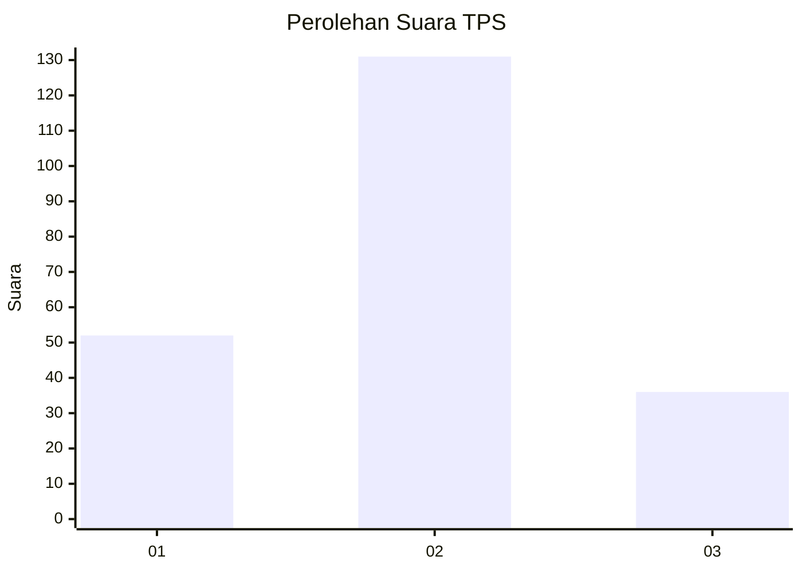

# Hasil

## Grafik

## Tabel

| No. | Nama Paslon    | Suara | Suara (raw) | Persentase |
|:--- |:-------------- | -----:| -----------:| ----------:|
| 1   | ANIES MUHAIMIN | 52    | [52][p-1]   | 23,74      |
| 2   | PRABOWO GIBRAN | 131   | [131][p-2]  | 59,82      |
| 3   | GANJAR MAHFUD  | 36    | [36][p-3]   | 16,44      |

[p-1]: https://github.com/gigit-pemilu/pemilu-2024/blob/main/pilpres/hitung-suara/sub/35-jawa-timur/sub/78-kota-surabaya/sub/17-kenjeran/sub/1001-tanah-kali-kedinding/sub/022-tps/sub/paslon-1.txt
[p-2]: https://github.com/gigit-pemilu/pemilu-2024/blob/main/pilpres/hitung-suara/sub/35-jawa-timur/sub/78-kota-surabaya/sub/17-kenjeran/sub/1001-tanah-kali-kedinding/sub/022-tps/sub/paslon-2.txt
[p-3]: https://github.com/gigit-pemilu/pemilu-2024/blob/main/pilpres/hitung-suara/sub/35-jawa-timur/sub/78-kota-surabaya/sub/17-kenjeran/sub/1001-tanah-kali-kedinding/sub/022-tps/sub/paslon-3.txt

## Foto C Plano

https://sirekap-obj-formc.kpu.go.id/97e6/pemilu/ppwp/35/78/17/10/01/3578171001022-20240215-014343--9f65f48a-242a-4877-91fa-a025be028e9c.jpg

https://sirekap-obj-formc.kpu.go.id/97e6/pemilu/ppwp/35/78/17/10/01/3578171001022-20240215-014623--f3e3eac1-6786-4223-a272-2d50a8abe26b.jpg

https://sirekap-obj-formc.kpu.go.id/97e6/pemilu/ppwp/35/78/17/10/01/3578171001022-20240215-014844--bf0a748d-0036-4761-9bcb-616dbd6cccd2.jpg

## Metadata

| Key        | Value               |
| ---------- | ------------------- |
| Time Stamp | 2024-02-25 12:00:00 |

