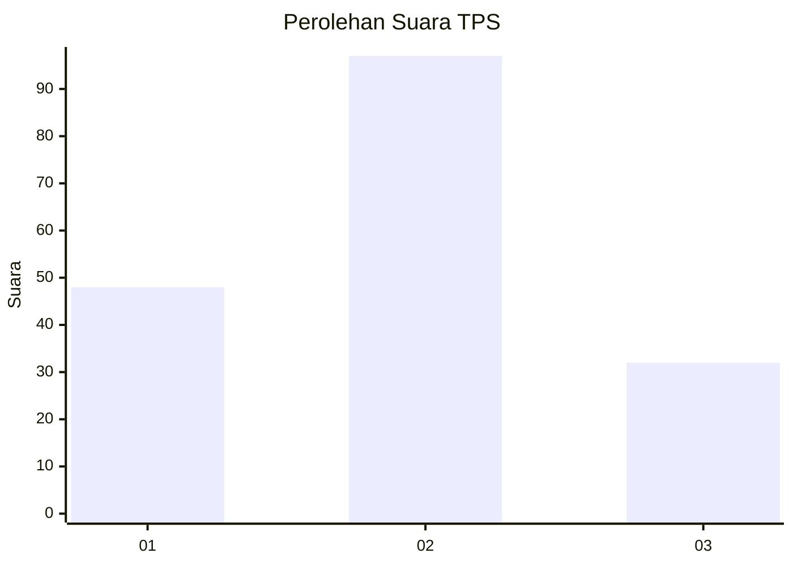
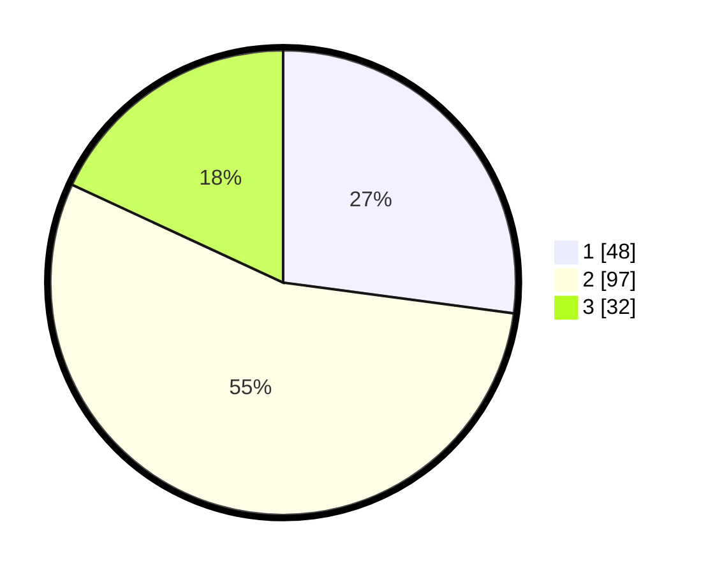

# Hasil

## Grafik

## Tabel

| No. | Nama Paslon    | Suara | Suara (raw) | Persentase |
|:--- |:-------------- | -----:| -----------:| ----------:|
| 1   | ANIES MUHAIMIN | 48    | [48][p-1]   | 27,12      |
| 2   | PRABOWO GIBRAN | 97    | [97][p-2]   | 54,80      |
| 3   | GANJAR MAHFUD  | 32    | [32][p-3]   | 18,08      |

[p-1]: https://github.com/gigit-pemilu/pemilu-2024-35-jawa-timur/blob/main/pilpres/hitung-suara/sub/35-jawa-timur/sub/78-kota-surabaya/sub/17-kenjeran/sub/1002-sidotopo-wetan/sub/033-tps/sub/paslon-1.txt
[p-2]: https://github.com/gigit-pemilu/pemilu-2024-35-jawa-timur/blob/main/pilpres/hitung-suara/sub/35-jawa-timur/sub/78-kota-surabaya/sub/17-kenjeran/sub/1002-sidotopo-wetan/sub/033-tps/sub/paslon-2.txt
[p-3]: https://github.com/gigit-pemilu/pemilu-2024-35-jawa-timur/blob/main/pilpres/hitung-suara/sub/35-jawa-timur/sub/78-kota-surabaya/sub/17-kenjeran/sub/1002-sidotopo-wetan/sub/033-tps/sub/paslon-3.txt

## Foto C Plano

https://sirekap-obj-formc.kpu.go.id/3b55/pemilu/ppwp/35/78/17/10/02/3578171002033-20240215-000303--c6ad2a9f-c98c-402a-92a9-79e1615e52a3.jpg

https://sirekap-obj-formc.kpu.go.id/3b55/pemilu/ppwp/35/78/17/10/02/3578171002033-20240215-000514--db2c3369-65b8-4889-9e5a-9783bffe23c2.jpg

https://sirekap-obj-formc.kpu.go.id/3b55/pemilu/ppwp/35/78/17/10/02/3578171002033-20240215-000558--aaf90795-b804-4335-bd94-48ac46b4e2d1.jpg

## Metadata

| Key        | Value               |
| ---------- | ------------------- |
| Time Stamp | 2024-02-25 21:00:00 |

