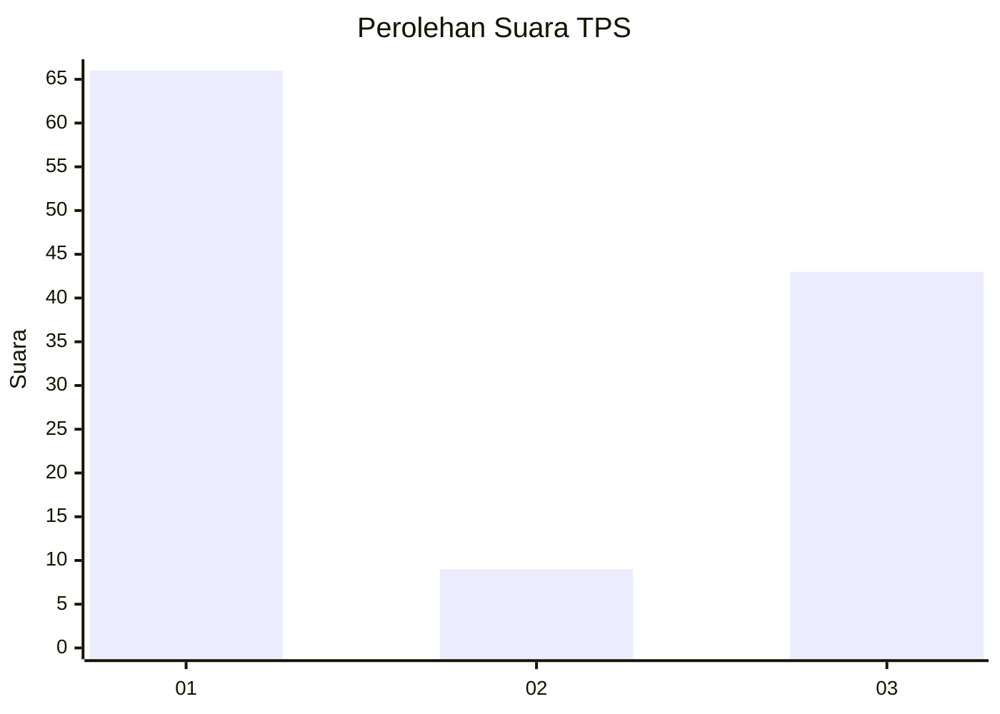
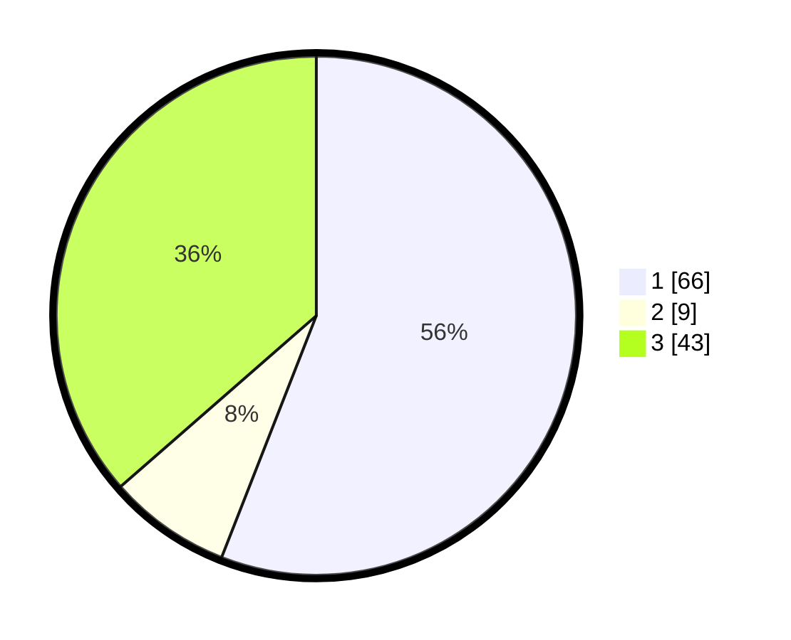

# Hasil

## Grafik

## Tabel

| No. | Nama Paslon    | Suara | Suara (raw) | Persentase |
|:--- |:-------------- | -----:| -----------:| ----------:|
| 1   | ANIES MUHAIMIN | 66    | [66][p-1]   | 55,93      |
| 2   | PRABOWO GIBRAN | 9     | [9][p-2]    | 7,63       |
| 3   | GANJAR MAHFUD  | 43    | [43][p-3]   | 36,44      |

[p-1]: https://github.com/gigit-pemilu/pemilu-2024-35-jawa-timur/blob/main/pilpres/hitung-suara/sub/35-jawa-timur/sub/78-kota-surabaya/sub/17-kenjeran/sub/1002-sidotopo-wetan/sub/036-tps/sub/paslon-1.txt
[p-2]: https://github.com/gigit-pemilu/pemilu-2024-35-jawa-timur/blob/main/pilpres/hitung-suara/sub/35-jawa-timur/sub/78-kota-surabaya/sub/17-kenjeran/sub/1002-sidotopo-wetan/sub/036-tps/sub/paslon-2.txt
[p-3]: https://github.com/gigit-pemilu/pemilu-2024-35-jawa-timur/blob/main/pilpres/hitung-suara/sub/35-jawa-timur/sub/78-kota-surabaya/sub/17-kenjeran/sub/1002-sidotopo-wetan/sub/036-tps/sub/paslon-3.txt

## Foto C Plano

https://sirekap-obj-formc.kpu.go.id/020b/pemilu/ppwp/35/78/17/10/02/3578171002036-20240214-204543--fb4de25f-1962-42d5-8ad3-6afa1cd61e89.jpg

https://sirekap-obj-formc.kpu.go.id/020b/pemilu/ppwp/35/78/17/10/02/3578171002036-20240214-205250--71163eb3-ccaf-4285-a28f-da2169c1d448.jpg

https://sirekap-obj-formc.kpu.go.id/020b/pemilu/ppwp/35/78/17/10/02/3578171002036-20240214-205407--939afe27-853f-40b4-8f71-a2b9ebd64a58.jpg

## Metadata

| Key        | Value               |
| ---------- | ------------------- |
| Time Stamp | 2024-02-25 12:00:00 |

