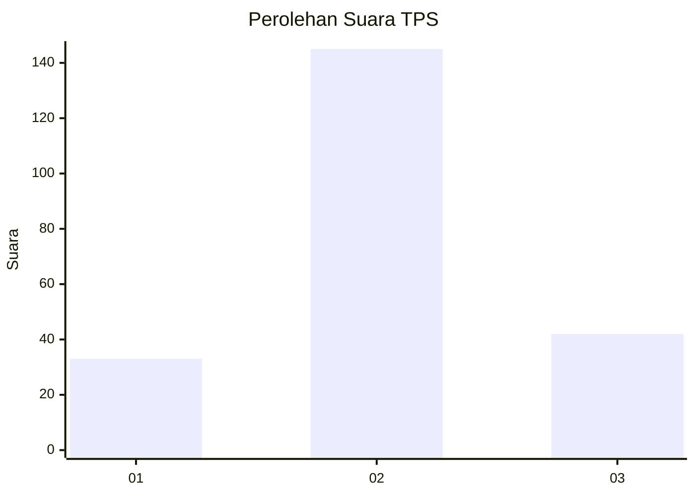
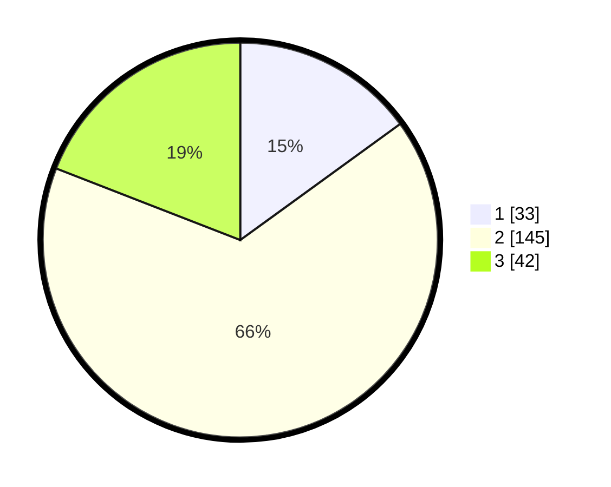

# Hasil

## Grafik

## Tabel

| No. | Nama Paslon    | Suara | Suara (raw) | Persentase |
|:--- |:-------------- | -----:| -----------:| ----------:|
| 1   | ANIES MUHAIMIN | 33    | [33][p-1]   | 15,00      |
| 2   | PRABOWO GIBRAN | 145   | [145][p-2]  | 65,91      |
| 3   | GANJAR MAHFUD  | 42    | [42][p-3]   | 19,09      |

[p-1]: https://github.com/gigit-pemilu/pemilu-2024/blob/main/pilpres/hitung-suara/sub/35-jawa-timur/sub/78-kota-surabaya/sub/17-kenjeran/sub/1004-tambak-wedi/sub/013-tps/sub/paslon-1.txt
[p-2]: https://github.com/gigit-pemilu/pemilu-2024/blob/main/pilpres/hitung-suara/sub/35-jawa-timur/sub/78-kota-surabaya/sub/17-kenjeran/sub/1004-tambak-wedi/sub/013-tps/sub/paslon-2.txt
[p-3]: https://github.com/gigit-pemilu/pemilu-2024/blob/main/pilpres/hitung-suara/sub/35-jawa-timur/sub/78-kota-surabaya/sub/17-kenjeran/sub/1004-tambak-wedi/sub/013-tps/sub/paslon-3.txt

## Foto C Plano

https://sirekap-obj-formc.kpu.go.id/d0dc/pemilu/ppwp/35/78/17/10/04/3578171004013-20240214-234747--81259866-445a-4f5d-87e1-4943fe93a375.jpg

https://sirekap-obj-formc.kpu.go.id/d0dc/pemilu/ppwp/35/78/17/10/04/3578171004013-20240214-234840--0c044102-6cb9-4da2-8eea-cb97ed8f1890.jpg

https://sirekap-obj-formc.kpu.go.id/d0dc/pemilu/ppwp/35/78/17/10/04/3578171004013-20240214-234904--8ed9d1bd-67a1-470e-bf41-fcffa802065d.jpg

## Metadata

| Key        | Value               |
| ---------- | ------------------- |
| Time Stamp | 2024-02-26 13:00:00 |

