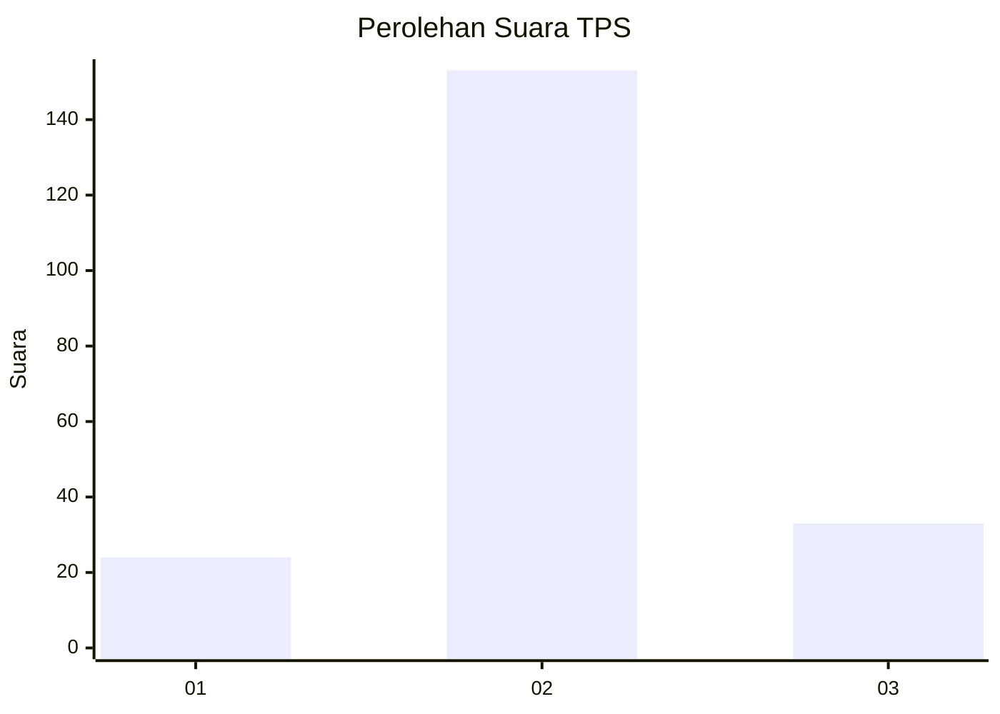
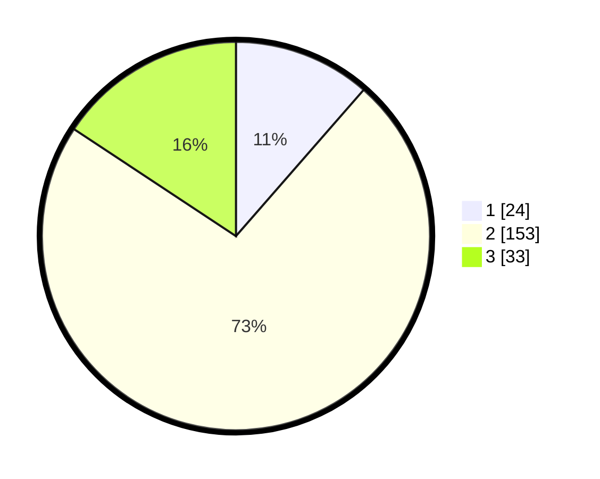

# Hasil

## Grafik

## Tabel

| No. | Nama Paslon    | Suara | Suara (raw) | Persentase |
|:--- |:-------------- | -----:| -----------:| ----------:|
| 1   | ANIES MUHAIMIN | 24    | [24][p-1]   | 11,43      |
| 2   | PRABOWO GIBRAN | 153   | [153][p-2]  | 72,86      |
| 3   | GANJAR MAHFUD  | 33    | [33][p-3]   | 15,71      |

[p-1]: https://github.com/gigit-pemilu/pemilu-2024/blob/main/pilpres/hitung-suara/sub/35-jawa-timur/sub/78-kota-surabaya/sub/18-lakarsantri/sub/1001-bangkingan/sub/002-tps/sub/paslon-1.txt
[p-2]: https://github.com/gigit-pemilu/pemilu-2024/blob/main/pilpres/hitung-suara/sub/35-jawa-timur/sub/78-kota-surabaya/sub/18-lakarsantri/sub/1001-bangkingan/sub/002-tps/sub/paslon-2.txt
[p-3]: https://github.com/gigit-pemilu/pemilu-2024/blob/main/pilpres/hitung-suara/sub/35-jawa-timur/sub/78-kota-surabaya/sub/18-lakarsantri/sub/1001-bangkingan/sub/002-tps/sub/paslon-3.txt

## Foto C Plano

https://sirekap-obj-formc.kpu.go.id/a6d5/pemilu/ppwp/35/78/18/10/01/3578181001002-20240214-202926--871319fd-022c-48da-9d8f-e10a73e9a852.jpg

https://sirekap-obj-formc.kpu.go.id/a6d5/pemilu/ppwp/35/78/18/10/01/3578181001002-20240214-202957--d68b517a-6a92-4419-9e90-153da36f081c.jpg

https://sirekap-obj-formc.kpu.go.id/a6d5/pemilu/ppwp/35/78/18/10/01/3578181001002-20240214-203026--cba27418-dc20-4ef6-89e4-14f6d222c746.jpg

## Metadata

| Key        | Value               |
| ---------- | ------------------- |
| Time Stamp | 2024-02-25 21:00:00 |

