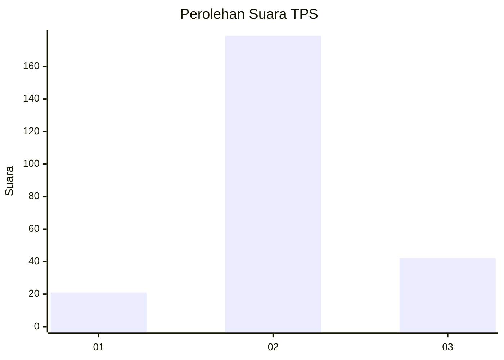
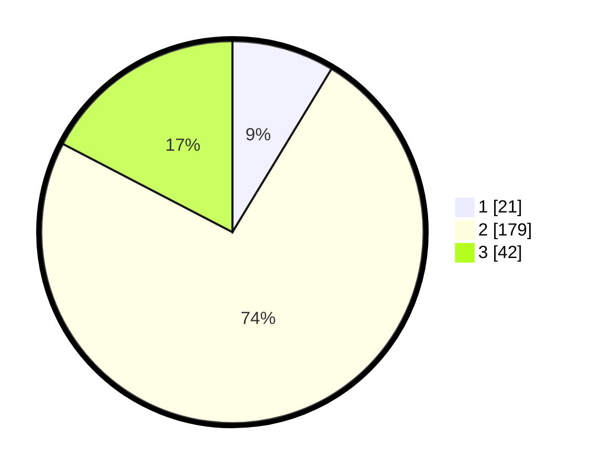

# Hasil

## Grafik

## Tabel

| No. | Nama Paslon    | Suara | Suara (raw) | Persentase |
|:--- |:-------------- | -----:| -----------:| ----------:|
| 1   | ANIES MUHAIMIN | 21    | [21][p-1]   | 8,68       |
| 2   | PRABOWO GIBRAN | 179   | [179][p-2]  | 73,97      |
| 3   | GANJAR MAHFUD  | 42    | [42][p-3]   | 17,36      |

[p-1]: https://github.com/gigit-pemilu/pemilu-2024-35-jawa-timur/blob/main/pilpres/hitung-suara/sub/35-jawa-timur/sub/78-kota-surabaya/sub/18-lakarsantri/sub/1001-bangkingan/sub/003-tps/sub/paslon-1.txt
[p-2]: https://github.com/gigit-pemilu/pemilu-2024-35-jawa-timur/blob/main/pilpres/hitung-suara/sub/35-jawa-timur/sub/78-kota-surabaya/sub/18-lakarsantri/sub/1001-bangkingan/sub/003-tps/sub/paslon-2.txt
[p-3]: https://github.com/gigit-pemilu/pemilu-2024-35-jawa-timur/blob/main/pilpres/hitung-suara/sub/35-jawa-timur/sub/78-kota-surabaya/sub/18-lakarsantri/sub/1001-bangkingan/sub/003-tps/sub/paslon-3.txt

## Foto C Plano

https://sirekap-obj-formc.kpu.go.id/662f/pemilu/ppwp/35/78/18/10/01/3578181001003-20240218-171903--6e8e48b7-2e2b-471d-9e5b-ae6d0458fc0b.jpg

https://sirekap-obj-formc.kpu.go.id/662f/pemilu/ppwp/35/78/18/10/01/3578181001003-20240218-172227--86edf843-178c-4af7-a61c-238ccc3886b7.jpg

https://sirekap-obj-formc.kpu.go.id/662f/pemilu/ppwp/35/78/18/10/01/3578181001003-20240214-220803--77cea065-8d82-4016-9caa-bdb618f8b455.jpg

## Metadata

| Key        | Value               |
| ---------- | ------------------- |
| Time Stamp | 2024-02-25 17:00:00 |

