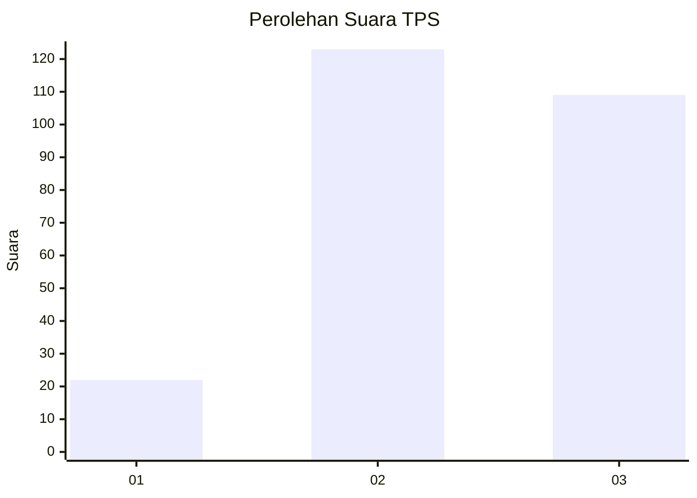
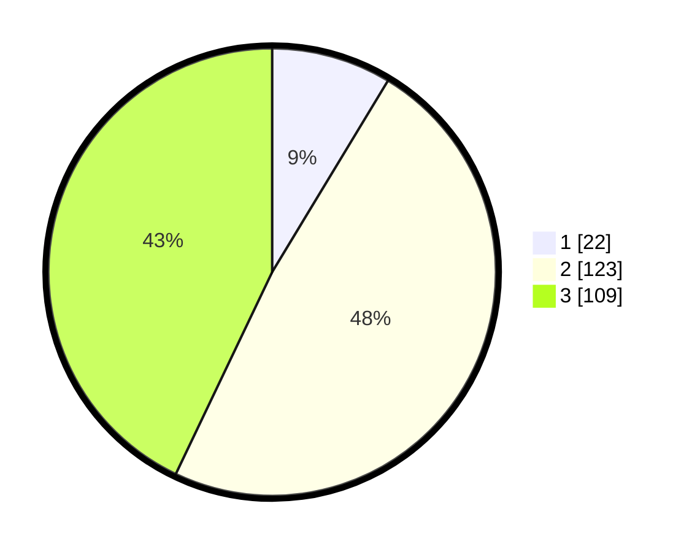

# Hasil

## Grafik

## Tabel

| No. | Nama Paslon    | Suara | Suara (raw) | Persentase |
|:--- |:-------------- | -----:| -----------:| ----------:|
| 1   | ANIES MUHAIMIN | 22    | [22][p-1]   | 8,66       |
| 2   | PRABOWO GIBRAN | 123   | [123][p-2]  | 48,43      |
| 3   | GANJAR MAHFUD  | 109   | [109][p-3]  | 42,91      |

[p-1]: https://github.com/gigit-pemilu/pemilu-2024/blob/main/pilpres/hitung-suara/sub/35-jawa-timur/sub/78-kota-surabaya/sub/18-lakarsantri/sub/1003-lakarsantri/sub/014-tps/sub/paslon-1.txt
[p-2]: https://github.com/gigit-pemilu/pemilu-2024/blob/main/pilpres/hitung-suara/sub/35-jawa-timur/sub/78-kota-surabaya/sub/18-lakarsantri/sub/1003-lakarsantri/sub/014-tps/sub/paslon-2.txt
[p-3]: https://github.com/gigit-pemilu/pemilu-2024/blob/main/pilpres/hitung-suara/sub/35-jawa-timur/sub/78-kota-surabaya/sub/18-lakarsantri/sub/1003-lakarsantri/sub/014-tps/sub/paslon-3.txt

## Foto C Plano

https://sirekap-obj-formc.kpu.go.id/a961/pemilu/ppwp/35/78/18/10/03/3578181003014-20240214-155029--4b36d99a-1006-423f-ada6-eb5ab232a8f8.jpg

https://sirekap-obj-formc.kpu.go.id/a961/pemilu/ppwp/35/78/18/10/03/3578181003014-20240214-155110--3d7694b2-37f7-4cfb-ae16-54a62618bf72.jpg

https://sirekap-obj-formc.kpu.go.id/a961/pemilu/ppwp/35/78/18/10/03/3578181003014-20240214-155247--ef4d3fec-58d2-433c-8b44-4b9699eb14a9.jpg

## Metadata

| Key        | Value               |
| ---------- | ------------------- |
| Time Stamp | 2024-02-25 20:00:00 |

