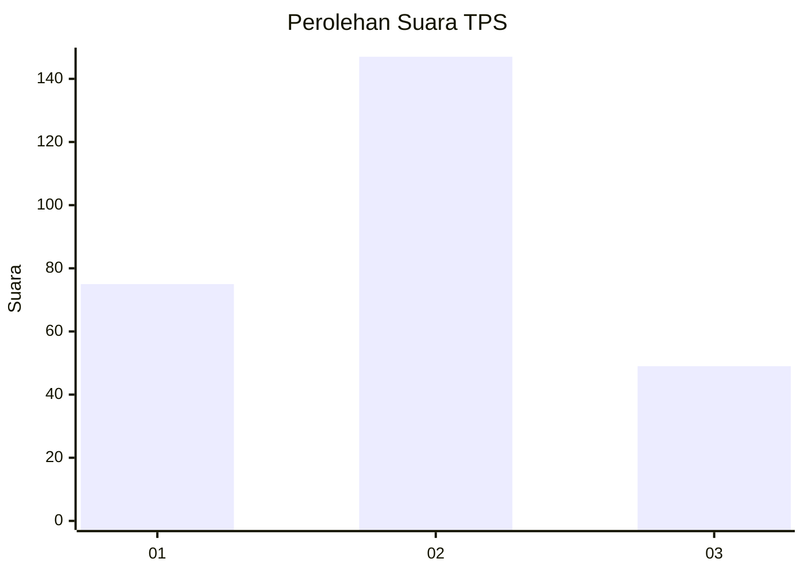
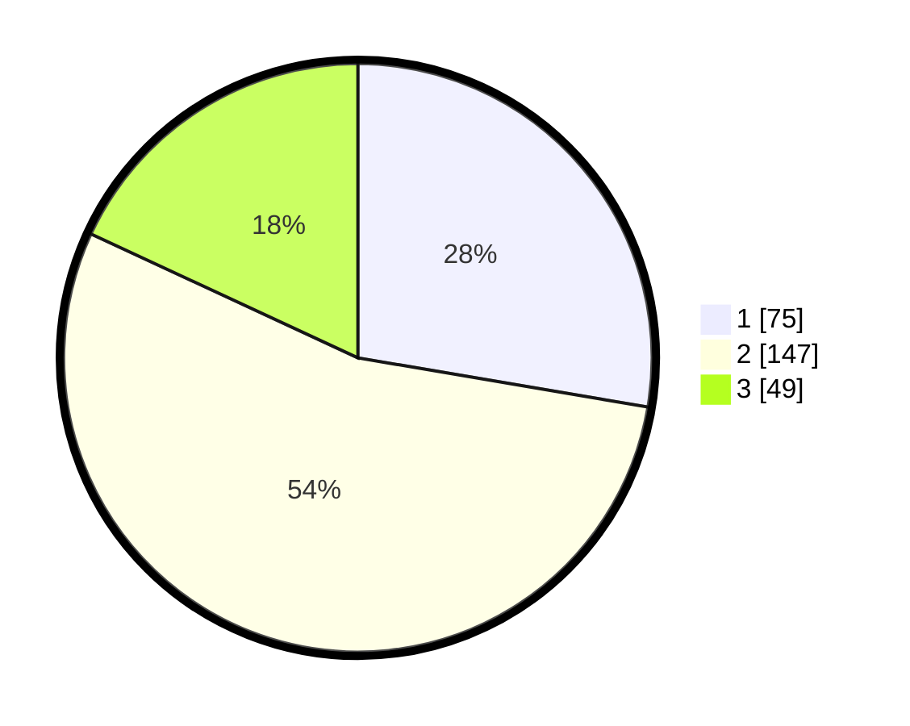

# Hasil

## Grafik

## Tabel

| No. | Nama Paslon    | Suara | Suara (raw) | Persentase |
|:--- |:-------------- | -----:| -----------:| ----------:|
| 1   | ANIES MUHAIMIN | 75    | [75][p-1]   | 27,68      |
| 2   | PRABOWO GIBRAN | 147   | [147][p-2]  | 54,24      |
| 3   | GANJAR MAHFUD  | 49    | [49][p-3]   | 18,08      |

[p-1]: https://github.com/gigit-pemilu/pemilu-2024-35-jawa-timur/blob/main/pilpres/hitung-suara/sub/35-jawa-timur/sub/78-kota-surabaya/sub/19-benowo/sub/1001-kandangan/sub/058-tps/sub/paslon-1.txt
[p-2]: https://github.com/gigit-pemilu/pemilu-2024-35-jawa-timur/blob/main/pilpres/hitung-suara/sub/35-jawa-timur/sub/78-kota-surabaya/sub/19-benowo/sub/1001-kandangan/sub/058-tps/sub/paslon-2.txt
[p-3]: https://github.com/gigit-pemilu/pemilu-2024-35-jawa-timur/blob/main/pilpres/hitung-suara/sub/35-jawa-timur/sub/78-kota-surabaya/sub/19-benowo/sub/1001-kandangan/sub/058-tps/sub/paslon-3.txt

## Foto C Plano

https://sirekap-obj-formc.kpu.go.id/3d0d/pemilu/ppwp/35/78/19/10/01/3578191001058-20240215-091237--6b0d9d8a-e08e-475f-9f3f-b540d96e4907.jpg

https://sirekap-obj-formc.kpu.go.id/3d0d/pemilu/ppwp/35/78/19/10/01/3578191001058-20240215-091229--bdb98d7d-be06-463d-81de-0edc29f461d5.jpg

https://sirekap-obj-formc.kpu.go.id/3d0d/pemilu/ppwp/35/78/19/10/01/3578191001058-20240215-091226--e231cc70-1be2-4898-a0b4-fe6a3e201740.jpg

## Metadata

| Key        | Value               |
| ---------- | ------------------- |
| Time Stamp | 2024-02-25 12:00:00 |

