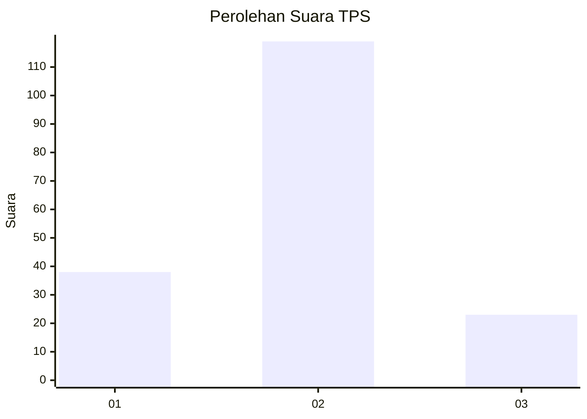
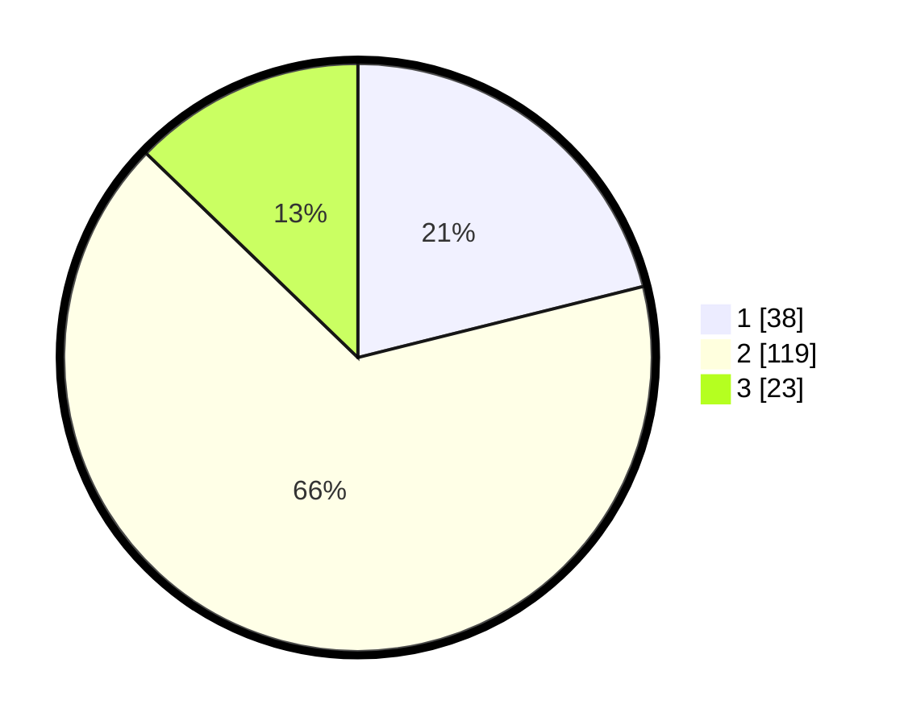

# Hasil

## Grafik

## Tabel

| No. | Nama Paslon    | Suara | Suara (raw) | Persentase |
|:--- |:-------------- | -----:| -----------:| ----------:|
| 1   | ANIES MUHAIMIN | 38    | [38][p-1]   | 21,11      |
| 2   | PRABOWO GIBRAN | 119   | [119][p-2]  | 66,11      |
| 3   | GANJAR MAHFUD  | 23    | [23][p-3]   | 12,78      |

[p-1]: https://github.com/gigit-pemilu/pemilu-2024/blob/main/pilpres/hitung-suara/sub/35-jawa-timur/sub/78-kota-surabaya/sub/19-benowo/sub/1004-tambak-oso-wilangun/sub/001-tps/sub/paslon-1.txt
[p-2]: https://github.com/gigit-pemilu/pemilu-2024/blob/main/pilpres/hitung-suara/sub/35-jawa-timur/sub/78-kota-surabaya/sub/19-benowo/sub/1004-tambak-oso-wilangun/sub/001-tps/sub/paslon-2.txt
[p-3]: https://github.com/gigit-pemilu/pemilu-2024/blob/main/pilpres/hitung-suara/sub/35-jawa-timur/sub/78-kota-surabaya/sub/19-benowo/sub/1004-tambak-oso-wilangun/sub/001-tps/sub/paslon-3.txt

## Foto C Plano

https://sirekap-obj-formc.kpu.go.id/3568/pemilu/ppwp/35/78/19/10/04/3578191004001-20240214-215315--9f0af3f9-e64d-4055-86c8-1ca6da00d9fa.jpg

https://sirekap-obj-formc.kpu.go.id/3568/pemilu/ppwp/35/78/19/10/04/3578191004001-20240214-215757--9f1e4397-9d94-427a-9091-970b8118efd9.jpg

https://sirekap-obj-formc.kpu.go.id/3568/pemilu/ppwp/35/78/19/10/04/3578191004001-20240214-215842--60c340a7-f6ae-41f7-8048-7ce5face3571.jpg

## Metadata

| Key        | Value               |
| ---------- | ------------------- |
| Time Stamp | 2024-02-25 20:00:00 |

