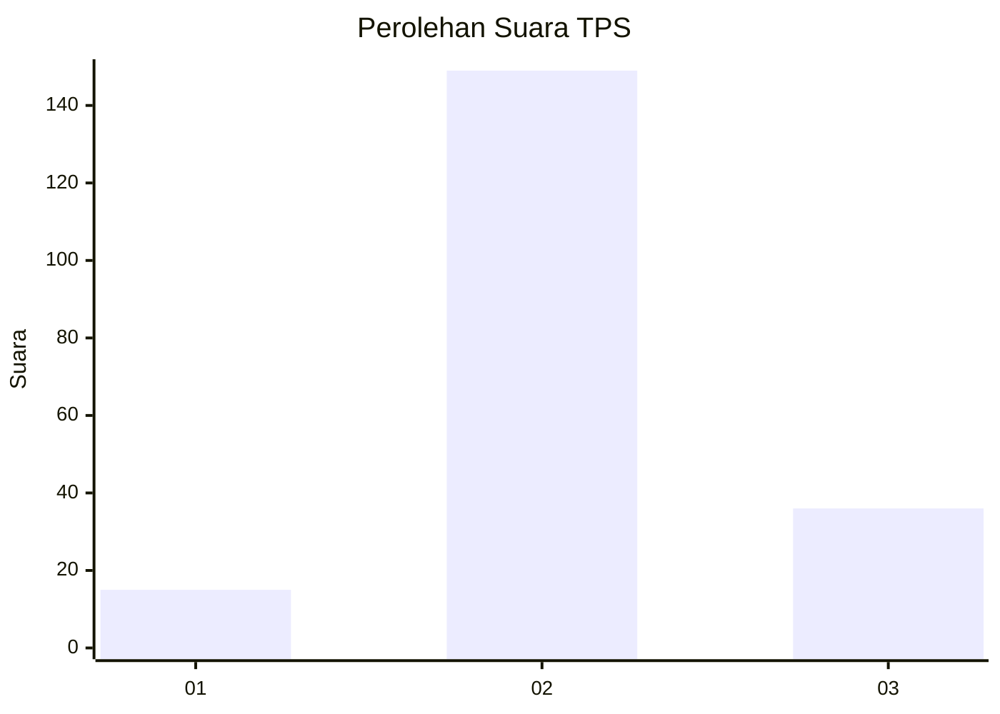

# Hasil

## Grafik

## Tabel

| No. | Nama Paslon    | Suara | Suara (raw) | Persentase |
|:--- |:-------------- | -----:| -----------:| ----------:|
| 1   | ANIES MUHAIMIN | 15    | [15][p-1]   | 7,50       |
| 2   | PRABOWO GIBRAN | 149   | [149][p-2]  | 74,50      |
| 3   | GANJAR MAHFUD  | 36    | [36][p-3]   | 18,00      |

[p-1]: https://github.com/gigit-pemilu/pemilu-2024-35-jawa-timur/blob/main/pilpres/hitung-suara/sub/35-jawa-timur/sub/78-kota-surabaya/sub/19-benowo/sub/1004-tambak-oso-wilangun/sub/003-tps/sub/paslon-1.txt
[p-2]: https://github.com/gigit-pemilu/pemilu-2024-35-jawa-timur/blob/main/pilpres/hitung-suara/sub/35-jawa-timur/sub/78-kota-surabaya/sub/19-benowo/sub/1004-tambak-oso-wilangun/sub/003-tps/sub/paslon-2.txt
[p-3]: https://github.com/gigit-pemilu/pemilu-2024-35-jawa-timur/blob/main/pilpres/hitung-suara/sub/35-jawa-timur/sub/78-kota-surabaya/sub/19-benowo/sub/1004-tambak-oso-wilangun/sub/003-tps/sub/paslon-3.txt

## Foto C Plano

https://sirekap-obj-formc.kpu.go.id/f88c/pemilu/ppwp/35/78/19/10/04/3578191004003-20240215-004425--ec7e986b-1eac-419d-8792-c438af5c9e8a.jpg

https://sirekap-obj-formc.kpu.go.id/f88c/pemilu/ppwp/35/78/19/10/04/3578191004003-20240215-004624--10c5af47-cc74-4917-bb84-b363dfaec757.jpg

https://sirekap-obj-formc.kpu.go.id/f88c/pemilu/ppwp/35/78/19/10/04/3578191004003-20240215-004840--9f5bc81a-e3cd-4d2f-8144-2b13ff7a7201.jpg

## Metadata

| Key        | Value               |
| ---------- | ------------------- |
| Time Stamp | 2024-02-24 22:31:28 |

