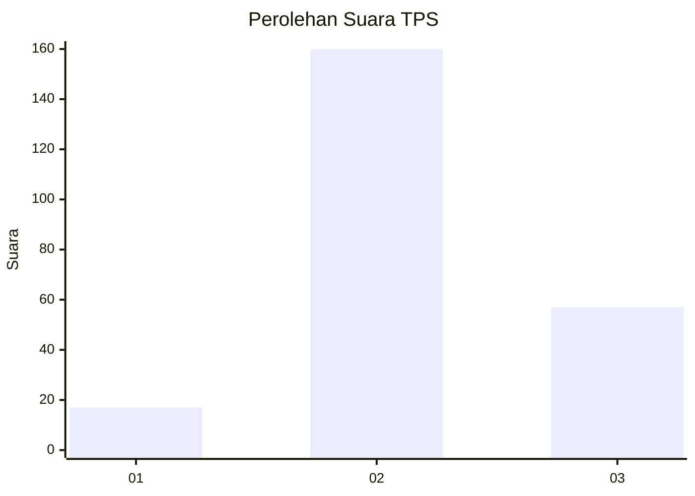
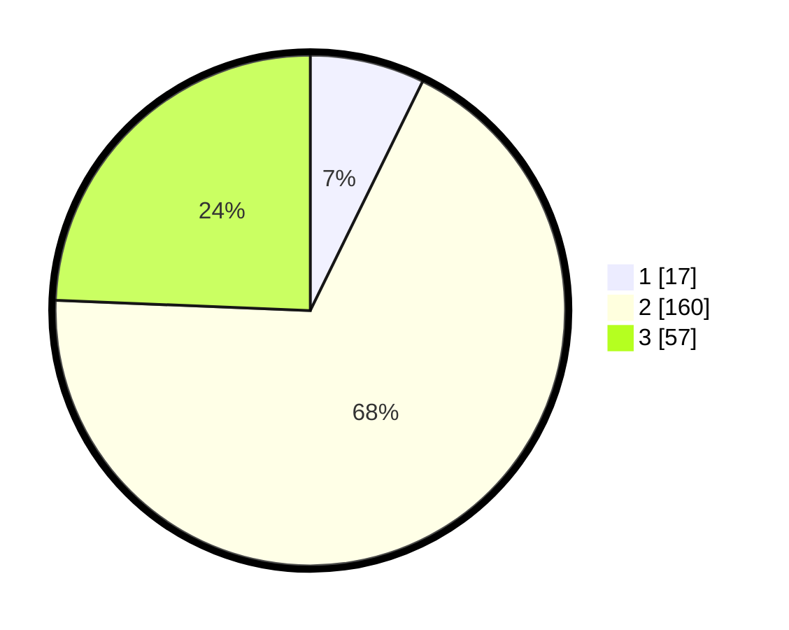

# Hasil

## Grafik

## Tabel

| No. | Nama Paslon    | Suara | Suara (raw) | Persentase |
|:--- |:-------------- | -----:| -----------:| ----------:|
| 1   | ANIES MUHAIMIN | 17    | [17][p-1]   | 7,26       |
| 2   | PRABOWO GIBRAN | 160   | [160][p-2]  | 68,38      |
| 3   | GANJAR MAHFUD  | 57    | [57][p-3]   | 24,36      |

[p-1]: https://github.com/gigit-pemilu/pemilu-2024/blob/main/pilpres/hitung-suara/sub/35-jawa-timur/sub/78-kota-surabaya/sub/20-wiyung/sub/1001-wiyung/sub/001-tps/sub/paslon-1.txt
[p-2]: https://github.com/gigit-pemilu/pemilu-2024/blob/main/pilpres/hitung-suara/sub/35-jawa-timur/sub/78-kota-surabaya/sub/20-wiyung/sub/1001-wiyung/sub/001-tps/sub/paslon-2.txt
[p-3]: https://github.com/gigit-pemilu/pemilu-2024/blob/main/pilpres/hitung-suara/sub/35-jawa-timur/sub/78-kota-surabaya/sub/20-wiyung/sub/1001-wiyung/sub/001-tps/sub/paslon-3.txt

## Foto C Plano

https://sirekap-obj-formc.kpu.go.id/9847/pemilu/ppwp/35/78/20/10/01/3578201001001-20240219-110923--7c3a93e4-a29f-4377-9db1-ca516b400d9a.jpg

https://sirekap-obj-formc.kpu.go.id/9847/pemilu/ppwp/35/78/20/10/01/3578201001001-20240215-012859--38403f71-7e96-4b5e-882a-1aef0df780e3.jpg

https://sirekap-obj-formc.kpu.go.id/9847/pemilu/ppwp/35/78/20/10/01/3578201001001-20240215-012934--9320d807-8bf1-419c-ad07-69107b60b748.jpg

## Metadata

| Key        | Value               |
| ---------- | ------------------- |
| Time Stamp | 2024-02-19 12:00:00 |

