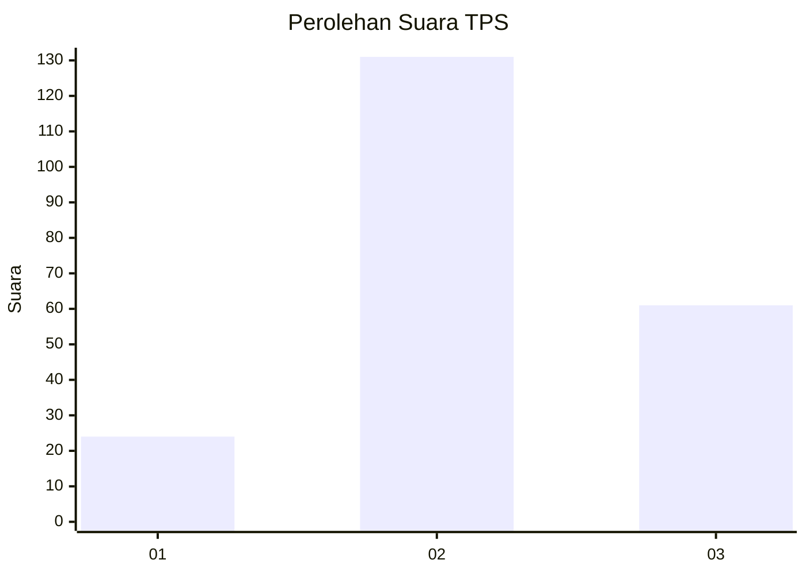
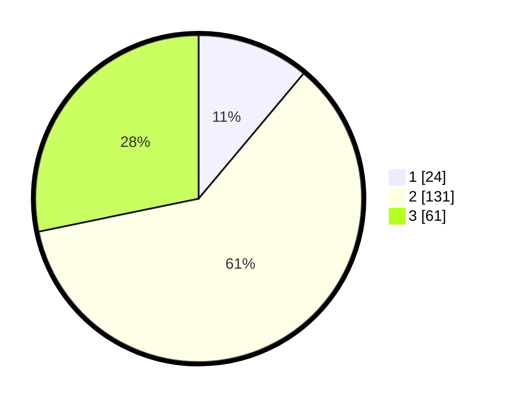

# Hasil

## Grafik

## Tabel

| No. | Nama Paslon    | Suara | Suara (raw) | Persentase |
|:--- |:-------------- | -----:| -----------:| ----------:|
| 1   | ANIES MUHAIMIN | 24    | [24][p-1]   | 11,11      |
| 2   | PRABOWO GIBRAN | 131   | [131][p-2]  | 60,65      |
| 3   | GANJAR MAHFUD  | 61    | [61][p-3]   | 28,24      |

[p-1]: https://github.com/gigit-pemilu/pemilu-2024-35-jawa-timur/blob/main/pilpres/hitung-suara/sub/35-jawa-timur/sub/78-kota-surabaya/sub/20-wiyung/sub/1001-wiyung/sub/003-tps/sub/paslon-1.txt
[p-2]: https://github.com/gigit-pemilu/pemilu-2024-35-jawa-timur/blob/main/pilpres/hitung-suara/sub/35-jawa-timur/sub/78-kota-surabaya/sub/20-wiyung/sub/1001-wiyung/sub/003-tps/sub/paslon-2.txt
[p-3]: https://github.com/gigit-pemilu/pemilu-2024-35-jawa-timur/blob/main/pilpres/hitung-suara/sub/35-jawa-timur/sub/78-kota-surabaya/sub/20-wiyung/sub/1001-wiyung/sub/003-tps/sub/paslon-3.txt

## Foto C Plano

https://sirekap-obj-formc.kpu.go.id/aed0/pemilu/ppwp/35/78/20/10/01/3578201001003-20240215-022119--c92d5a47-6356-40ed-86ad-35aa111c3a6a.jpg

https://sirekap-obj-formc.kpu.go.id/aed0/pemilu/ppwp/35/78/20/10/01/3578201001003-20240215-022323--e6305d9e-b3ef-404c-89d4-54f5dc791e38.jpg

https://sirekap-obj-formc.kpu.go.id/aed0/pemilu/ppwp/35/78/20/10/01/3578201001003-20240215-022353--b32e83e6-d467-4b79-bd53-c5d985a0d549.jpg

## Metadata

| Key        | Value               |
| ---------- | ------------------- |
| Time Stamp | 2024-02-19 06:16:00 |

