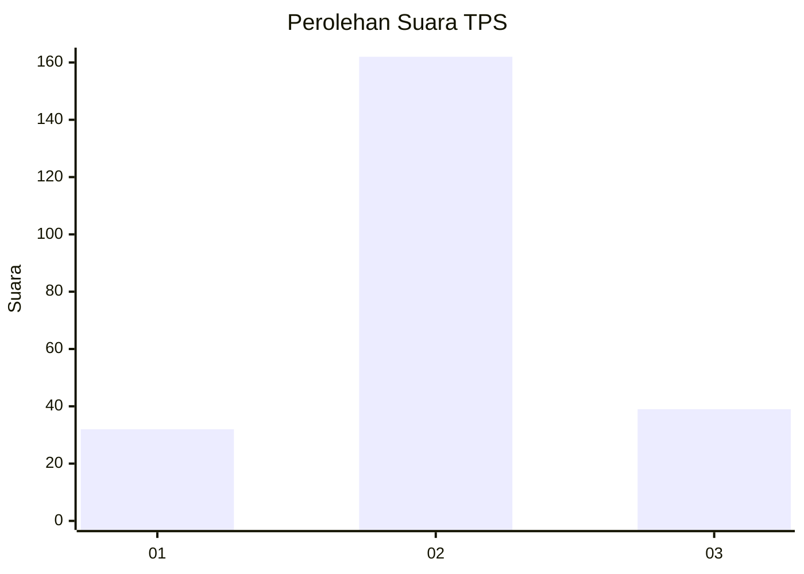
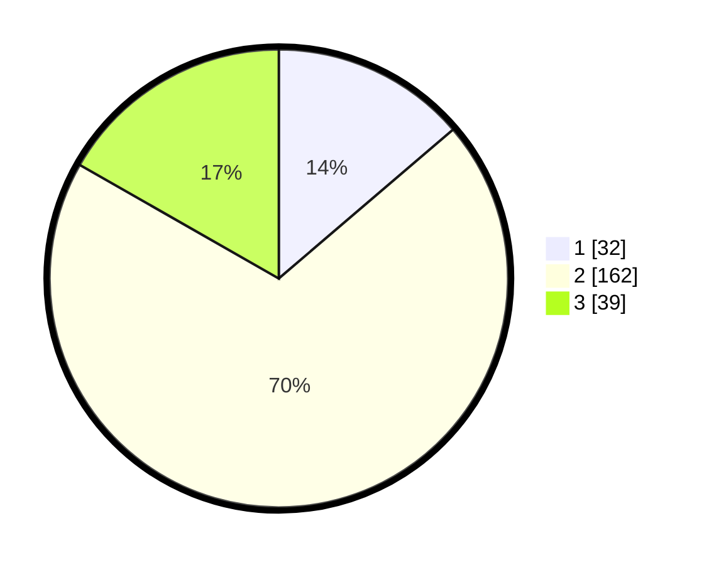

# Hasil

## Grafik

## Tabel

| No. | Nama Paslon    | Suara | Suara (raw) | Persentase |
|:--- |:-------------- | -----:| -----------:| ----------:|
| 1   | ANIES MUHAIMIN | 32    | [32][p-1]   | 13,73      |
| 2   | PRABOWO GIBRAN | 162   | [162][p-2]  | 69,53      |
| 3   | GANJAR MAHFUD  | 39    | [39][p-3]   | 16,74      |

[p-1]: https://github.com/gigit-pemilu/pemilu-2024/blob/main/pilpres/hitung-suara/sub/35-jawa-timur/sub/78-kota-surabaya/sub/20-wiyung/sub/1001-wiyung/sub/006-tps/sub/paslon-1.txt
[p-2]: https://github.com/gigit-pemilu/pemilu-2024/blob/main/pilpres/hitung-suara/sub/35-jawa-timur/sub/78-kota-surabaya/sub/20-wiyung/sub/1001-wiyung/sub/006-tps/sub/paslon-2.txt
[p-3]: https://github.com/gigit-pemilu/pemilu-2024/blob/main/pilpres/hitung-suara/sub/35-jawa-timur/sub/78-kota-surabaya/sub/20-wiyung/sub/1001-wiyung/sub/006-tps/sub/paslon-3.txt

## Foto C Plano

https://sirekap-obj-formc.kpu.go.id/5c0c/pemilu/ppwp/35/78/20/10/01/3578201001006-20240215-032455--cbd1f1d7-1d08-4f19-8b76-7d151f5c0474.jpg

https://sirekap-obj-formc.kpu.go.id/5c0c/pemilu/ppwp/35/78/20/10/01/3578201001006-20240214-230940--9858c80c-f41d-4042-b542-05c79e578fd7.jpg

https://sirekap-obj-formc.kpu.go.id/5c0c/pemilu/ppwp/35/78/20/10/01/3578201001006-20240215-032556--641c87f9-0dfc-4f05-a49d-60b4f73ecb96.jpg

## Metadata

| Key        | Value               |
| ---------- | ------------------- |
| Time Stamp | 2024-02-25 16:00:00 |

