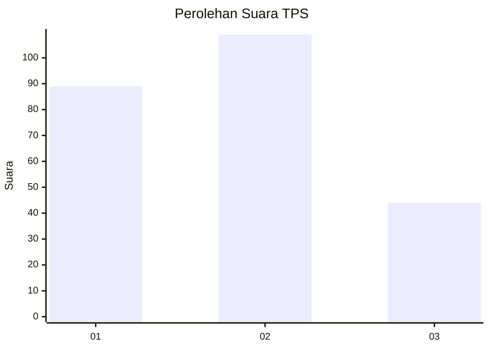
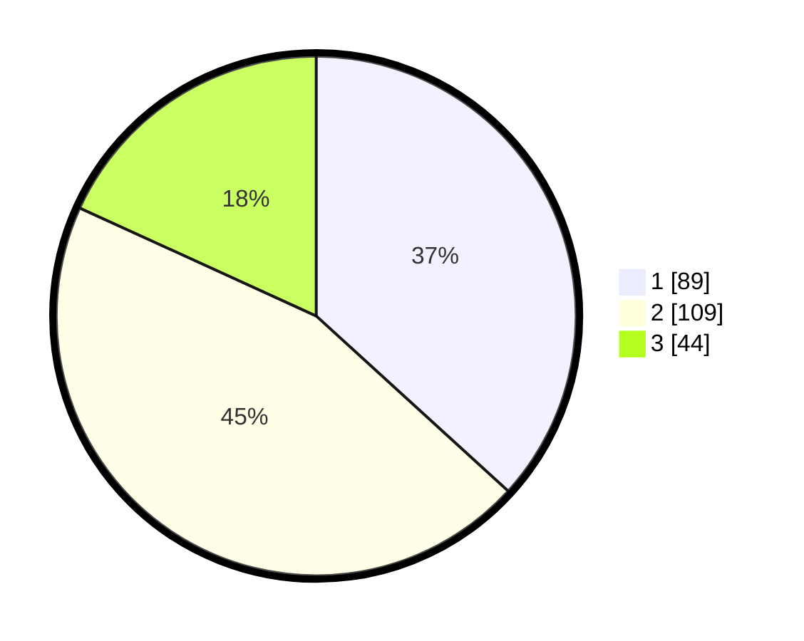

# Hasil

## Grafik

## Tabel

| No. | Nama Paslon    | Suara | Suara (raw) | Persentase |
|:--- |:-------------- | -----:| -----------:| ----------:|
| 1   | ANIES MUHAIMIN | 89    | [89][p-1]   | 36,78      |
| 2   | PRABOWO GIBRAN | 109   | [109][p-2]  | 45,04      |
| 3   | GANJAR MAHFUD  | 44    | [44][p-3]   | 18,18      |

[p-1]: https://github.com/gigit-pemilu/pemilu-2024/blob/main/pilpres/hitung-suara/sub/35-jawa-timur/sub/78-kota-surabaya/sub/20-wiyung/sub/1001-wiyung/sub/030-tps/sub/paslon-1.txt
[p-2]: https://github.com/gigit-pemilu/pemilu-2024/blob/main/pilpres/hitung-suara/sub/35-jawa-timur/sub/78-kota-surabaya/sub/20-wiyung/sub/1001-wiyung/sub/030-tps/sub/paslon-2.txt
[p-3]: https://github.com/gigit-pemilu/pemilu-2024/blob/main/pilpres/hitung-suara/sub/35-jawa-timur/sub/78-kota-surabaya/sub/20-wiyung/sub/1001-wiyung/sub/030-tps/sub/paslon-3.txt

## Foto C Plano

https://sirekap-obj-formc.kpu.go.id/8ee2/pemilu/ppwp/35/78/20/10/01/3578201001030-20240215-035931--d1587ed0-b321-497c-8394-6fa9f059c64e.jpg

https://sirekap-obj-formc.kpu.go.id/8ee2/pemilu/ppwp/35/78/20/10/01/3578201001030-20240215-040114--71ceff03-0e26-4e67-9999-77dd30b5a417.jpg

https://sirekap-obj-formc.kpu.go.id/8ee2/pemilu/ppwp/35/78/20/10/01/3578201001030-20240215-035833--98f4d582-fdc9-42b9-8274-b41506e072c3.jpg

## Metadata

| Key        | Value               |
| ---------- | ------------------- |
| Time Stamp | 2024-02-24 22:31:28 |

