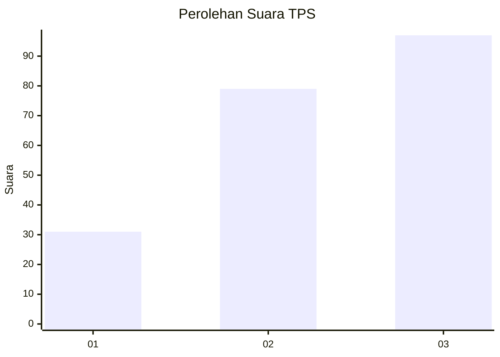
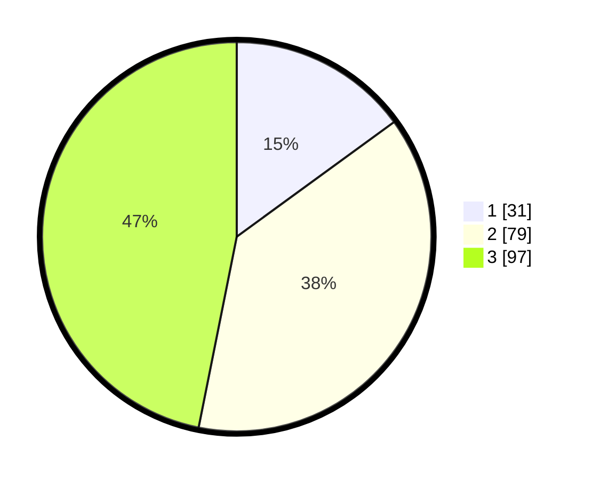

# Hasil

## Grafik

## Tabel

| No. | Nama Paslon    | Suara | Suara (raw) | Persentase |
|:--- |:-------------- | -----:| -----------:| ----------:|
| 1   | ANIES MUHAIMIN | 31    | [31][p-1]   | 14,98      |
| 2   | PRABOWO GIBRAN | 79    | [79][p-2]   | 38,16      |
| 3   | GANJAR MAHFUD  | 97    | [97][p-3]   | 46,86      |

[p-1]: https://github.com/gigit-pemilu/pemilu-2024-35-jawa-timur/blob/main/pilpres/hitung-suara/sub/35-jawa-timur/sub/78-kota-surabaya/sub/20-wiyung/sub/1001-wiyung/sub/043-tps/sub/paslon-1.txt
[p-2]: https://github.com/gigit-pemilu/pemilu-2024-35-jawa-timur/blob/main/pilpres/hitung-suara/sub/35-jawa-timur/sub/78-kota-surabaya/sub/20-wiyung/sub/1001-wiyung/sub/043-tps/sub/paslon-2.txt
[p-3]: https://github.com/gigit-pemilu/pemilu-2024-35-jawa-timur/blob/main/pilpres/hitung-suara/sub/35-jawa-timur/sub/78-kota-surabaya/sub/20-wiyung/sub/1001-wiyung/sub/043-tps/sub/paslon-3.txt

## Foto C Plano

https://sirekap-obj-formc.kpu.go.id/64e2/pemilu/ppwp/35/78/20/10/01/3578201001043-20240214-235516--4fb726da-7479-48a7-afa7-f4daf0014da3.jpg

https://sirekap-obj-formc.kpu.go.id/64e2/pemilu/ppwp/35/78/20/10/01/3578201001043-20240214-235809--82fc8eee-1a2c-4316-9c8a-1b4d3c8e6bd9.jpg

https://sirekap-obj-formc.kpu.go.id/64e2/pemilu/ppwp/35/78/20/10/01/3578201001043-20240214-235941--8078dc18-fa52-4dfb-8363-1dd4ed738b88.jpg

## Metadata

| Key        | Value               |
| ---------- | ------------------- |
| Time Stamp | 2024-02-19 06:16:00 |

