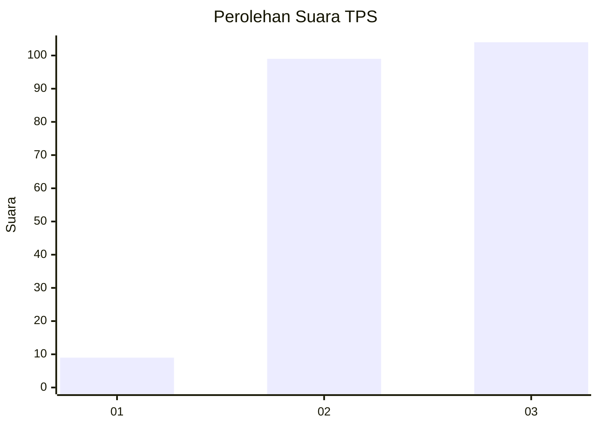
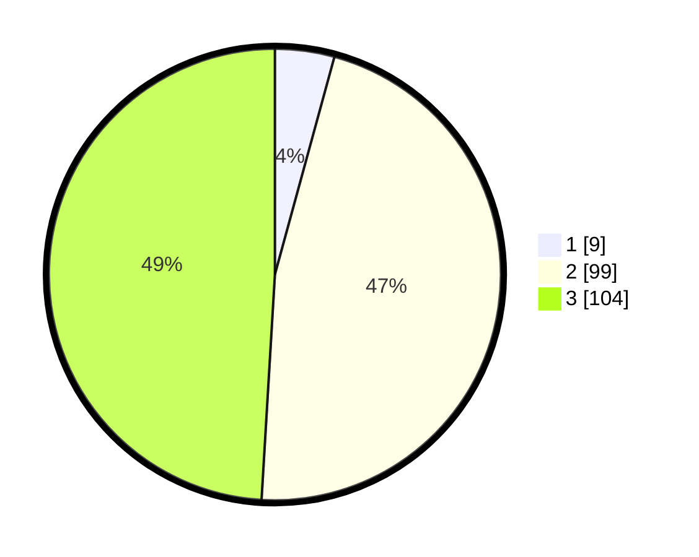

# Hasil

## Grafik

## Tabel

| No. | Nama Paslon    | Suara | Suara (raw) | Persentase |
|:--- |:-------------- | -----:| -----------:| ----------:|
| 1   | ANIES MUHAIMIN | 9     | [9][p-1]    | 4,25       |
| 2   | PRABOWO GIBRAN | 99    | [99][p-2]   | 46,70      |
| 3   | GANJAR MAHFUD  | 104   | [104][p-3]  | 49,06      |

[p-1]: https://github.com/gigit-pemilu/pemilu-2024-35-jawa-timur/blob/main/pilpres/hitung-suara/sub/35-jawa-timur/sub/78-kota-surabaya/sub/20-wiyung/sub/1001-wiyung/sub/046-tps/sub/paslon-1.txt
[p-2]: https://github.com/gigit-pemilu/pemilu-2024-35-jawa-timur/blob/main/pilpres/hitung-suara/sub/35-jawa-timur/sub/78-kota-surabaya/sub/20-wiyung/sub/1001-wiyung/sub/046-tps/sub/paslon-2.txt
[p-3]: https://github.com/gigit-pemilu/pemilu-2024-35-jawa-timur/blob/main/pilpres/hitung-suara/sub/35-jawa-timur/sub/78-kota-surabaya/sub/20-wiyung/sub/1001-wiyung/sub/046-tps/sub/paslon-3.txt

## Foto C Plano

https://sirekap-obj-formc.kpu.go.id/709c/pemilu/ppwp/35/78/20/10/01/3578201001046-20240218-162241--7b51a2d5-1420-4530-a276-a9f48a4f1619.jpg

https://sirekap-obj-formc.kpu.go.id/709c/pemilu/ppwp/35/78/20/10/01/3578201001046-20240218-162614--059ab699-83a3-44ad-a140-4068f95fab4a.jpg

https://sirekap-obj-formc.kpu.go.id/709c/pemilu/ppwp/35/78/20/10/01/3578201001046-20240218-162729--6ed92267-f50f-4534-a400-d022b7d2d72f.jpg

## Metadata

| Key        | Value               |
| ---------- | ------------------- |
| Time Stamp | 2024-02-19 12:00:00 |

