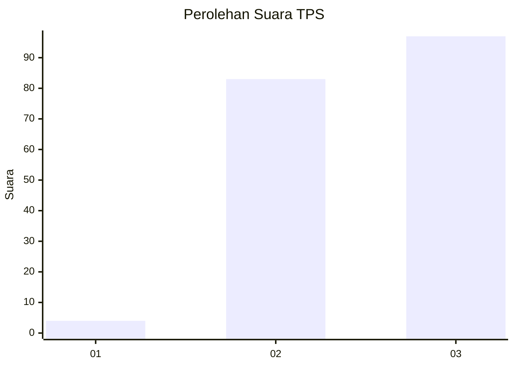
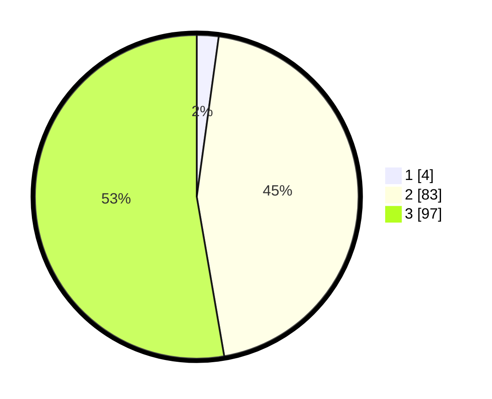

# Hasil

## Grafik

## Tabel

| No. | Nama Paslon    | Suara | Suara (raw) | Persentase |
|:--- |:-------------- | -----:| -----------:| ----------:|
| 1   | ANIES MUHAIMIN | 4     | [4][p-1]    | 2,17       |
| 2   | PRABOWO GIBRAN | 83    | [83][p-2]   | 45,11      |
| 3   | GANJAR MAHFUD  | 97    | [97][p-3]   | 52,72      |

[p-1]: https://github.com/gigit-pemilu/pemilu-2024/blob/main/pilpres/hitung-suara/sub/35-jawa-timur/sub/78-kota-surabaya/sub/20-wiyung/sub/1001-wiyung/sub/047-tps/sub/paslon-1.txt
[p-2]: https://github.com/gigit-pemilu/pemilu-2024/blob/main/pilpres/hitung-suara/sub/35-jawa-timur/sub/78-kota-surabaya/sub/20-wiyung/sub/1001-wiyung/sub/047-tps/sub/paslon-2.txt
[p-3]: https://github.com/gigit-pemilu/pemilu-2024/blob/main/pilpres/hitung-suara/sub/35-jawa-timur/sub/78-kota-surabaya/sub/20-wiyung/sub/1001-wiyung/sub/047-tps/sub/paslon-3.txt

## Foto C Plano

https://sirekap-obj-formc.kpu.go.id/49ec/pemilu/ppwp/35/78/20/10/01/3578201001047-20240215-004725--94d4bfba-1b86-4fd5-b8c2-23a4cc225332.jpg

https://sirekap-obj-formc.kpu.go.id/49ec/pemilu/ppwp/35/78/20/10/01/3578201001047-20240215-004812--98ab48ae-5b87-4238-9a97-7f56f4e06f6b.jpg

https://sirekap-obj-formc.kpu.go.id/49ec/pemilu/ppwp/35/78/20/10/01/3578201001047-20240215-004853--6a7187e0-8e2f-4d7a-8fab-477dd086886c.jpg

## Metadata

| Key        | Value               |
| ---------- | ------------------- |
| Time Stamp | 2024-02-24 22:31:28 |

