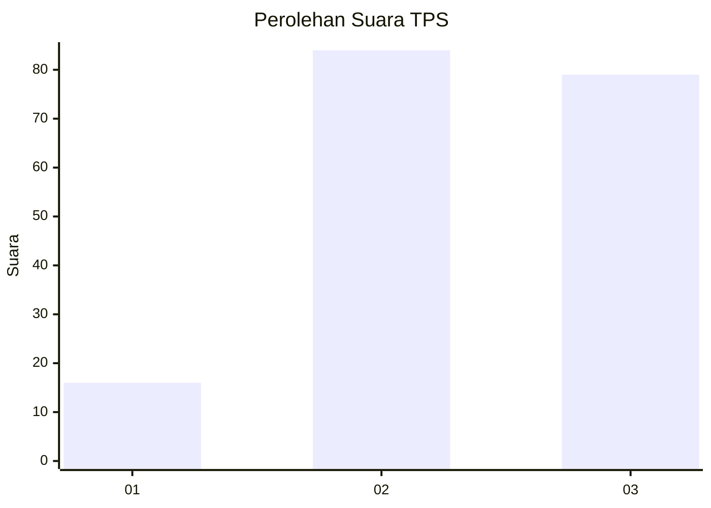
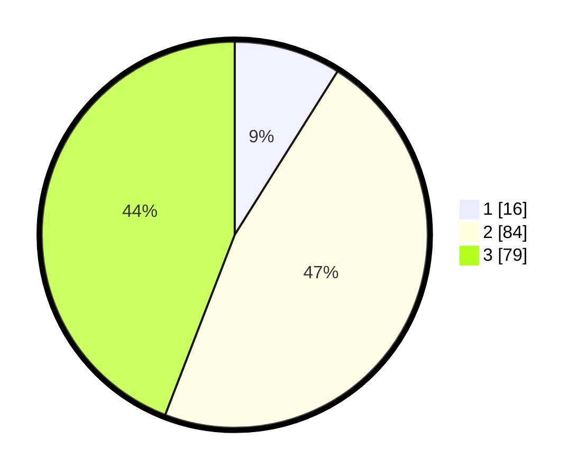

# Hasil

## Grafik

## Tabel

| No. | Nama Paslon    | Suara | Suara (raw) | Persentase |
|:--- |:-------------- | -----:| -----------:| ----------:|
| 1   | ANIES MUHAIMIN | 16    | [16][p-1]   | 8,94       |
| 2   | PRABOWO GIBRAN | 84    | [84][p-2]   | 46,93      |
| 3   | GANJAR MAHFUD  | 79    | [79][p-3]   | 44,13      |

[p-1]: https://github.com/gigit-pemilu/pemilu-2024/blob/main/pilpres/hitung-suara/sub/35-jawa-timur/sub/78-kota-surabaya/sub/20-wiyung/sub/1002-jajar-tunggal/sub/028-tps/sub/paslon-1.txt
[p-2]: https://github.com/gigit-pemilu/pemilu-2024/blob/main/pilpres/hitung-suara/sub/35-jawa-timur/sub/78-kota-surabaya/sub/20-wiyung/sub/1002-jajar-tunggal/sub/028-tps/sub/paslon-2.txt
[p-3]: https://github.com/gigit-pemilu/pemilu-2024/blob/main/pilpres/hitung-suara/sub/35-jawa-timur/sub/78-kota-surabaya/sub/20-wiyung/sub/1002-jajar-tunggal/sub/028-tps/sub/paslon-3.txt

## Foto C Plano

https://sirekap-obj-formc.kpu.go.id/00b7/pemilu/ppwp/35/78/20/10/02/3578201002028-20240214-201236--8ad39f9f-27fb-469f-b63a-96d968465615.jpg

https://sirekap-obj-formc.kpu.go.id/00b7/pemilu/ppwp/35/78/20/10/02/3578201002028-20240214-201308--4fe4584e-0483-48aa-985c-05481639e234.jpg

https://sirekap-obj-formc.kpu.go.id/00b7/pemilu/ppwp/35/78/20/10/02/3578201002028-20240214-201325--7460f845-6dbd-496d-9f7d-8c91f0b9c5a1.jpg

## Metadata

| Key        | Value               |
| ---------- | ------------------- |
| Time Stamp | 2024-02-19 06:16:00 |

