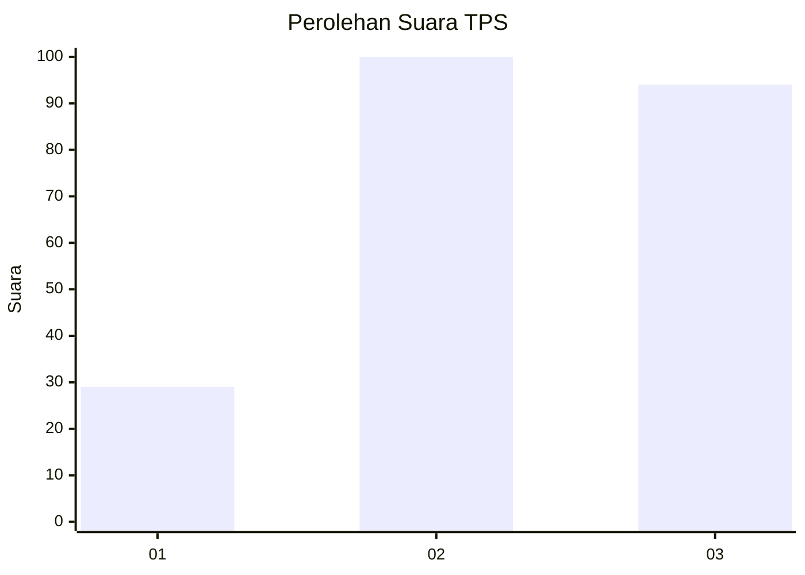
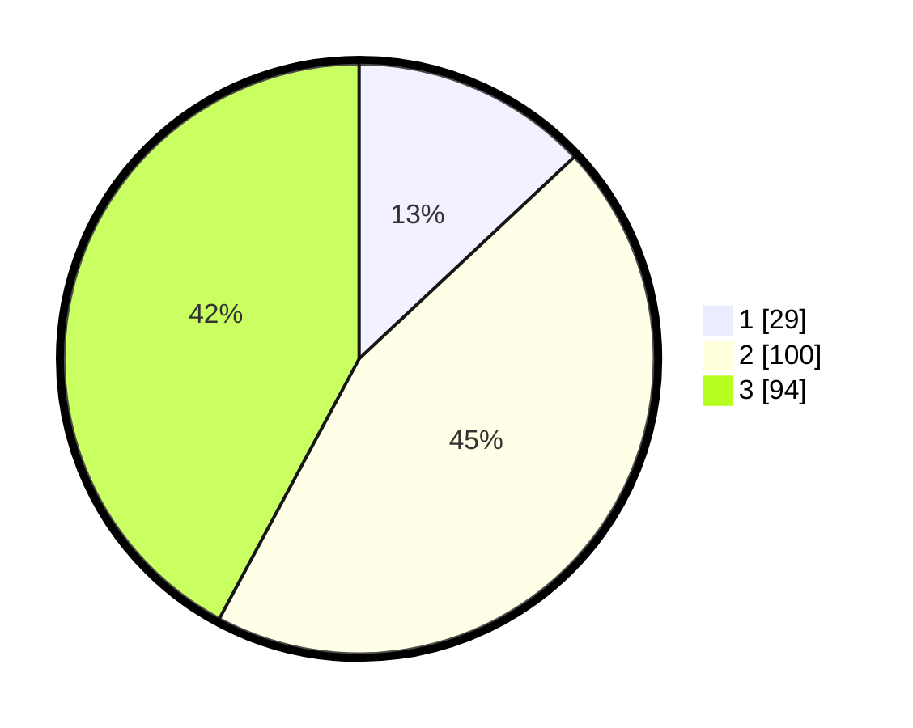

# Hasil

## Grafik

## Tabel

| No. | Nama Paslon    | Suara | Suara (raw) | Persentase |
|:--- |:-------------- | -----:| -----------:| ----------:|
| 1   | ANIES MUHAIMIN | 29    | [29][p-1]   | 13,00      |
| 2   | PRABOWO GIBRAN | 100   | [100][p-2]  | 44,84      |
| 3   | GANJAR MAHFUD  | 94    | [94][p-3]   | 42,15      |

[p-1]: https://github.com/gigit-pemilu/pemilu-2024/blob/main/pilpres/hitung-suara/sub/35-jawa-timur/sub/78-kota-surabaya/sub/20-wiyung/sub/1003-babatan/sub/060-tps/sub/paslon-1.txt
[p-2]: https://github.com/gigit-pemilu/pemilu-2024/blob/main/pilpres/hitung-suara/sub/35-jawa-timur/sub/78-kota-surabaya/sub/20-wiyung/sub/1003-babatan/sub/060-tps/sub/paslon-2.txt
[p-3]: https://github.com/gigit-pemilu/pemilu-2024/blob/main/pilpres/hitung-suara/sub/35-jawa-timur/sub/78-kota-surabaya/sub/20-wiyung/sub/1003-babatan/sub/060-tps/sub/paslon-3.txt

## Foto C Plano

https://sirekap-obj-formc.kpu.go.id/2f66/pemilu/ppwp/35/78/20/10/03/3578201003060-20240215-024521--bc33eb3d-6ffc-471b-ae3a-9f6256ffaa7c.jpg

https://sirekap-obj-formc.kpu.go.id/2f66/pemilu/ppwp/35/78/20/10/03/3578201003060-20240215-024609--ecc346b2-9f8f-4504-8dad-0de8ad385651.jpg

https://sirekap-obj-formc.kpu.go.id/2f66/pemilu/ppwp/35/78/20/10/03/3578201003060-20240215-024638--30579b50-a91f-4b8a-b22d-95bc5d31b84c.jpg

## Metadata

| Key        | Value               |
| ---------- | ------------------- |
| Time Stamp | 2024-02-25 16:00:00 |

