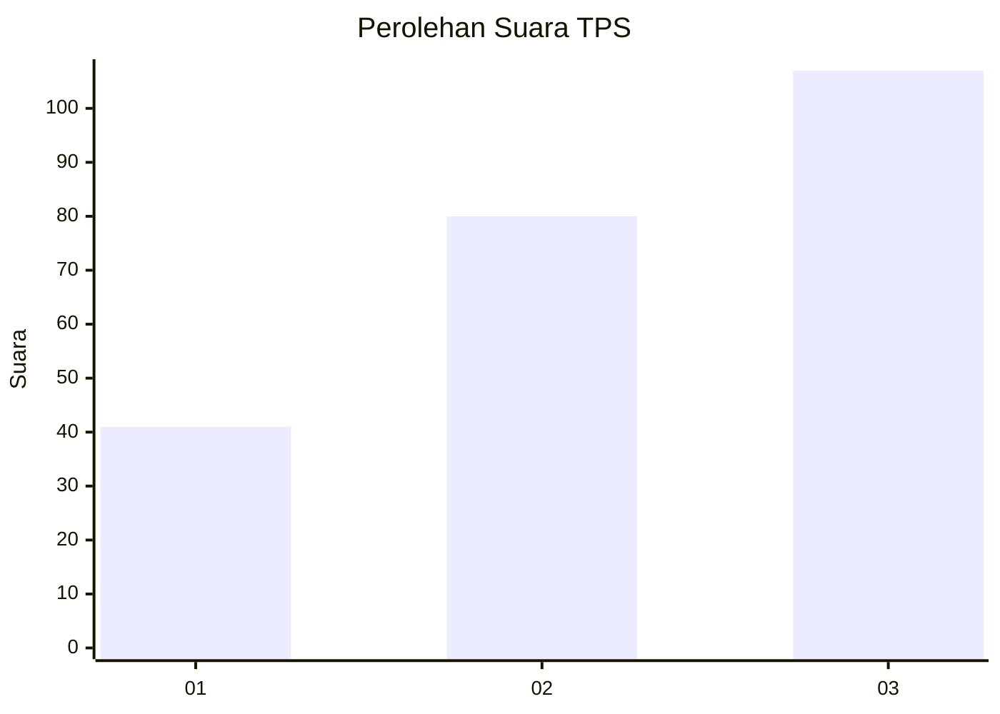
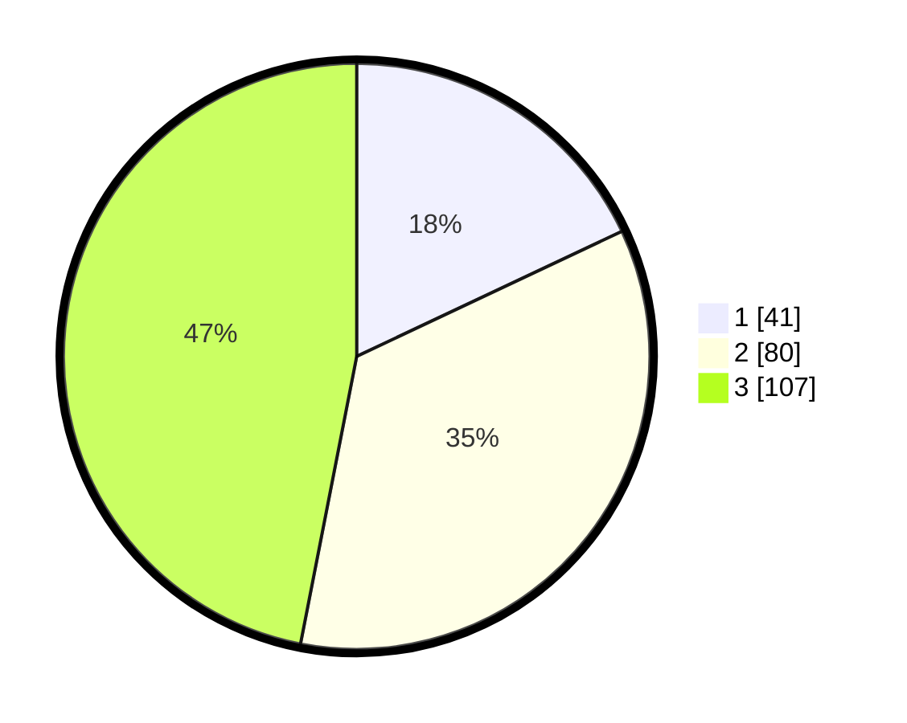

# Hasil

## Grafik

## Tabel

| No. | Nama Paslon    | Suara | Suara (raw) | Persentase |
|:--- |:-------------- | -----:| -----------:| ----------:|
| 1   | ANIES MUHAIMIN | 41    | [41][p-1]   | 17,98      |
| 2   | PRABOWO GIBRAN | 80    | [80][p-2]   | 35,09      |
| 3   | GANJAR MAHFUD  | 107   | [107][p-3]  | 46,93      |

[p-1]: https://github.com/gigit-pemilu/pemilu-2024-35-jawa-timur/blob/main/pilpres/hitung-suara/sub/35-jawa-timur/sub/78-kota-surabaya/sub/20-wiyung/sub/1003-babatan/sub/066-tps/sub/paslon-1.txt
[p-2]: https://github.com/gigit-pemilu/pemilu-2024-35-jawa-timur/blob/main/pilpres/hitung-suara/sub/35-jawa-timur/sub/78-kota-surabaya/sub/20-wiyung/sub/1003-babatan/sub/066-tps/sub/paslon-2.txt
[p-3]: https://github.com/gigit-pemilu/pemilu-2024-35-jawa-timur/blob/main/pilpres/hitung-suara/sub/35-jawa-timur/sub/78-kota-surabaya/sub/20-wiyung/sub/1003-babatan/sub/066-tps/sub/paslon-3.txt

## Foto C Plano

https://sirekap-obj-formc.kpu.go.id/1557/pemilu/ppwp/35/78/20/10/03/3578201003066-20240215-162326--6808ee3f-88d9-4349-a0bf-ef8b1593c113.jpg

https://sirekap-obj-formc.kpu.go.id/1557/pemilu/ppwp/35/78/20/10/03/3578201003066-20240215-162334--05cc0c7f-ec50-4617-a090-6fed0cdad5ac.jpg

https://sirekap-obj-formc.kpu.go.id/1557/pemilu/ppwp/35/78/20/10/03/3578201003066-20240215-162341--1f02da4c-5da4-45fa-9d9e-1fc6016ae517.jpg

## Metadata

| Key        | Value               |
| ---------- | ------------------- |
| Time Stamp | 2024-02-24 22:31:28 |

