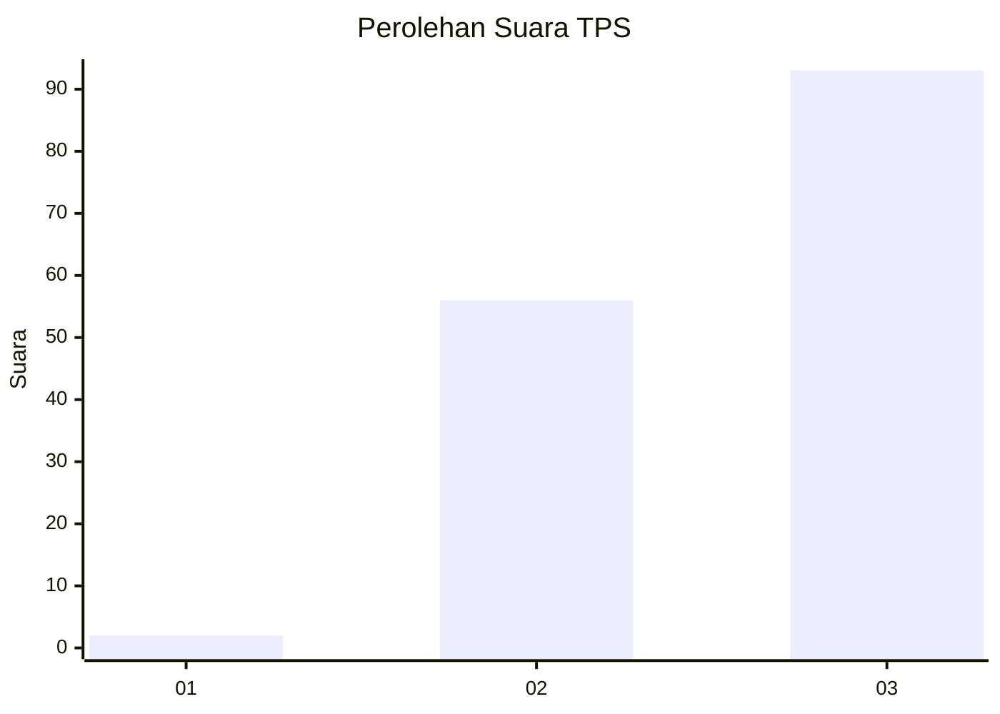
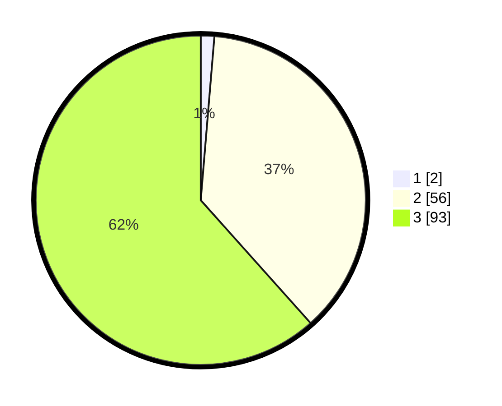

# Hasil

## Grafik

## Tabel

| No. | Nama Paslon    | Suara | Suara (raw) | Persentase |
|:--- |:-------------- | -----:| -----------:| ----------:|
| 1   | ANIES MUHAIMIN | 2     | [2][p-1]    | 1,32       |
| 2   | PRABOWO GIBRAN | 56    | [56][p-2]   | 37,09      |
| 3   | GANJAR MAHFUD  | 93    | [93][p-3]   | 61,59      |

[p-1]: https://github.com/gigit-pemilu/pemilu-2024-35-jawa-timur/blob/main/pilpres/hitung-suara/sub/35-jawa-timur/sub/78-kota-surabaya/sub/20-wiyung/sub/1003-babatan/sub/073-tps/sub/paslon-1.txt
[p-2]: https://github.com/gigit-pemilu/pemilu-2024-35-jawa-timur/blob/main/pilpres/hitung-suara/sub/35-jawa-timur/sub/78-kota-surabaya/sub/20-wiyung/sub/1003-babatan/sub/073-tps/sub/paslon-2.txt
[p-3]: https://github.com/gigit-pemilu/pemilu-2024-35-jawa-timur/blob/main/pilpres/hitung-suara/sub/35-jawa-timur/sub/78-kota-surabaya/sub/20-wiyung/sub/1003-babatan/sub/073-tps/sub/paslon-3.txt

## Foto C Plano

https://sirekap-obj-formc.kpu.go.id/36ce/pemilu/ppwp/35/78/20/10/03/3578201003073-20240214-210916--20d6ec08-ef4b-4d17-878b-489704884212.jpg

https://sirekap-obj-formc.kpu.go.id/36ce/pemilu/ppwp/35/78/20/10/03/3578201003073-20240214-210955--c7801626-a397-443a-b11f-6b086013f44a.jpg

https://sirekap-obj-formc.kpu.go.id/36ce/pemilu/ppwp/35/78/20/10/03/3578201003073-20240214-211027--9804e017-c6e5-4f0c-8d4b-2b796ef4e63d.jpg

## Metadata

| Key        | Value               |
| ---------- | ------------------- |
| Time Stamp | 2024-02-19 06:16:00 |

