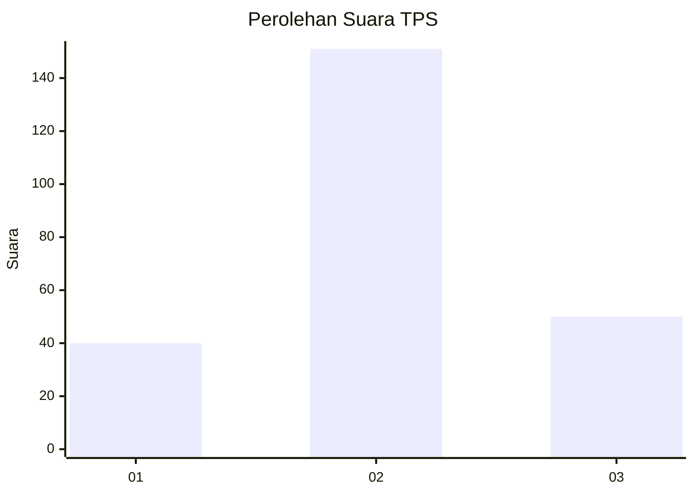
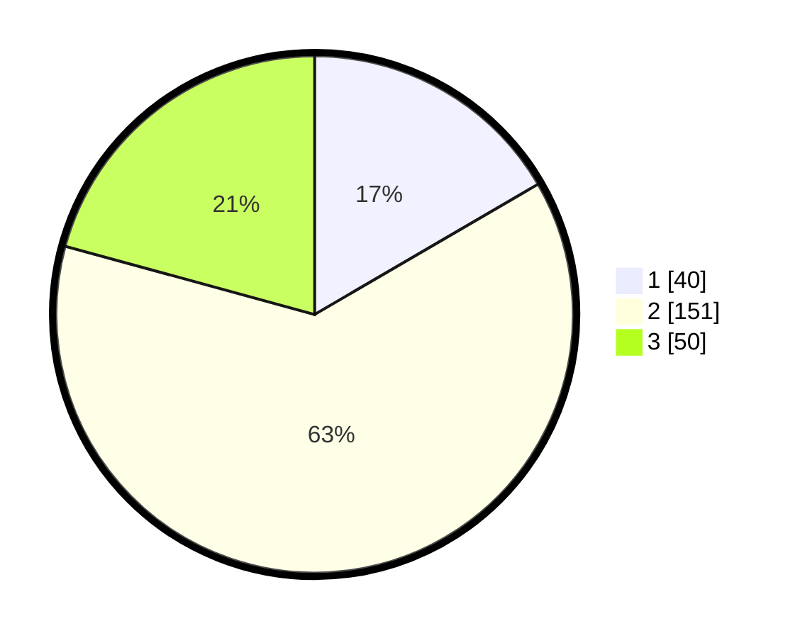

# Hasil

## Grafik

## Tabel

| No. | Nama Paslon    | Suara | Suara (raw) | Persentase |
|:--- |:-------------- | -----:| -----------:| ----------:|
| 1   | ANIES MUHAIMIN | 40    | [40][p-1]   | 16,60      |
| 2   | PRABOWO GIBRAN | 151   | [151][p-2]  | 62,66      |
| 3   | GANJAR MAHFUD  | 50    | [50][p-3]   | 20,75      |

[p-1]: https://github.com/gigit-pemilu/pemilu-2024/blob/main/pilpres/hitung-suara/sub/35-jawa-timur/sub/78-kota-surabaya/sub/20-wiyung/sub/1004-balas-klumprik/sub/001-tps/sub/paslon-1.txt
[p-2]: https://github.com/gigit-pemilu/pemilu-2024/blob/main/pilpres/hitung-suara/sub/35-jawa-timur/sub/78-kota-surabaya/sub/20-wiyung/sub/1004-balas-klumprik/sub/001-tps/sub/paslon-2.txt
[p-3]: https://github.com/gigit-pemilu/pemilu-2024/blob/main/pilpres/hitung-suara/sub/35-jawa-timur/sub/78-kota-surabaya/sub/20-wiyung/sub/1004-balas-klumprik/sub/001-tps/sub/paslon-3.txt

## Foto C Plano

https://sirekap-obj-formc.kpu.go.id/e089/pemilu/ppwp/35/78/20/10/04/3578201004001-20240219-113301--4084f651-a8ed-4e1f-a7b4-8df834433e28.jpg

https://sirekap-obj-formc.kpu.go.id/e089/pemilu/ppwp/35/78/20/10/04/3578201004001-20240219-113613--950ce8ec-ffc7-418b-95f8-356b4aa109af.jpg

https://sirekap-obj-formc.kpu.go.id/e089/pemilu/ppwp/35/78/20/10/04/3578201004001-20240219-113712--7b80485a-0c3a-4bab-9e57-9869834ee516.jpg

## Metadata

| Key        | Value               |
| ---------- | ------------------- |
| Time Stamp | 2024-02-19 12:00:00 |

