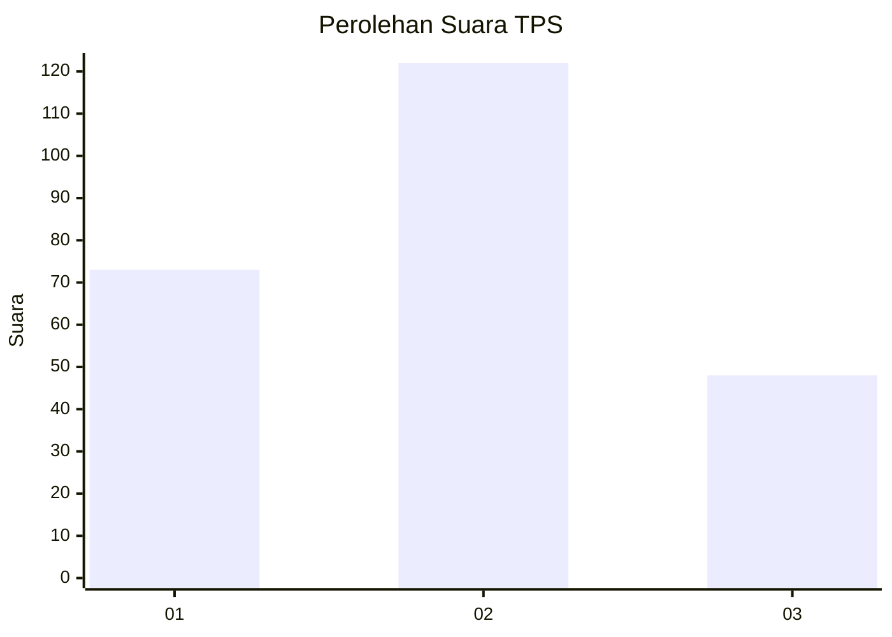
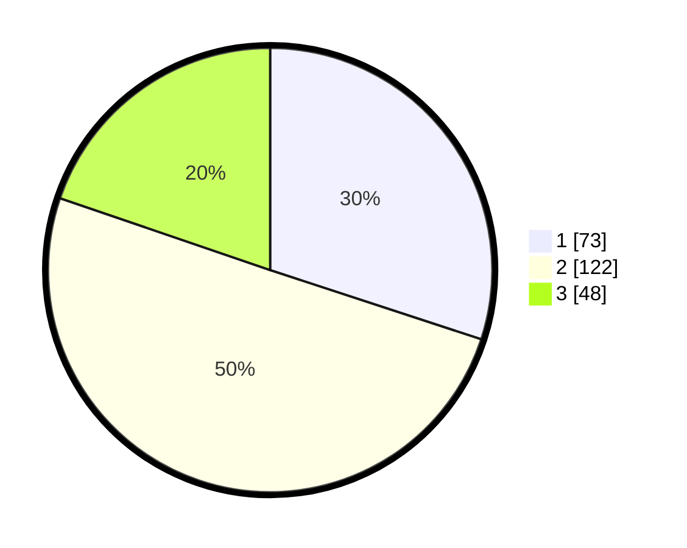

# Hasil

## Grafik

## Tabel

| No. | Nama Paslon    | Suara | Suara (raw) | Persentase |
|:--- |:-------------- | -----:| -----------:| ----------:|
| 1   | ANIES MUHAIMIN | 73    | [73][p-1]   | 30,04      |
| 2   | PRABOWO GIBRAN | 122   | [122][p-2]  | 50,21      |
| 3   | GANJAR MAHFUD  | 48    | [48][p-3]   | 19,75      |

[p-1]: https://github.com/gigit-pemilu/pemilu-2024-35-jawa-timur/blob/main/pilpres/hitung-suara/sub/35-jawa-timur/sub/78-kota-surabaya/sub/20-wiyung/sub/1004-balas-klumprik/sub/025-tps/sub/paslon-1.txt
[p-2]: https://github.com/gigit-pemilu/pemilu-2024-35-jawa-timur/blob/main/pilpres/hitung-suara/sub/35-jawa-timur/sub/78-kota-surabaya/sub/20-wiyung/sub/1004-balas-klumprik/sub/025-tps/sub/paslon-2.txt
[p-3]: https://github.com/gigit-pemilu/pemilu-2024-35-jawa-timur/blob/main/pilpres/hitung-suara/sub/35-jawa-timur/sub/78-kota-surabaya/sub/20-wiyung/sub/1004-balas-klumprik/sub/025-tps/sub/paslon-3.txt

## Foto C Plano

https://sirekap-obj-formc.kpu.go.id/50e7/pemilu/ppwp/35/78/20/10/04/3578201004025-20240215-025246--51dd4c70-74f0-4de8-a80e-3d3b9f24fe2d.jpg

https://sirekap-obj-formc.kpu.go.id/50e7/pemilu/ppwp/35/78/20/10/04/3578201004025-20240215-025248--b26b6724-4790-48d4-922f-255ed8e33aee.jpg

https://sirekap-obj-formc.kpu.go.id/50e7/pemilu/ppwp/35/78/20/10/04/3578201004025-20240215-025251--77689d4b-94a8-4b81-bd81-516f56029060.jpg

## Metadata

| Key        | Value               |
| ---------- | ------------------- |
| Time Stamp | 2024-02-25 15:00:00 |

