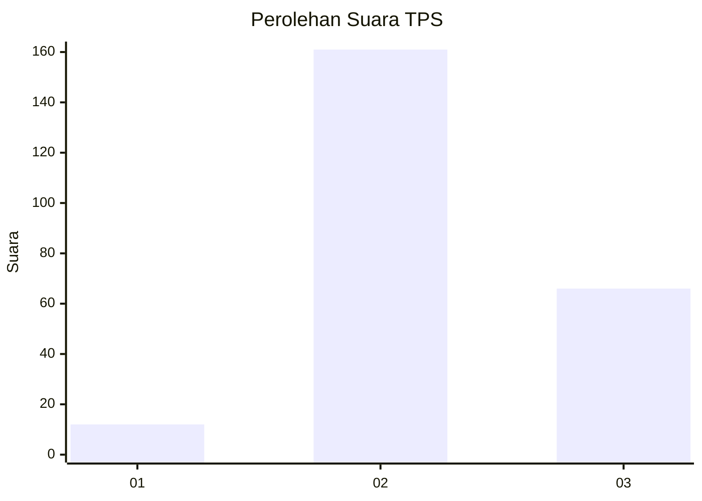
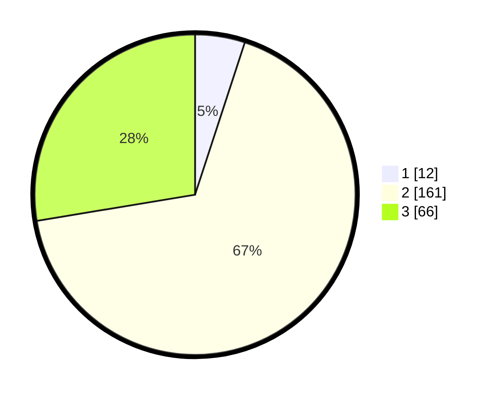

# Hasil

## Grafik

## Tabel

| No. | Nama Paslon    | Suara | Suara (raw) | Persentase |
|:--- |:-------------- | -----:| -----------:| ----------:|
| 1   | ANIES MUHAIMIN | 12    | [12][p-1]   | 5,02       |
| 2   | PRABOWO GIBRAN | 161   | [161][p-2]  | 67,36      |
| 3   | GANJAR MAHFUD  | 66    | [66][p-3]   | 27,62      |

[p-1]: https://github.com/gigit-pemilu/pemilu-2024-35-jawa-timur/blob/main/pilpres/hitung-suara/sub/35-jawa-timur/sub/78-kota-surabaya/sub/21-dukuh-pakis/sub/1001-dukuh-pakis/sub/006-tps/sub/paslon-1.txt
[p-2]: https://github.com/gigit-pemilu/pemilu-2024-35-jawa-timur/blob/main/pilpres/hitung-suara/sub/35-jawa-timur/sub/78-kota-surabaya/sub/21-dukuh-pakis/sub/1001-dukuh-pakis/sub/006-tps/sub/paslon-2.txt
[p-3]: https://github.com/gigit-pemilu/pemilu-2024-35-jawa-timur/blob/main/pilpres/hitung-suara/sub/35-jawa-timur/sub/78-kota-surabaya/sub/21-dukuh-pakis/sub/1001-dukuh-pakis/sub/006-tps/sub/paslon-3.txt

## Foto C Plano

https://sirekap-obj-formc.kpu.go.id/0c74/pemilu/ppwp/35/78/21/10/01/3578211001006-20240221-195829--40489468-6e01-4f55-ad10-112bc1ecd62b.jpg

https://sirekap-obj-formc.kpu.go.id/0c74/pemilu/ppwp/35/78/21/10/01/3578211001006-20240220-195121--0e87ce38-0b2a-4f2b-8f54-6b1d5e3fe16b.jpg

https://sirekap-obj-formc.kpu.go.id/0c74/pemilu/ppwp/35/78/21/10/01/3578211001006-20240220-195244--03f965b1-a3d9-4b42-9aaf-1474f1323d01.jpg

## Metadata

| Key        | Value               |
| ---------- | ------------------- |
| Time Stamp | 2024-02-24 22:31:28 |

