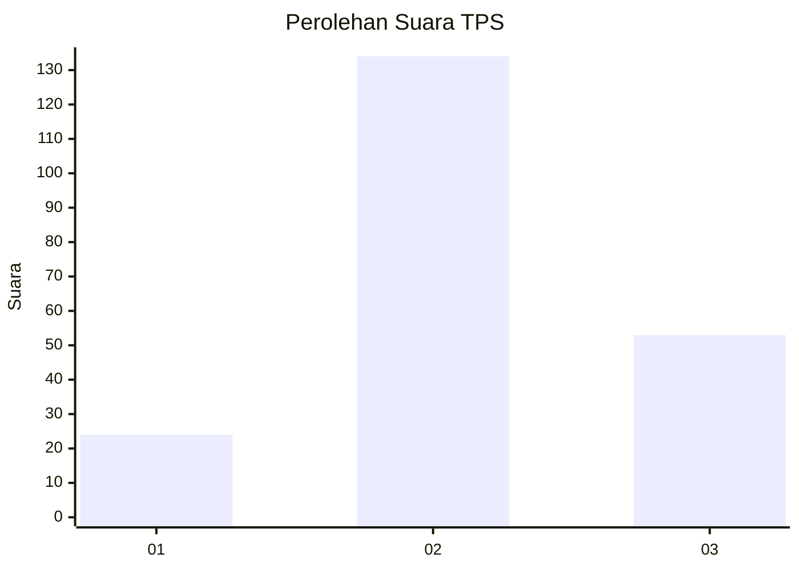
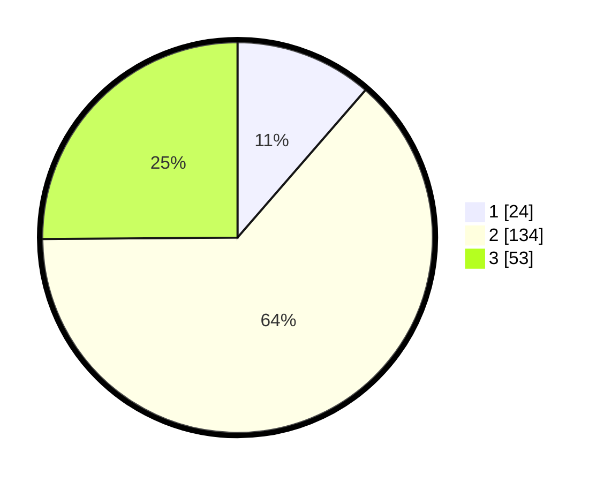

# Hasil

## Grafik

## Tabel

| No. | Nama Paslon    | Suara | Suara (raw) | Persentase |
|:--- |:-------------- | -----:| -----------:| ----------:|
| 1   | ANIES MUHAIMIN | 24    | [24][p-1]   | 11,37      |
| 2   | PRABOWO GIBRAN | 134   | [134][p-2]  | 63,51      |
| 3   | GANJAR MAHFUD  | 53    | [53][p-3]   | 25,12      |

[p-1]: https://github.com/gigit-pemilu/pemilu-2024/blob/main/pilpres/hitung-suara/sub/35-jawa-timur/sub/78-kota-surabaya/sub/21-dukuh-pakis/sub/1002-dukuh-kupang/sub/003-tps/sub/paslon-1.txt
[p-2]: https://github.com/gigit-pemilu/pemilu-2024/blob/main/pilpres/hitung-suara/sub/35-jawa-timur/sub/78-kota-surabaya/sub/21-dukuh-pakis/sub/1002-dukuh-kupang/sub/003-tps/sub/paslon-2.txt
[p-3]: https://github.com/gigit-pemilu/pemilu-2024/blob/main/pilpres/hitung-suara/sub/35-jawa-timur/sub/78-kota-surabaya/sub/21-dukuh-pakis/sub/1002-dukuh-kupang/sub/003-tps/sub/paslon-3.txt

## Foto C Plano

https://sirekap-obj-formc.kpu.go.id/0abd/pemilu/ppwp/35/78/21/10/02/3578211002003-20240218-201404--6b8f820b-b131-41a0-a197-24f886e4b47b.jpg

https://sirekap-obj-formc.kpu.go.id/0abd/pemilu/ppwp/35/78/21/10/02/3578211002003-20240218-201550--863a9868-001d-4bd4-94b4-3a2ab634a692.jpg

https://sirekap-obj-formc.kpu.go.id/0abd/pemilu/ppwp/35/78/21/10/02/3578211002003-20240218-201722--8e0b6f47-cfcc-482c-97d4-53e6c2e55bcf.jpg

## Metadata

| Key        | Value               |
| ---------- | ------------------- |
| Time Stamp | 2024-02-25 16:00:00 |

