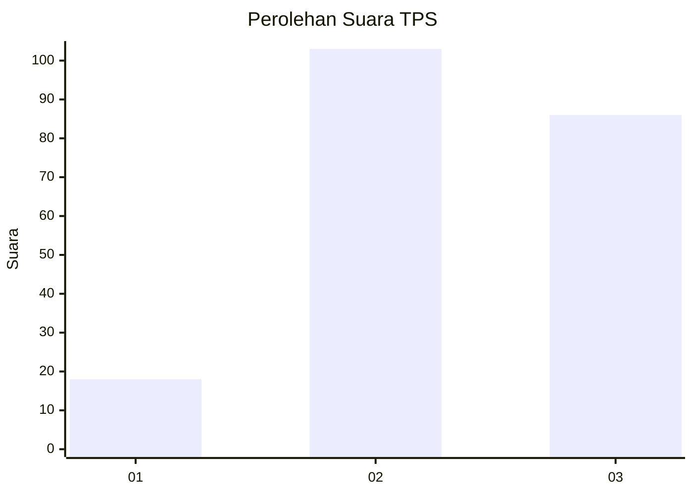
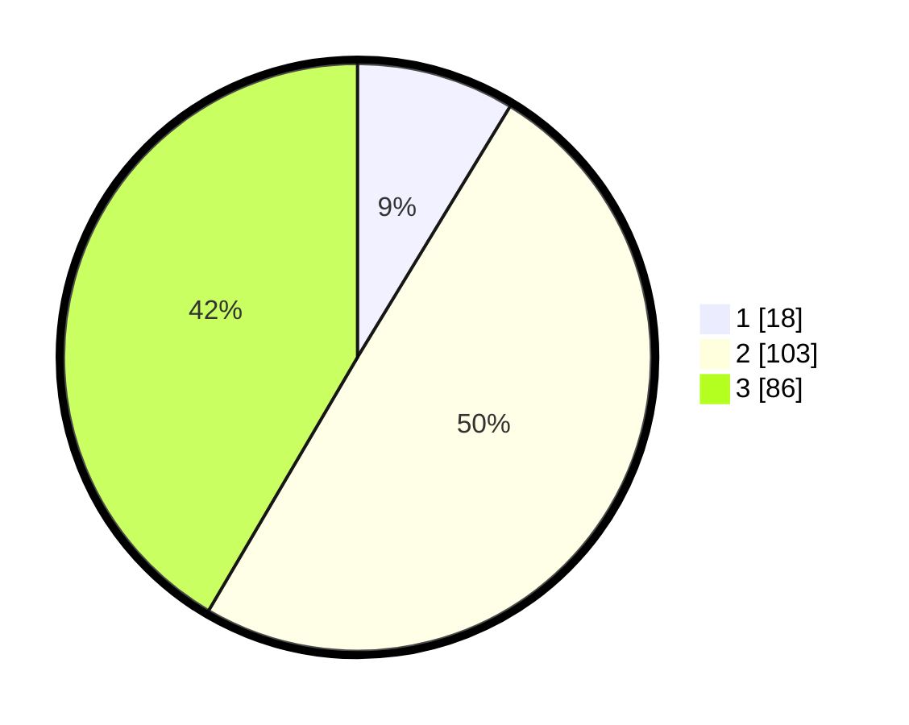

# Hasil

## Grafik

## Tabel

| No. | Nama Paslon    | Suara | Suara (raw) | Persentase |
|:--- |:-------------- | -----:| -----------:| ----------:|
| 1   | ANIES MUHAIMIN | 18    | [18][p-1]   | 8,70       |
| 2   | PRABOWO GIBRAN | 103   | [103][p-2]  | 49,76      |
| 3   | GANJAR MAHFUD  | 86    | [86][p-3]   | 41,55      |

[p-1]: https://github.com/gigit-pemilu/pemilu-2024/blob/main/pilpres/hitung-suara/sub/35-jawa-timur/sub/78-kota-surabaya/sub/21-dukuh-pakis/sub/1003-gunung-sari/sub/032-tps/sub/paslon-1.txt
[p-2]: https://github.com/gigit-pemilu/pemilu-2024/blob/main/pilpres/hitung-suara/sub/35-jawa-timur/sub/78-kota-surabaya/sub/21-dukuh-pakis/sub/1003-gunung-sari/sub/032-tps/sub/paslon-2.txt
[p-3]: https://github.com/gigit-pemilu/pemilu-2024/blob/main/pilpres/hitung-suara/sub/35-jawa-timur/sub/78-kota-surabaya/sub/21-dukuh-pakis/sub/1003-gunung-sari/sub/032-tps/sub/paslon-3.txt

## Foto C Plano

https://sirekap-obj-formc.kpu.go.id/47f0/pemilu/ppwp/35/78/21/10/03/3578211003032-20240220-171111--ff8214d5-7266-4410-b1a9-a53280f8af5c.jpg

https://sirekap-obj-formc.kpu.go.id/47f0/pemilu/ppwp/35/78/21/10/03/3578211003032-20240220-171245--b1e889c0-53c7-4ba4-aa79-3107061a2a70.jpg

https://sirekap-obj-formc.kpu.go.id/47f0/pemilu/ppwp/35/78/21/10/03/3578211003032-20240220-171358--6f7f465a-8402-4bbf-b8ea-8053f8e99b37.jpg

## Metadata

| Key        | Value               |
| ---------- | ------------------- |
| Time Stamp | 2024-02-25 21:00:00 |

