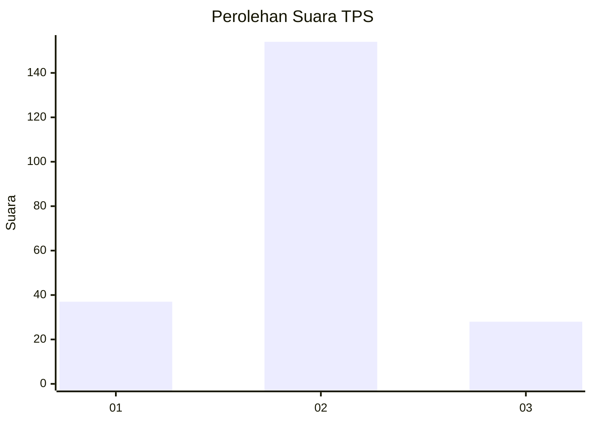
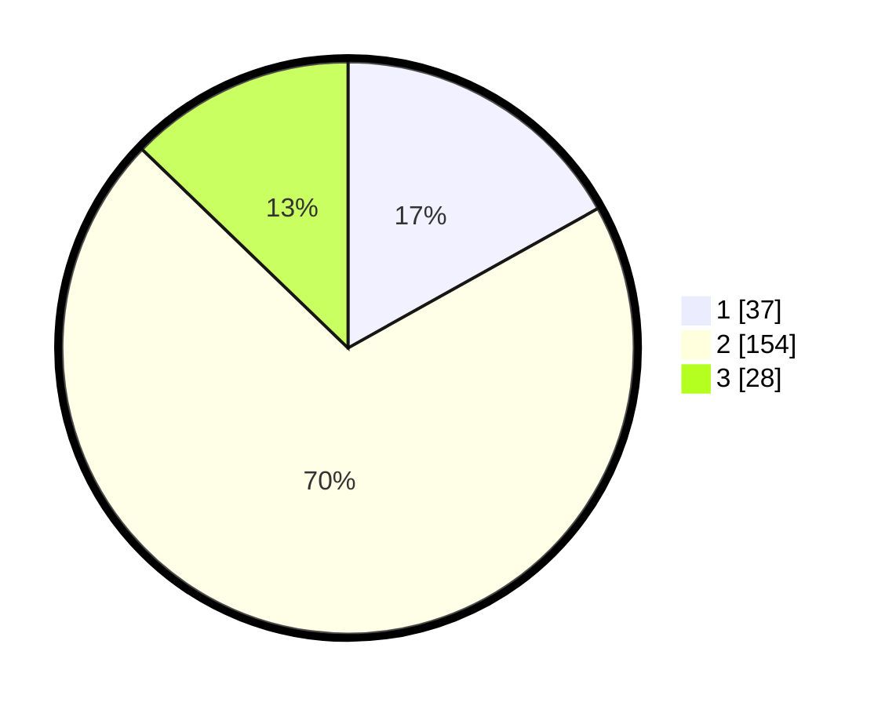

# Hasil

## Grafik

## Tabel

| No. | Nama Paslon    | Suara | Suara (raw) | Persentase |
|:--- |:-------------- | -----:| -----------:| ----------:|
| 1   | ANIES MUHAIMIN | 37    | [37][p-1]   | 16,89      |
| 2   | PRABOWO GIBRAN | 154   | [154][p-2]  | 70,32      |
| 3   | GANJAR MAHFUD  | 28    | [28][p-3]   | 12,79      |

[p-1]: https://github.com/gigit-pemilu/pemilu-2024/blob/main/pilpres/hitung-suara/sub/35-jawa-timur/sub/78-kota-surabaya/sub/22-gayungan/sub/1001-gayungan/sub/005-tps/sub/paslon-1.txt
[p-2]: https://github.com/gigit-pemilu/pemilu-2024/blob/main/pilpres/hitung-suara/sub/35-jawa-timur/sub/78-kota-surabaya/sub/22-gayungan/sub/1001-gayungan/sub/005-tps/sub/paslon-2.txt
[p-3]: https://github.com/gigit-pemilu/pemilu-2024/blob/main/pilpres/hitung-suara/sub/35-jawa-timur/sub/78-kota-surabaya/sub/22-gayungan/sub/1001-gayungan/sub/005-tps/sub/paslon-3.txt

## Foto C Plano

https://sirekap-obj-formc.kpu.go.id/56d5/pemilu/ppwp/35/78/22/10/01/3578221001005-20240214-215342--ac8a43f7-eba9-4d1f-a856-8e8963663e17.jpg

https://sirekap-obj-formc.kpu.go.id/56d5/pemilu/ppwp/35/78/22/10/01/3578221001005-20240214-215808--98ee0490-07e1-4ebf-825e-58ac32945af1.jpg

https://sirekap-obj-formc.kpu.go.id/56d5/pemilu/ppwp/35/78/22/10/01/3578221001005-20240214-220016--c687a031-034f-4f35-893b-fb74210d53a5.jpg

## Metadata

| Key        | Value               |
| ---------- | ------------------- |
| Time Stamp | 2024-02-25 10:00:00 |

