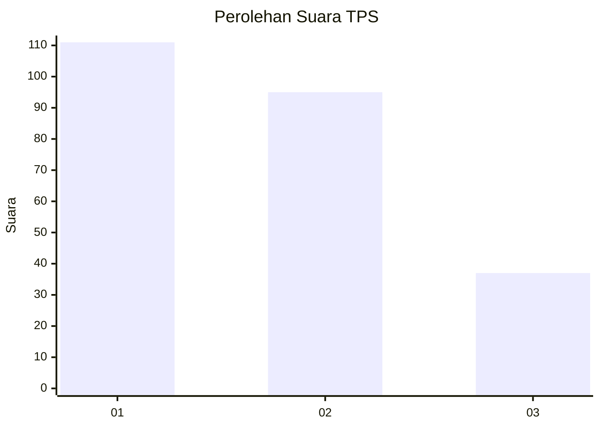
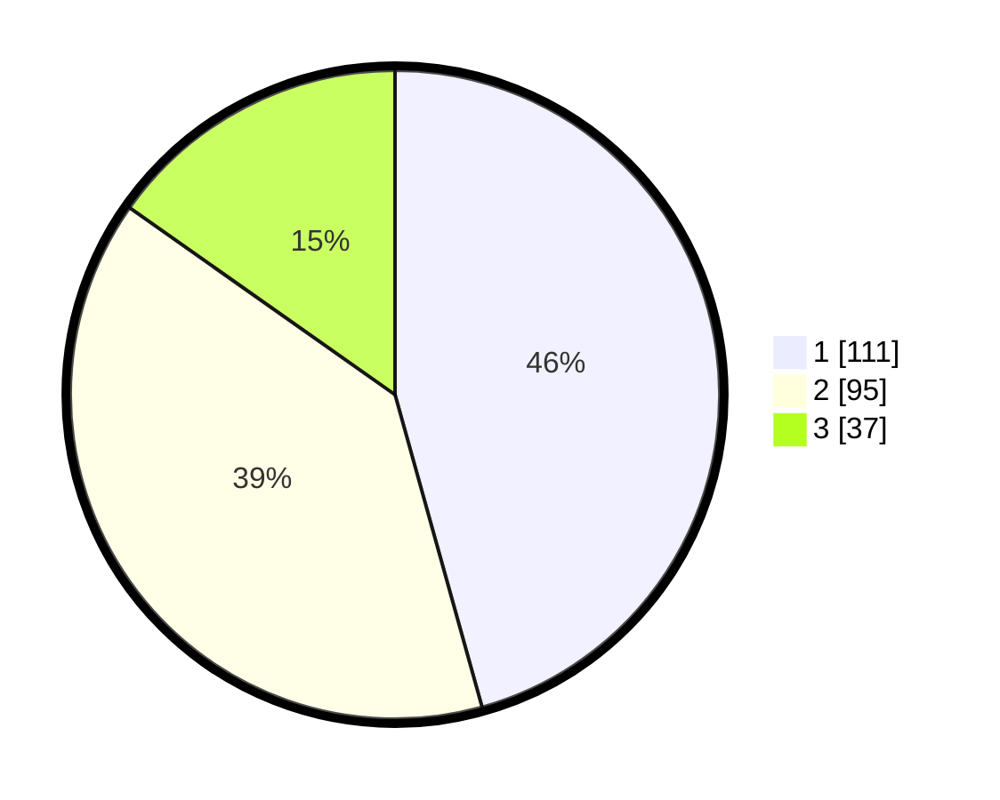

# Hasil

## Grafik

## Tabel

| No. | Nama Paslon    | Suara | Suara (raw) | Persentase |
|:--- |:-------------- | -----:| -----------:| ----------:|
| 1   | ANIES MUHAIMIN | 111   | [111][p-1]  | 45,68      |
| 2   | PRABOWO GIBRAN | 95    | [95][p-2]   | 39,09      |
| 3   | GANJAR MAHFUD  | 37    | [37][p-3]   | 15,23      |

[p-1]: https://github.com/gigit-pemilu/pemilu-2024-35-jawa-timur/blob/main/pilpres/hitung-suara/sub/35-jawa-timur/sub/78-kota-surabaya/sub/22-gayungan/sub/1001-gayungan/sub/010-tps/sub/paslon-1.txt
[p-2]: https://github.com/gigit-pemilu/pemilu-2024-35-jawa-timur/blob/main/pilpres/hitung-suara/sub/35-jawa-timur/sub/78-kota-surabaya/sub/22-gayungan/sub/1001-gayungan/sub/010-tps/sub/paslon-2.txt
[p-3]: https://github.com/gigit-pemilu/pemilu-2024-35-jawa-timur/blob/main/pilpres/hitung-suara/sub/35-jawa-timur/sub/78-kota-surabaya/sub/22-gayungan/sub/1001-gayungan/sub/010-tps/sub/paslon-3.txt

## Foto C Plano

https://sirekap-obj-formc.kpu.go.id/e08c/pemilu/ppwp/35/78/22/10/01/3578221001010-20240222-210644--ab59bc01-0535-4709-8ec6-356937dd6614.jpg

https://sirekap-obj-formc.kpu.go.id/e08c/pemilu/ppwp/35/78/22/10/01/3578221001010-20240222-210747--ae14c289-1be8-4a94-8bb9-f6cd05c4fc9b.jpg

https://sirekap-obj-formc.kpu.go.id/e08c/pemilu/ppwp/35/78/22/10/01/3578221001010-20240222-210958--d8283e57-1fdb-470f-89e0-ad593713641b.jpg

## Metadata

| Key        | Value               |
| ---------- | ------------------- |
| Time Stamp | 2024-02-25 11:00:00 |

