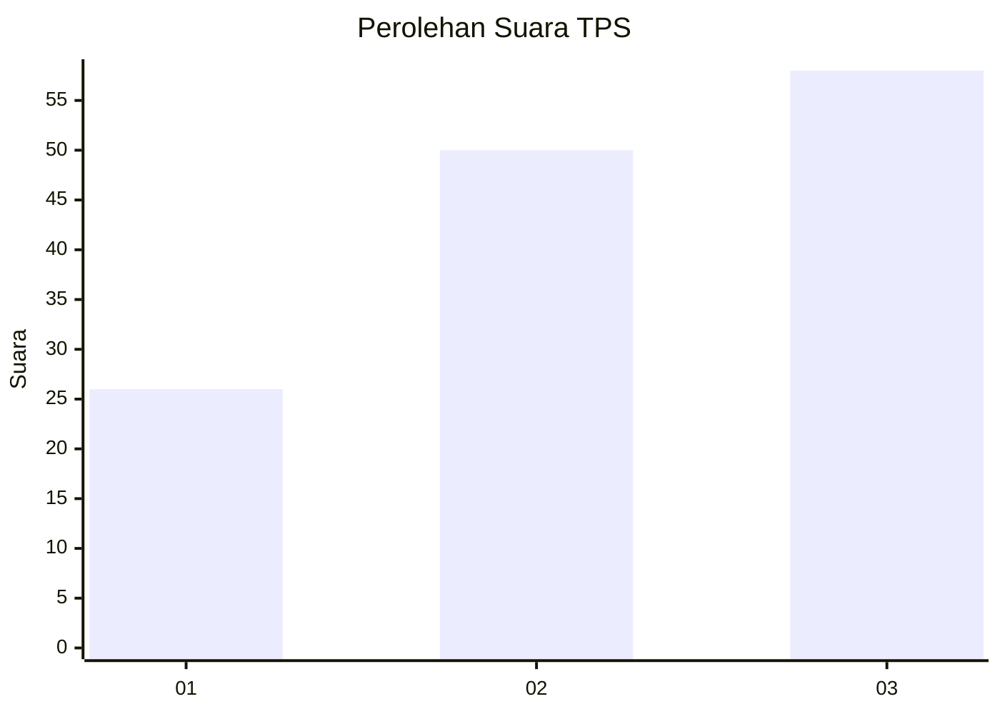
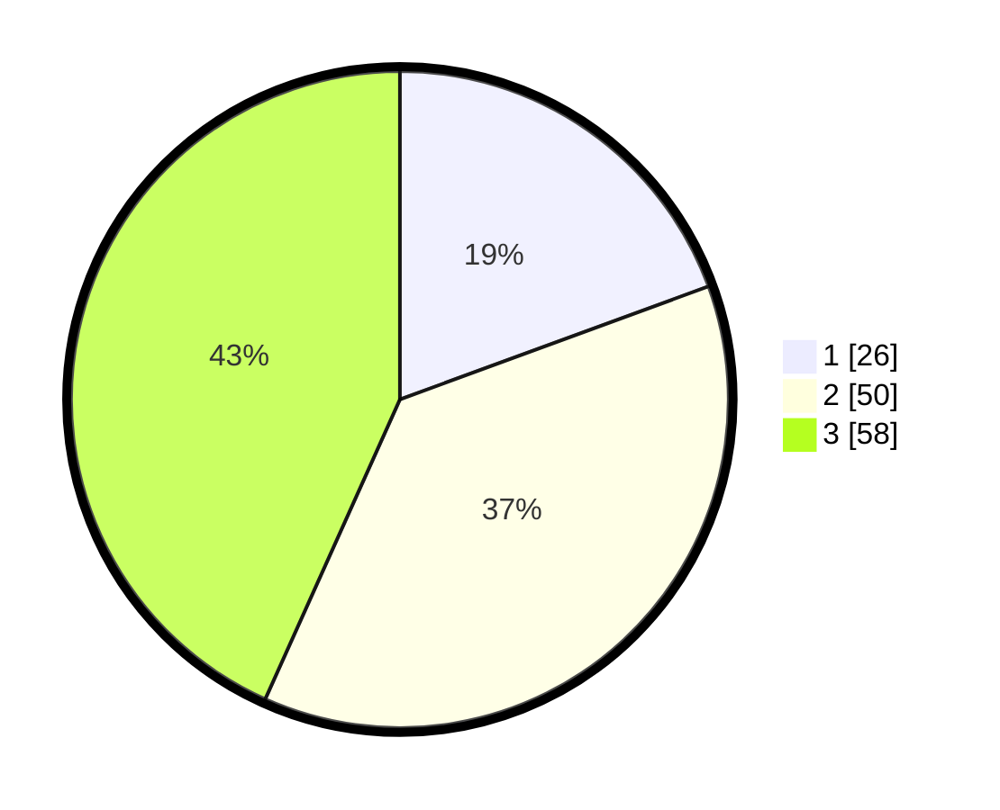

# Hasil

## Grafik

## Tabel

| No. | Nama Paslon    | Suara | Suara (raw) | Persentase |
|:--- |:-------------- | -----:| -----------:| ----------:|
| 1   | ANIES MUHAIMIN | 26    | [26][p-1]   | 19,40      |
| 2   | PRABOWO GIBRAN | 50    | [50][p-2]   | 37,31      |
| 3   | GANJAR MAHFUD  | 58    | [58][p-3]   | 43,28      |

[p-1]: https://github.com/gigit-pemilu/pemilu-2024/blob/main/pilpres/hitung-suara/sub/35-jawa-timur/sub/78-kota-surabaya/sub/22-gayungan/sub/1003-dukuh-menanggal/sub/014-tps/sub/paslon-1.txt
[p-2]: https://github.com/gigit-pemilu/pemilu-2024/blob/main/pilpres/hitung-suara/sub/35-jawa-timur/sub/78-kota-surabaya/sub/22-gayungan/sub/1003-dukuh-menanggal/sub/014-tps/sub/paslon-2.txt
[p-3]: https://github.com/gigit-pemilu/pemilu-2024/blob/main/pilpres/hitung-suara/sub/35-jawa-timur/sub/78-kota-surabaya/sub/22-gayungan/sub/1003-dukuh-menanggal/sub/014-tps/sub/paslon-3.txt

## Foto C Plano

https://sirekap-obj-formc.kpu.go.id/91cb/pemilu/ppwp/35/78/22/10/03/3578221003014-20240215-045237--3f398b57-f4bc-40b0-8891-678482455492.jpg

https://sirekap-obj-formc.kpu.go.id/91cb/pemilu/ppwp/35/78/22/10/03/3578221003014-20240215-053031--8da5e37e-da35-4e8c-8530-bb84499e47e3.jpg

https://sirekap-obj-formc.kpu.go.id/91cb/pemilu/ppwp/35/78/22/10/03/3578221003014-20240215-053122--c013bb5c-a912-459b-8e08-1b135fd7717d.jpg

## Metadata

| Key        | Value               |
| ---------- | ------------------- |
| Time Stamp | 2024-03-01 22:00:00 |

