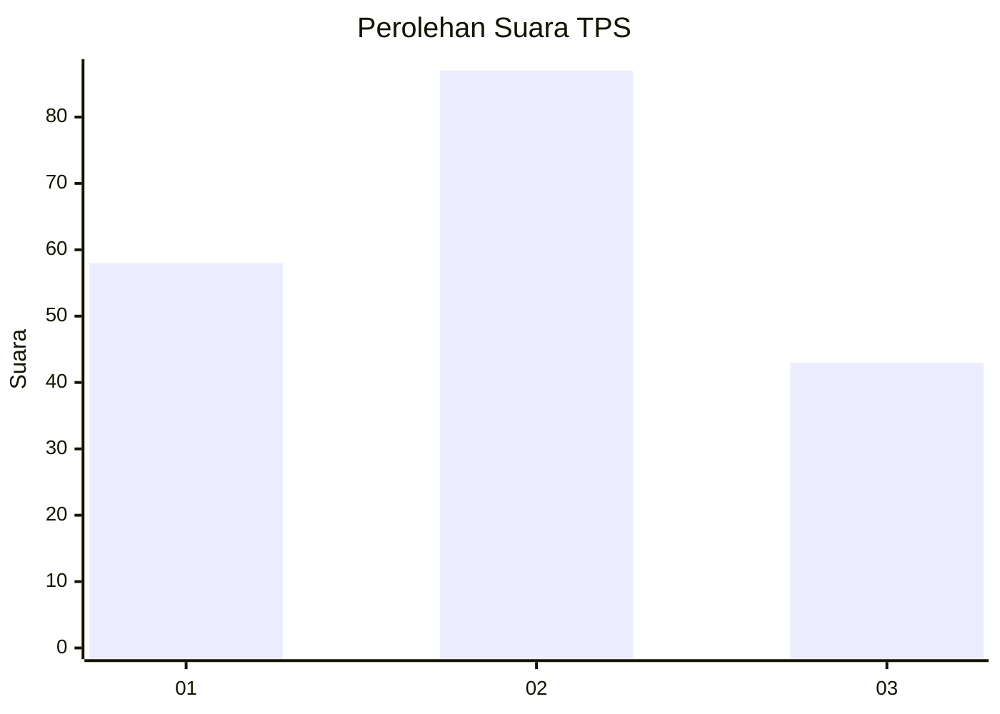
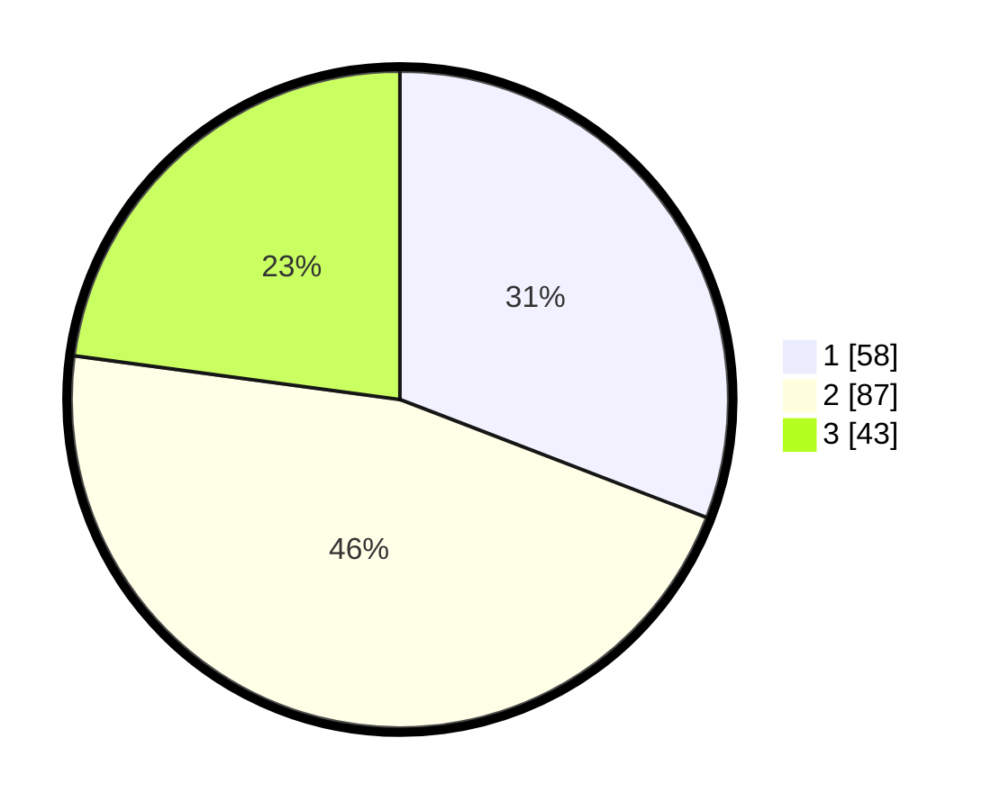

# Hasil

## Grafik

## Tabel

| No. | Nama Paslon    | Suara | Suara (raw) | Persentase |
|:--- |:-------------- | -----:| -----------:| ----------:|
| 1   | ANIES MUHAIMIN | 58    | [58][p-1]   | 30,85      |
| 2   | PRABOWO GIBRAN | 87    | [87][p-2]   | 46,28      |
| 3   | GANJAR MAHFUD  | 43    | [43][p-3]   | 22,87      |

[p-1]: https://github.com/gigit-pemilu/pemilu-2024-35-jawa-timur/blob/main/pilpres/hitung-suara/sub/35-jawa-timur/sub/78-kota-surabaya/sub/22-gayungan/sub/1004-ketintang/sub/003-tps/sub/paslon-1.txt
[p-2]: https://github.com/gigit-pemilu/pemilu-2024-35-jawa-timur/blob/main/pilpres/hitung-suara/sub/35-jawa-timur/sub/78-kota-surabaya/sub/22-gayungan/sub/1004-ketintang/sub/003-tps/sub/paslon-2.txt
[p-3]: https://github.com/gigit-pemilu/pemilu-2024-35-jawa-timur/blob/main/pilpres/hitung-suara/sub/35-jawa-timur/sub/78-kota-surabaya/sub/22-gayungan/sub/1004-ketintang/sub/003-tps/sub/paslon-3.txt

## Foto C Plano

https://sirekap-obj-formc.kpu.go.id/1b35/pemilu/ppwp/35/78/22/10/04/3578221004003-20240214-222919--acab9237-457e-4bb5-bb08-8c19e4781379.jpg

https://sirekap-obj-formc.kpu.go.id/1b35/pemilu/ppwp/35/78/22/10/04/3578221004003-20240214-222508--f07fe20e-cd2a-45d7-83b1-09032eacd282.jpg

https://sirekap-obj-formc.kpu.go.id/1b35/pemilu/ppwp/35/78/22/10/04/3578221004003-20240214-223126--b06d37aa-df07-454d-85c8-d32fb4d52bf0.jpg

## Metadata

| Key        | Value               |
| ---------- | ------------------- |
| Time Stamp | 2024-02-25 12:00:00 |

