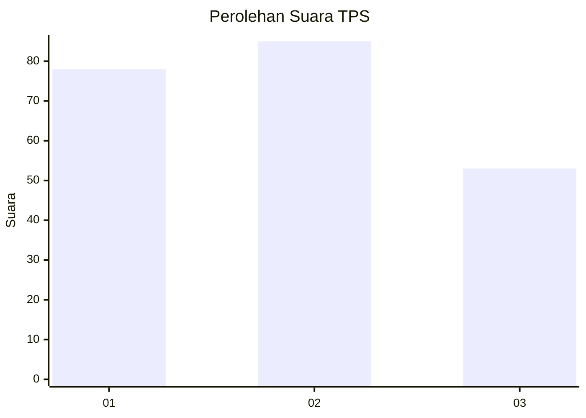
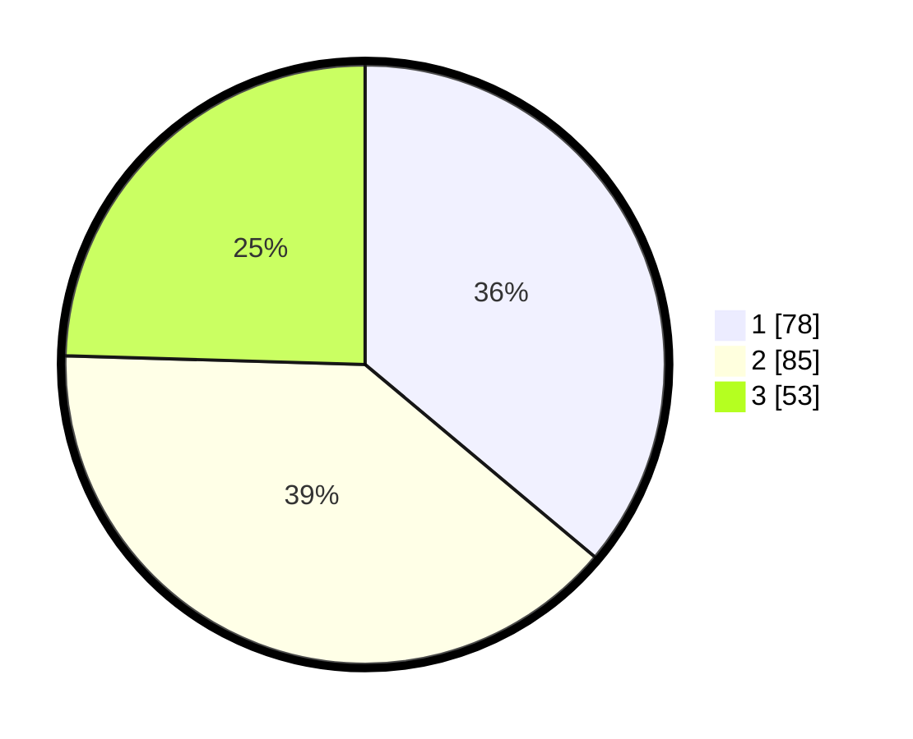

# Hasil

## Grafik

## Tabel

| No. | Nama Paslon    | Suara | Suara (raw) | Persentase |
|:--- |:-------------- | -----:| -----------:| ----------:|
| 1   | ANIES MUHAIMIN | 78    | [78][p-1]   | 36,11      |
| 2   | PRABOWO GIBRAN | 85    | [85][p-2]   | 39,35      |
| 3   | GANJAR MAHFUD  | 53    | [53][p-3]   | 24,54      |

[p-1]: https://github.com/gigit-pemilu/pemilu-2024/blob/main/pilpres/hitung-suara/sub/35-jawa-timur/sub/78-kota-surabaya/sub/22-gayungan/sub/1004-ketintang/sub/007-tps/sub/paslon-1.txt
[p-2]: https://github.com/gigit-pemilu/pemilu-2024/blob/main/pilpres/hitung-suara/sub/35-jawa-timur/sub/78-kota-surabaya/sub/22-gayungan/sub/1004-ketintang/sub/007-tps/sub/paslon-2.txt
[p-3]: https://github.com/gigit-pemilu/pemilu-2024/blob/main/pilpres/hitung-suara/sub/35-jawa-timur/sub/78-kota-surabaya/sub/22-gayungan/sub/1004-ketintang/sub/007-tps/sub/paslon-3.txt

## Foto C Plano

https://sirekap-obj-formc.kpu.go.id/00c6/pemilu/ppwp/35/78/22/10/04/3578221004007-20240214-232424--a9877dd7-302b-4f40-95f9-3dd6e8cb106b.jpg

https://sirekap-obj-formc.kpu.go.id/00c6/pemilu/ppwp/35/78/22/10/04/3578221004007-20240214-233254--fc87db10-3753-4dad-9a3d-404fbc59200f.jpg

https://sirekap-obj-formc.kpu.go.id/00c6/pemilu/ppwp/35/78/22/10/04/3578221004007-20240214-233356--e9b550f0-efef-40e7-acc4-b6862e14a8d2.jpg

## Metadata

| Key        | Value               |
| ---------- | ------------------- |
| Time Stamp | 2024-02-25 15:00:00 |

