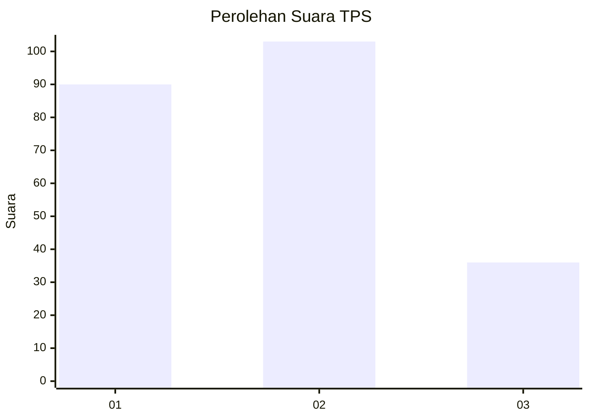
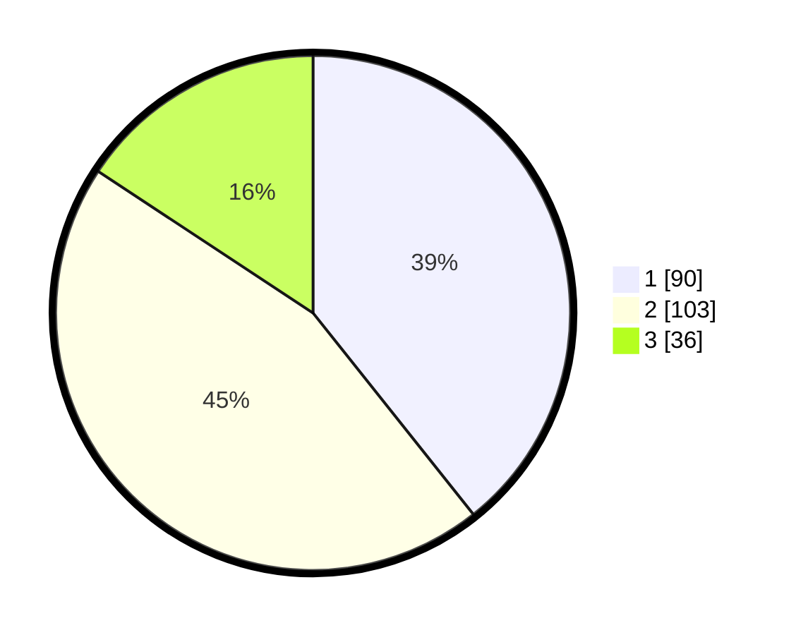

# Hasil

## Grafik

## Tabel

| No. | Nama Paslon    | Suara | Suara (raw) | Persentase |
|:--- |:-------------- | -----:| -----------:| ----------:|
| 1   | ANIES MUHAIMIN | 90    | [90][p-1]   | 39,30      |
| 2   | PRABOWO GIBRAN | 103   | [103][p-2]  | 44,98      |
| 3   | GANJAR MAHFUD  | 36    | [36][p-3]   | 15,72      |

[p-1]: https://github.com/gigit-pemilu/pemilu-2024/blob/main/pilpres/hitung-suara/sub/35-jawa-timur/sub/78-kota-surabaya/sub/22-gayungan/sub/1004-ketintang/sub/023-tps/sub/paslon-1.txt
[p-2]: https://github.com/gigit-pemilu/pemilu-2024/blob/main/pilpres/hitung-suara/sub/35-jawa-timur/sub/78-kota-surabaya/sub/22-gayungan/sub/1004-ketintang/sub/023-tps/sub/paslon-2.txt
[p-3]: https://github.com/gigit-pemilu/pemilu-2024/blob/main/pilpres/hitung-suara/sub/35-jawa-timur/sub/78-kota-surabaya/sub/22-gayungan/sub/1004-ketintang/sub/023-tps/sub/paslon-3.txt

## Foto C Plano

https://sirekap-obj-formc.kpu.go.id/4f61/pemilu/ppwp/35/78/22/10/04/3578221004023-20240215-062627--a02cffaf-32af-4d9b-baca-fd02b32ce47f.jpg

https://sirekap-obj-formc.kpu.go.id/4f61/pemilu/ppwp/35/78/22/10/04/3578221004023-20240214-203650--cdbd0948-fc99-4d33-b455-db8dad5266fb.jpg

https://sirekap-obj-formc.kpu.go.id/4f61/pemilu/ppwp/35/78/22/10/04/3578221004023-20240215-062705--d5afbc50-fb20-47ef-b095-b634514e64c3.jpg

## Metadata

| Key        | Value               |
| ---------- | ------------------- |
| Time Stamp | 2024-02-21 20:00:00 |

