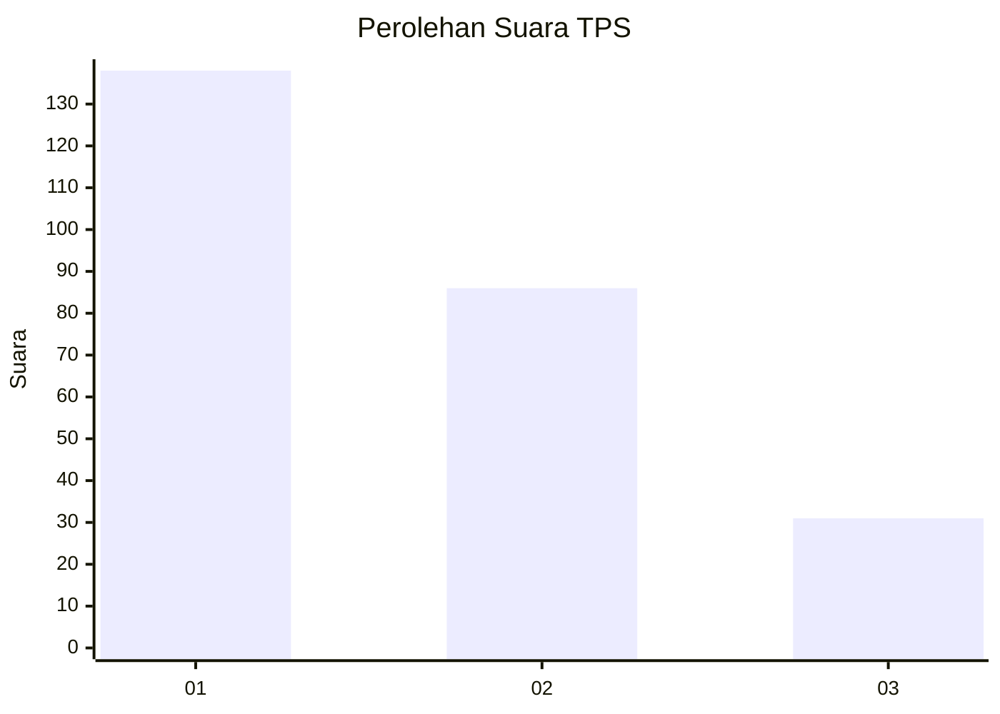
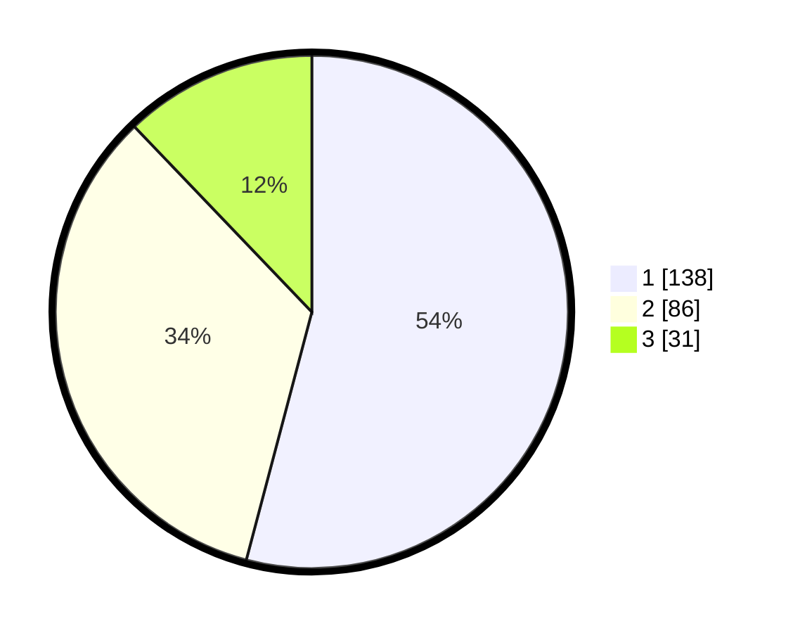

# Hasil

## Grafik

## Tabel

| No. | Nama Paslon    | Suara | Suara (raw) | Persentase |
|:--- |:-------------- | -----:| -----------:| ----------:|
| 1   | ANIES MUHAIMIN | 138   | [138][p-1]  | 54,12      |
| 2   | PRABOWO GIBRAN | 86    | [86][p-2]   | 33,73      |
| 3   | GANJAR MAHFUD  | 31    | [31][p-3]   | 12,16      |

[p-1]: https://github.com/gigit-pemilu/pemilu-2024-35-jawa-timur/blob/main/pilpres/hitung-suara/sub/35-jawa-timur/sub/78-kota-surabaya/sub/22-gayungan/sub/1004-ketintang/sub/031-tps/sub/paslon-1.txt
[p-2]: https://github.com/gigit-pemilu/pemilu-2024-35-jawa-timur/blob/main/pilpres/hitung-suara/sub/35-jawa-timur/sub/78-kota-surabaya/sub/22-gayungan/sub/1004-ketintang/sub/031-tps/sub/paslon-2.txt
[p-3]: https://github.com/gigit-pemilu/pemilu-2024-35-jawa-timur/blob/main/pilpres/hitung-suara/sub/35-jawa-timur/sub/78-kota-surabaya/sub/22-gayungan/sub/1004-ketintang/sub/031-tps/sub/paslon-3.txt

## Foto C Plano

https://sirekap-obj-formc.kpu.go.id/84af/pemilu/ppwp/35/78/22/10/04/3578221004031-20240214-204217--9513dd30-15ed-4c51-b0bc-ab956b17ea5d.jpg

https://sirekap-obj-formc.kpu.go.id/84af/pemilu/ppwp/35/78/22/10/04/3578221004031-20240214-204324--8269aa5d-55fa-4ccf-baeb-d8696a946c8b.jpg

https://sirekap-obj-formc.kpu.go.id/84af/pemilu/ppwp/35/78/22/10/04/3578221004031-20240214-225609--7015fa3e-7cfa-481b-a200-d1bcffc631ad.jpg

## Metadata

| Key        | Value               |
| ---------- | ------------------- |
| Time Stamp | 2024-02-21 18:00:00 |

