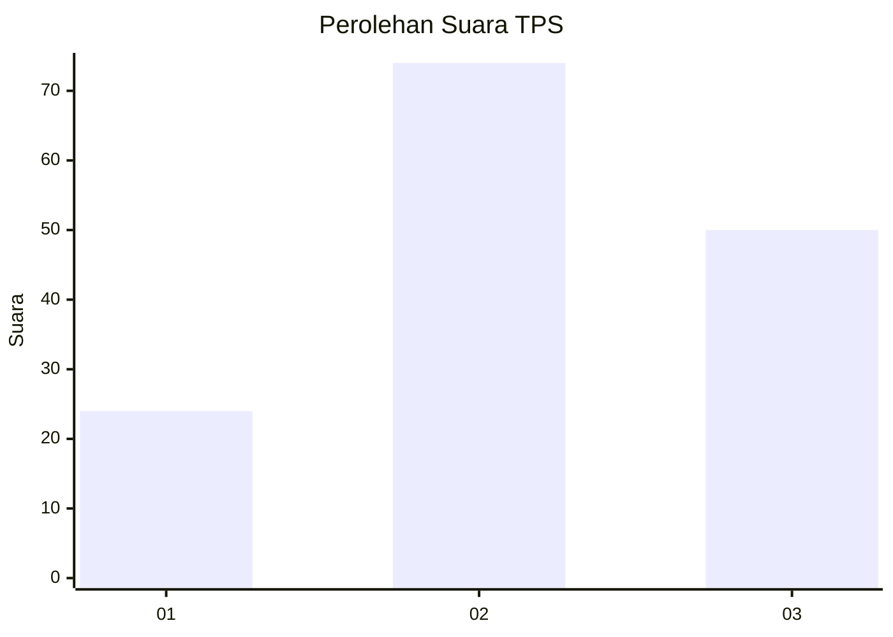
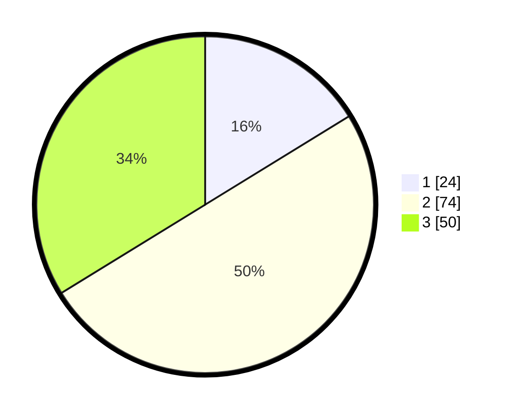

# Hasil

## Grafik

## Tabel

| No. | Nama Paslon    | Suara | Suara (raw) | Persentase |
|:--- |:-------------- | -----:| -----------:| ----------:|
| 1   | ANIES MUHAIMIN | 24    | [24][p-1]   | 16,22      |
| 2   | PRABOWO GIBRAN | 74    | [74][p-2]   | 50,00      |
| 3   | GANJAR MAHFUD  | 50    | [50][p-3]   | 33,78      |

[p-1]: https://github.com/gigit-pemilu/pemilu-2024/blob/main/pilpres/hitung-suara/sub/35-jawa-timur/sub/78-kota-surabaya/sub/23-jambangan/sub/1001-jambangan/sub/001-tps/sub/paslon-1.txt
[p-2]: https://github.com/gigit-pemilu/pemilu-2024/blob/main/pilpres/hitung-suara/sub/35-jawa-timur/sub/78-kota-surabaya/sub/23-jambangan/sub/1001-jambangan/sub/001-tps/sub/paslon-2.txt
[p-3]: https://github.com/gigit-pemilu/pemilu-2024/blob/main/pilpres/hitung-suara/sub/35-jawa-timur/sub/78-kota-surabaya/sub/23-jambangan/sub/1001-jambangan/sub/001-tps/sub/paslon-3.txt

## Foto C Plano

https://sirekap-obj-formc.kpu.go.id/2e05/pemilu/ppwp/35/78/23/10/01/3578231001001-20240228-212650--5b7e8fd9-ee9c-4b14-9074-f27dc88d1508.jpg

https://sirekap-obj-formc.kpu.go.id/2e05/pemilu/ppwp/35/78/23/10/01/3578231001001-20240222-162429--b03d232d-edac-4eed-9f28-4141266640f2.jpg

https://sirekap-obj-formc.kpu.go.id/2e05/pemilu/ppwp/35/78/23/10/01/3578231001001-20240222-162503--d4f753cb-7215-4d1f-b3f0-a6d8e25538df.jpg

## Metadata

| Key        | Value               |
| ---------- | ------------------- |
| Time Stamp | 2024-02-28 22:00:00 |

## DATA PEMILIH TETAP

Jumlah pemilih dalam DPT: **884**.
 * L: **88**.
 * P: **888**.

## DATA PENGGUNA HAK PILIH

Jumlah pengguna hak pilih dalam DPT: **214**.
 * L: **49**.
 * P: **115**.

Jumlah pengguna hak pilih dalam DPTb: **3**.
 * L: **2**.
 * P: **1**.

Jumlah pengguna hak pilih dalam DPK: **3**.
 * L: **2**.
 * P: **1**.

Jumlah pengguna hak pilih: **220**.
 * L: **105**.
 * P: **117**.

## JUMLAH SUARA SAH DAN TIDAK SAH

JUMLAH SELURUH SUARA SAH: **260**.

JUMLAH SUARA TIDAK SAH: **10**.

JUMLAH SELURUH SUARA SAH DAN SUARA TIDAK SAH: **220**.

