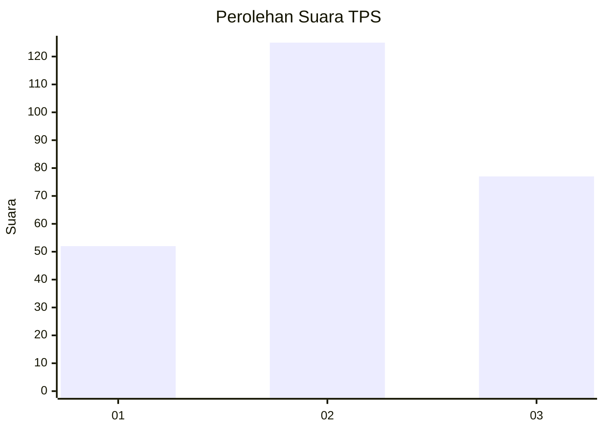
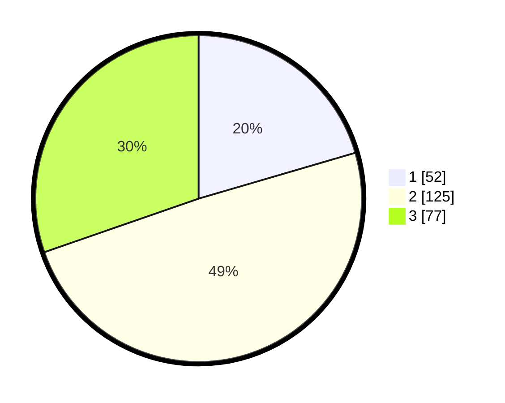

# Hasil

## Grafik

## Tabel

| No. | Nama Paslon    | Suara | Suara (raw) | Persentase |
|:--- |:-------------- | -----:| -----------:| ----------:|
| 1   | ANIES MUHAIMIN | 52    | [52][p-1]   | 20,47      |
| 2   | PRABOWO GIBRAN | 125   | [125][p-2]  | 49,21      |
| 3   | GANJAR MAHFUD  | 77    | [77][p-3]   | 30,31      |

[p-1]: https://github.com/gigit-pemilu/pemilu-2024-35-jawa-timur/blob/main/pilpres/hitung-suara/sub/35-jawa-timur/sub/78-kota-surabaya/sub/23-jambangan/sub/1001-jambangan/sub/004-tps/sub/paslon-1.txt
[p-2]: https://github.com/gigit-pemilu/pemilu-2024-35-jawa-timur/blob/main/pilpres/hitung-suara/sub/35-jawa-timur/sub/78-kota-surabaya/sub/23-jambangan/sub/1001-jambangan/sub/004-tps/sub/paslon-2.txt
[p-3]: https://github.com/gigit-pemilu/pemilu-2024-35-jawa-timur/blob/main/pilpres/hitung-suara/sub/35-jawa-timur/sub/78-kota-surabaya/sub/23-jambangan/sub/1001-jambangan/sub/004-tps/sub/paslon-3.txt

## Foto C Plano

https://sirekap-obj-formc.kpu.go.id/70d3/pemilu/ppwp/35/78/23/10/01/3578231001004-20240222-201202--b2fe6963-e6d9-4f60-9b1c-2434e5e83209.jpg

https://sirekap-obj-formc.kpu.go.id/70d3/pemilu/ppwp/35/78/23/10/01/3578231001004-20240222-201259--e8386d89-e570-43d4-b495-d9afefbeaf3c.jpg

https://sirekap-obj-formc.kpu.go.id/70d3/pemilu/ppwp/35/78/23/10/01/3578231001004-20240222-201329--19327c34-7356-42fd-b55e-2934406f5088.jpg

## Metadata

| Key        | Value               |
| ---------- | ------------------- |
| Time Stamp | 2024-02-22 21:00:00 |

## DATA PEMILIH TETAP

Jumlah pemilih dalam DPT: **243**.
 * L: **127**.
 * P: **142**.

## DATA PENGGUNA HAK PILIH

Jumlah pengguna hak pilih dalam DPT: **229**.
 * L: **177**.
 * P: **113**.

Jumlah pengguna hak pilih dalam DPTb: **504**.
 * L: **307**.
 * P: **253**.

Jumlah pengguna hak pilih dalam DPK: **704**.
 * L: **772**.
 * P: **2**.

Jumlah pengguna hak pilih: **277**.
 * L: **921**.
 * P: **115**.

## JUMLAH SUARA SAH DAN TIDAK SAH

JUMLAH SELURUH SUARA SAH: **231**.

JUMLAH SUARA TIDAK SAH: **5**.

JUMLAH SELURUH SUARA SAH DAN SUARA TIDAK SAH: **237**.

