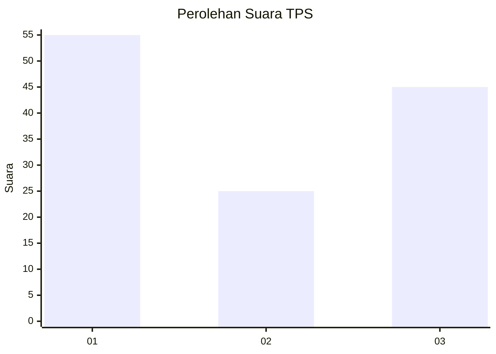
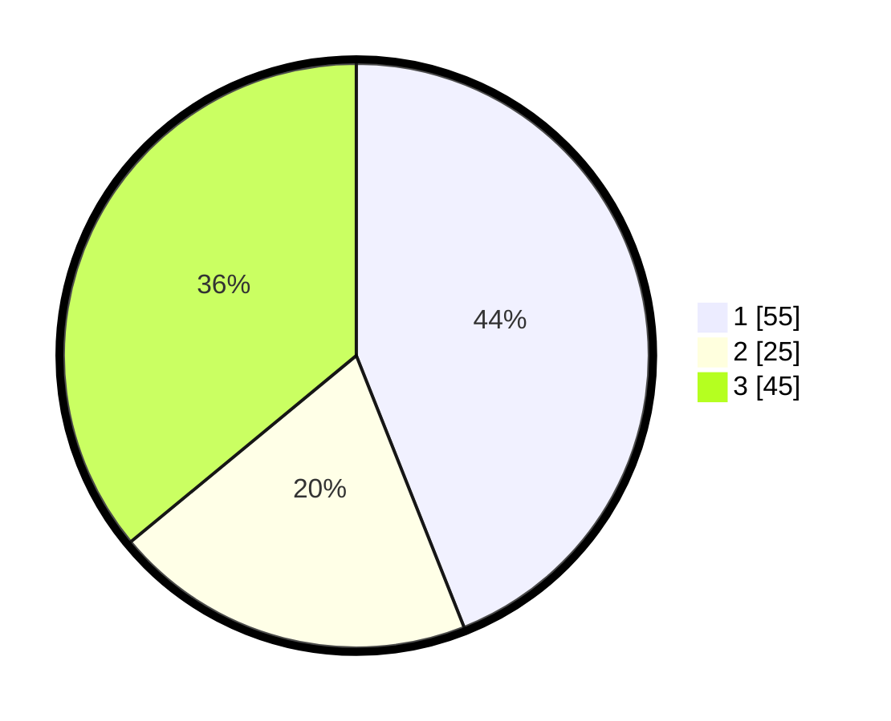

# Hasil

## Grafik

## Tabel

| No. | Nama Paslon    | Suara | Suara (raw) | Persentase |
|:--- |:-------------- | -----:| -----------:| ----------:|
| 1   | ANIES MUHAIMIN | 55    | [55][p-1]   | 44,00      |
| 2   | PRABOWO GIBRAN | 25    | [25][p-2]   | 20,00      |
| 3   | GANJAR MAHFUD  | 45    | [45][p-3]   | 36,00      |

[p-1]: https://github.com/gigit-pemilu/pemilu-2024-35-jawa-timur/blob/main/pilpres/hitung-suara/sub/35-jawa-timur/sub/78-kota-surabaya/sub/23-jambangan/sub/1001-jambangan/sub/010-tps/sub/paslon-1.txt
[p-2]: https://github.com/gigit-pemilu/pemilu-2024-35-jawa-timur/blob/main/pilpres/hitung-suara/sub/35-jawa-timur/sub/78-kota-surabaya/sub/23-jambangan/sub/1001-jambangan/sub/010-tps/sub/paslon-2.txt
[p-3]: https://github.com/gigit-pemilu/pemilu-2024-35-jawa-timur/blob/main/pilpres/hitung-suara/sub/35-jawa-timur/sub/78-kota-surabaya/sub/23-jambangan/sub/1001-jambangan/sub/010-tps/sub/paslon-3.txt

## Foto C Plano

https://sirekap-obj-formc.kpu.go.id/6b39/pemilu/ppwp/35/78/23/10/01/3578231001010-20240223-144903--c4148679-ccf4-4530-bcba-eab3467dd19d.jpg

https://sirekap-obj-formc.kpu.go.id/6b39/pemilu/ppwp/35/78/23/10/01/3578231001010-20240223-145022--6c2cff3b-73f4-4d74-ae8d-d67c772273cd.jpg

https://sirekap-obj-formc.kpu.go.id/6b39/pemilu/ppwp/35/78/23/10/01/3578231001010-20240223-145232--aa3f5e64-8b3f-4e6b-a8e2-e79894c53e48.jpg

## Metadata

| Key        | Value               |
| ---------- | ------------------- |
| Time Stamp | 2024-02-24 22:31:28 |

## DATA PEMILIH TETAP

Jumlah pemilih dalam DPT: **280**.
 * L: **137**.
 * P: **343**.

## DATA PENGGUNA HAK PILIH

Jumlah pengguna hak pilih dalam DPT: **277**.
 * L: **102**.
 * P: **209**.

Jumlah pengguna hak pilih dalam DPTb: **75**.
 * L: **4**.
 * P: **77**.

Jumlah pengguna hak pilih dalam DPK: **3**.
 * L: **7**.
 * P: **2**.

Jumlah pengguna hak pilih: **224**.
 * L: **107**.
 * P: **722**.

## JUMLAH SUARA SAH DAN TIDAK SAH

JUMLAH SELURUH SUARA SAH: **226**.

JUMLAH SUARA TIDAK SAH: **5**.

JUMLAH SELURUH SUARA SAH DAN SUARA TIDAK SAH: **229**.

