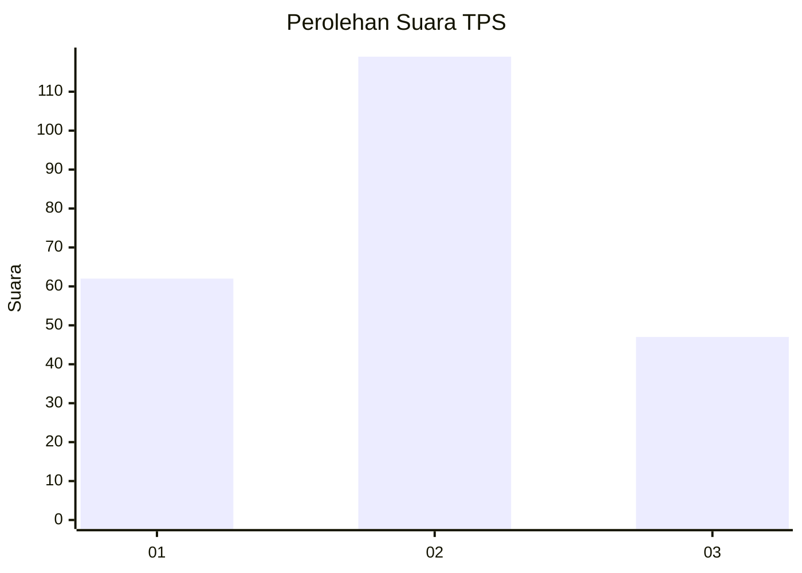
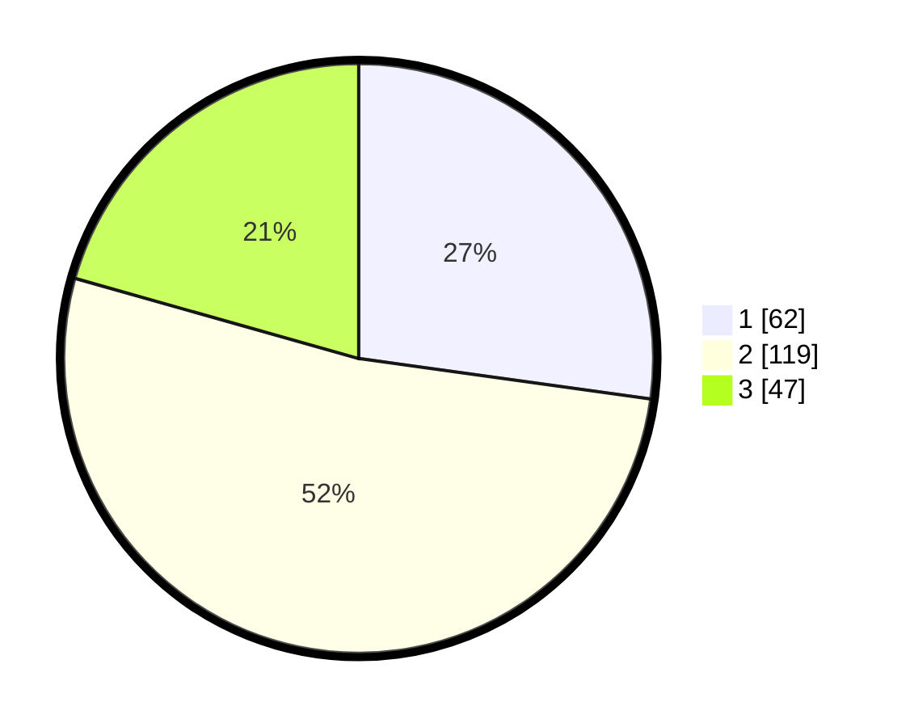

# Hasil

## Grafik

## Tabel

| No. | Nama Paslon    | Suara | Suara (raw) | Persentase |
|:--- |:-------------- | -----:| -----------:| ----------:|
| 1   | ANIES MUHAIMIN | 62    | [62][p-1]   | 27,19      |
| 2   | PRABOWO GIBRAN | 119   | [119][p-2]  | 52,19      |
| 3   | GANJAR MAHFUD  | 47    | [47][p-3]   | 20,61      |

[p-1]: https://github.com/gigit-pemilu/pemilu-2024/blob/main/pilpres/hitung-suara/sub/35-jawa-timur/sub/78-kota-surabaya/sub/23-jambangan/sub/1001-jambangan/sub/029-tps/sub/paslon-1.txt
[p-2]: https://github.com/gigit-pemilu/pemilu-2024/blob/main/pilpres/hitung-suara/sub/35-jawa-timur/sub/78-kota-surabaya/sub/23-jambangan/sub/1001-jambangan/sub/029-tps/sub/paslon-2.txt
[p-3]: https://github.com/gigit-pemilu/pemilu-2024/blob/main/pilpres/hitung-suara/sub/35-jawa-timur/sub/78-kota-surabaya/sub/23-jambangan/sub/1001-jambangan/sub/029-tps/sub/paslon-3.txt

## Foto C Plano

https://sirekap-obj-formc.kpu.go.id/37c9/pemilu/ppwp/35/78/23/10/01/3578231001029-20240224-133356--072691d1-f6eb-4e34-8602-dd4fd354f813.jpg

https://sirekap-obj-formc.kpu.go.id/37c9/pemilu/ppwp/35/78/23/10/01/3578231001029-20240224-134045--49b74a67-4d63-4b01-984a-2397c2d2af56.jpg

https://sirekap-obj-formc.kpu.go.id/37c9/pemilu/ppwp/35/78/23/10/01/3578231001029-20240224-134331--d1a8dc51-5227-4b9d-9836-ff02bec9a54d.jpg

## Metadata

| Key        | Value               |
| ---------- | ------------------- |
| Time Stamp | 2024-02-25 12:00:00 |

## DATA PEMILIH TETAP

Jumlah pemilih dalam DPT: **20**.
 * L: **0**.
 * P: **0**.

## DATA PENGGUNA HAK PILIH

Jumlah pengguna hak pilih dalam DPT: **551**.
 * L: **0**.
 * P: **555**.

Jumlah pengguna hak pilih dalam DPTb: **551**.
 * L: **55**.
 * P: **555**.

Jumlah pengguna hak pilih dalam DPK: **51**.
 * L: **52**.
 * P: **0**.

Jumlah pengguna hak pilih: **6**.
 * L: **0**.
 * P: **0**.

## JUMLAH SUARA SAH DAN TIDAK SAH

JUMLAH SELURUH SUARA SAH: **228**.

JUMLAH SUARA TIDAK SAH: **6**.

JUMLAH SELURUH SUARA SAH DAN SUARA TIDAK SAH: **234**.

