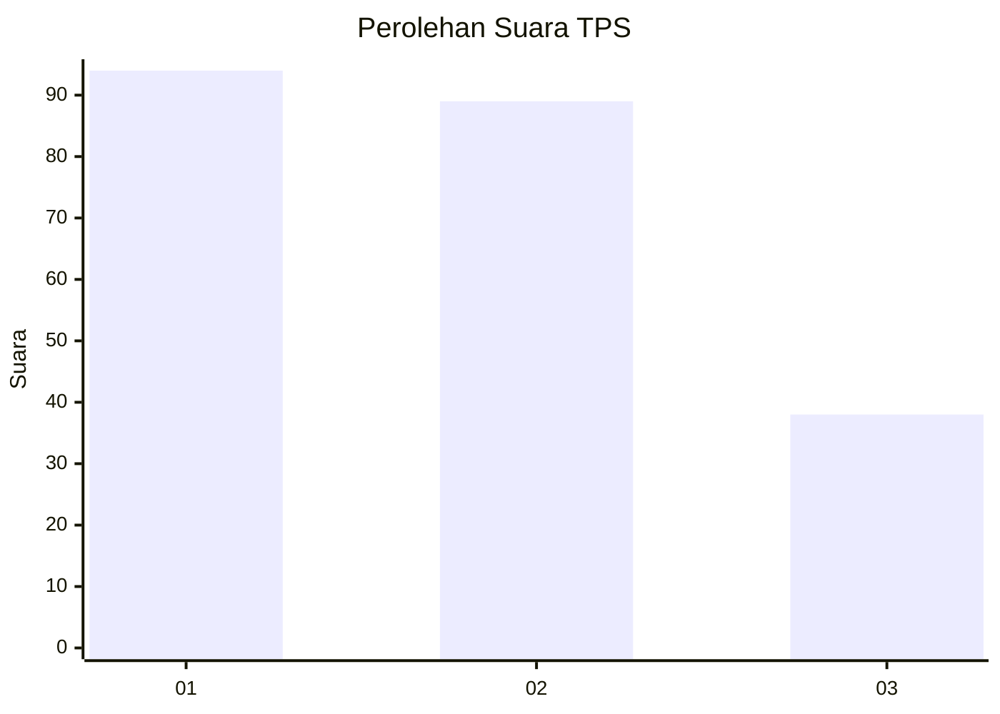
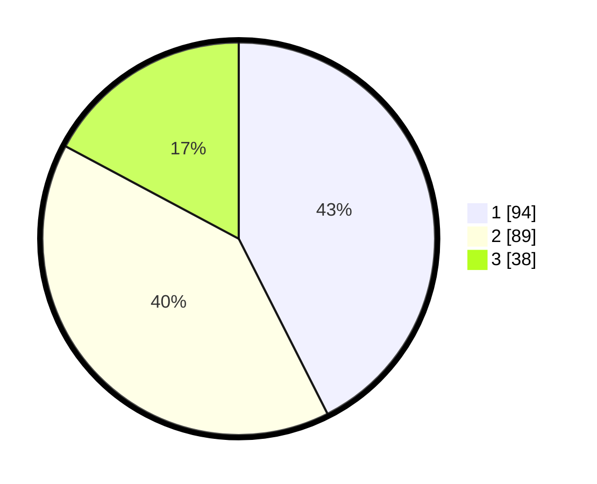

# Hasil

## Grafik

## Tabel

| No. | Nama Paslon    | Suara | Suara (raw) | Persentase |
|:--- |:-------------- | -----:| -----------:| ----------:|
| 1   | ANIES MUHAIMIN | 94    | [94][p-1]   | 42,53      |
| 2   | PRABOWO GIBRAN | 89    | [89][p-2]   | 40,27      |
| 3   | GANJAR MAHFUD  | 38    | [38][p-3]   | 17,19      |

[p-1]: https://github.com/gigit-pemilu/pemilu-2024/blob/main/pilpres/hitung-suara/sub/35-jawa-timur/sub/78-kota-surabaya/sub/23-jambangan/sub/1002-karah/sub/027-tps/sub/paslon-1.txt
[p-2]: https://github.com/gigit-pemilu/pemilu-2024/blob/main/pilpres/hitung-suara/sub/35-jawa-timur/sub/78-kota-surabaya/sub/23-jambangan/sub/1002-karah/sub/027-tps/sub/paslon-2.txt
[p-3]: https://github.com/gigit-pemilu/pemilu-2024/blob/main/pilpres/hitung-suara/sub/35-jawa-timur/sub/78-kota-surabaya/sub/23-jambangan/sub/1002-karah/sub/027-tps/sub/paslon-3.txt

## Foto C Plano

https://sirekap-obj-formc.kpu.go.id/4e94/pemilu/ppwp/35/78/23/10/02/3578231002027-20240215-011722--e648579a-60a3-4845-a367-9ea36a5d8b35.jpg

https://sirekap-obj-formc.kpu.go.id/4e94/pemilu/ppwp/35/78/23/10/02/3578231002027-20240215-011755--01187cfa-f8e0-476e-85a2-a0e93c0ae945.jpg

https://sirekap-obj-formc.kpu.go.id/4e94/pemilu/ppwp/35/78/23/10/02/3578231002027-20240215-011845--d0c2329a-5f26-4409-aeca-8dd1bf2945d4.jpg

## Metadata

| Key        | Value               |
| ---------- | ------------------- |
| Time Stamp | 2024-02-24 22:31:28 |

