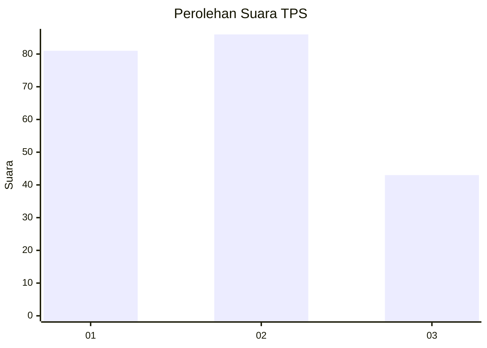
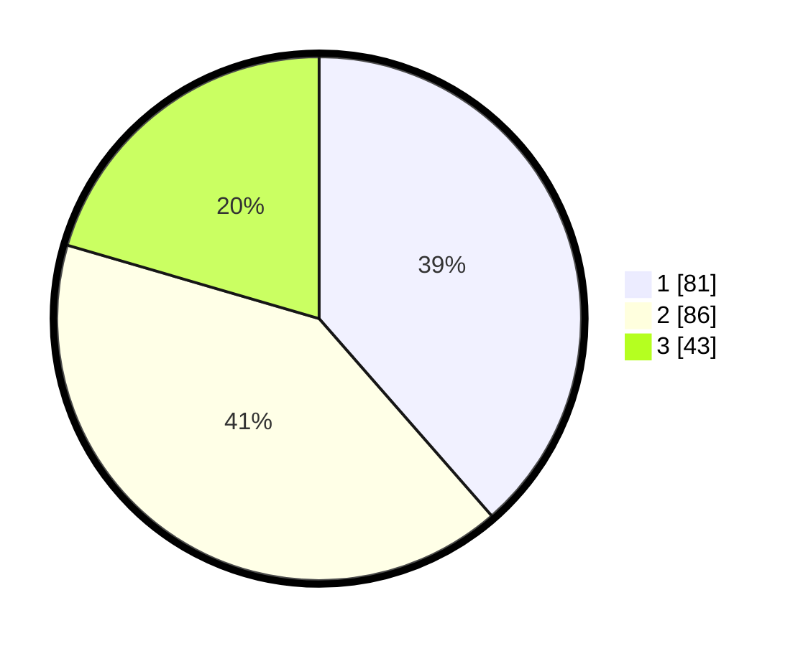

# Hasil

## Grafik

## Tabel

| No. | Nama Paslon    | Suara | Suara (raw) | Persentase |
|:--- |:-------------- | -----:| -----------:| ----------:|
| 1   | ANIES MUHAIMIN | 81    | [81][p-1]   | 38,57      |
| 2   | PRABOWO GIBRAN | 86    | [86][p-2]   | 40,95      |
| 3   | GANJAR MAHFUD  | 43    | [43][p-3]   | 20,48      |

[p-1]: https://github.com/gigit-pemilu/pemilu-2024-35-jawa-timur/blob/main/pilpres/hitung-suara/sub/35-jawa-timur/sub/78-kota-surabaya/sub/23-jambangan/sub/1002-karah/sub/028-tps/sub/paslon-1.txt
[p-2]: https://github.com/gigit-pemilu/pemilu-2024-35-jawa-timur/blob/main/pilpres/hitung-suara/sub/35-jawa-timur/sub/78-kota-surabaya/sub/23-jambangan/sub/1002-karah/sub/028-tps/sub/paslon-2.txt
[p-3]: https://github.com/gigit-pemilu/pemilu-2024-35-jawa-timur/blob/main/pilpres/hitung-suara/sub/35-jawa-timur/sub/78-kota-surabaya/sub/23-jambangan/sub/1002-karah/sub/028-tps/sub/paslon-3.txt

## Foto C Plano

https://sirekap-obj-formc.kpu.go.id/667a/pemilu/ppwp/35/78/23/10/02/3578231002028-20240214-220307--a754d536-8375-4cfd-9c56-95509cb90cf5.jpg

https://sirekap-obj-formc.kpu.go.id/667a/pemilu/ppwp/35/78/23/10/02/3578231002028-20240214-220404--ef05287f-d244-4a07-9105-565e0a29ecd2.jpg

https://sirekap-obj-formc.kpu.go.id/667a/pemilu/ppwp/35/78/23/10/02/3578231002028-20240214-220503--ae6b9662-5968-413f-8083-4dbcd51b967f.jpg

## Metadata

| Key        | Value               |
| ---------- | ------------------- |
| Time Stamp | 2024-02-25 11:00:00 |

